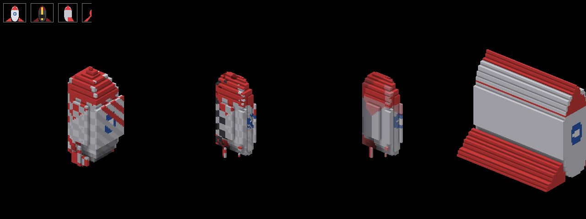

# SR2D — refactored for maximum throughput

Drop-in replacement for the original `SR2D.dll` / `SR2D64.dll` sprite engine plus a
rewritten `Sprite` / `SR2D` C# layer. **Every exported function keeps its name,
calling convention, argument order and bit-exact pixel results.**

```
SR2D/
├─ CHANGELOG.txt           what changed, newest first (kept up to date with every addition / change)
├─ build_release.bat       one click: DLL (clang-cl, x64, Release) + bench (Release) + DLL copied next to the exe; OK / FAILED summary
├─ template/               empty WinForms app (net10.0-windows, x64) wired to SR2D: a SpriteBox canvas + a few controls; copy it and start (template/README.txt)
├─ native/                 C++ DLL (Visual Studio 2022 solution, ClangCL toolset + x64 by default, Win32 still available)
│  ├─ sr2d_api.h           single X-macro list of all exports (54 original + DRAW_WARP, DRAW_LINE2)
│  ├─ sr2d_simd.h          SSE2 / AVX2 vector traits
│  ├─ sr2d_kernels.inl     ALL pixel kernels, written once as a template
│  ├─ sr2d_fx.inl          DRAW_FX: effect chains (blur / distortion / colour) - included by the above
│  ├─ sr2d_select.inl      FLOOD_MASK / FILL_MASK8 / LERP_MASK8: flood fill + selection masks - included by the above
│  ├─ sr2d_kernels_sse2.cpp   instantiates kernels for SSE2  (baseline)
│  ├─ sr2d_kernels_avx2.cpp   instantiates kernels for AVX2  (compiled /arch:AVX2)
│  ├─ sr2d.cpp             DllMain, CPUID detection, dispatch table, exports
│  ├─ SR2D.def / .vcxproj / .sln
├─ cs/
│  ├─ SR2D.cs              enums + all P/Invoke declarations (blittable pointers)
│  ├─ Sprite.cs            Sprite class, same public API as before (+ new methods)
│  ├─ Sprite.Shapes.cs     partial Sprite: polylines/polygons with width, rect, ellipse, arrow, bracket (AA, blend ops)
│  ├─ Sprite.Rect.cs       partial Sprite: Rectangle (x,y,w,h) overloads of the L/R/T/B methods, Bounds, LockRect
│  ├─ Sprite.Curves.cs     partial Sprite: splines through points, Béziers, arcs, PathBuilder (DrawPath / FillPath)
│  ├─ Vector.cs / .Render.cs / .Svg.cs / .Ps.cs / .Pdf.cs   VectorImage model, rasteriser, SVG / PostScript-EPS-AI / PDF importers
│  ├─ Vector.Cache.cs      VectorSprite: cached raster of a VectorImage (blit per frame until zoom / angle / content changes)
│  ├─ Vector.Edit.cs       Container edits: Recolor / SwapColors / Palette (fill, stroke or both), by-name SetFill / SetStroke / Hide / Show / Remove, Merge, Shuffle, order
│  ├─ Sprite.Gradient.cs   partial Sprite: gradient-paint overloads of FillRect / RoundRect / Ellipse / Circle / Polygon / Path / StrokePath + SpriteGradient factory
│  ├─ Sprite.Edit.cs       partial Sprite: in-place Flip / Rotate90 / Rotate(deg) / Resize / Crop / Expand / Trim / Shift / colour ops / Apply
│  ├─ Sprite.Blend.cs      partial Sprite: DrawBlend* / FillBlend with the editor blend modes (SR2D.BlendMode)
│  ├─ SpriteTransform.cs   general 2-D transform (scale / rotate / pivot / matrix / perspective / opacity / filter): LayeredSprite.Transform, layer.Transform, Sprite.DrawTransformed
│  ├─ WebP.cs              managed WebP decoder (lossy VP8, lossless VP8L, alpha, VP8X); Sprite.FromWebP, auto in Sprite(file)
│  ├─ Sprite.Effects.cs    partial Sprite: DrawBlurred / DrawBlurredAt / Blur / ToBlurred (Gaussian-like blur, soft edges)
│  ├─ Effects.cs           Effects chain class (Blur / Wave / Ripple / Noise / Turbulence / DistortMap / Color / Shadow / Glow / Outline / Dilate / Erode, per-stage Enable) + Sprite.DrawFx*
│  ├─ LayeredSprite.cs     stack of sprites (own effects / placement / op each) that composes itself into one premultiplied sprite, re-composing only what changed
│  ├─ Selection.cs         8-bit coverage selection (magic wand, polygon, ellipse, rect, from alpha / luma; Add / Subtract / Intersect, Feather, Grow, Border) + Sprite.FloodFill / ReplaceColor / Fill / Apply / CopyThrough / Extract
│  ├─ VoxelGrid.cs         Voxel (8 B: ARGB, emit, material, user) + VoxelGrid (w x h x d, faces / light caches, edits, Pick) + VoxelCamera (presets, Free) + Sprite.DrawVoxels
│  ├─ VoxelGrid.Edit.cs    VoxelSelection (3-D masks, VOXEL_FLOOD), VoxelNoise (fractal Perlin), editing: selections, Fill / Paint / Map, Shell / Hollow / Invert / FloodFill, solids (sphere, cylinder, cone, capsule, torus, line, box), transforms, noise / terrain / scatter
│  ├─ VoxelGrid.Objects.cs Merge / Merged / Stacked (Over, Under, Replace, Erase, Intersect) and named objects: VoxelObject (material-tagged or selection-backed), Select / Hide / Show / Remove / Recolor / Extract by name
│  ├─ VoxelGrid.IO.cs      MagicaVoxel .vox load / save (palette, materials, scene graph, > 256 split), Wavefront .obj voxeliser (mtl colours, closed-mesh fill, vertex colours)
│  ├─ VoxelGrid.Projections.cs  FromProjections: front / back / left / right / top / bottom sprites -> grid (silhouette intersection, nearest-view colours, Dither / Lerp seam between opposite views, Stretch / Proportional / Pixel fit, alpha cutoff, colour key), ToProjection
│  ├─ SpriteBox.cs         WinForms control: client area = Sprite, flicker-free present
│  ├─ SpriteBox.View.cs    SizeMode (PictureBox-like placement + zoom multiplier + pan / overscroll / inertia), scroll bars, magnifier / hand navigation, SR2D-drawn view menu
│  ├─ SpriteBox.Voxel.cs   VoxelBox: a SpriteBox viewport onto a VoxelGrid (orbit / pan / zoom, presets, lighting tiers, fade, preview while dragging, VoxelClick / VoxelHover, right-click settings menu)
│  ├─ SpriteView.cs        the view geometry (modes, zoom anchor, pan limits, client <-> image mapping, scroll model, inertia) - no WinForms
│  ├─ SpriteControls.cs    SpriteControlBase (palette, hover, text, body look, animation) + SpriteRangeControl (CommitOnRelease) + SpriteKnob (rotary) + SpriteSlider
│  ├─ SpriteControls.Buttons.cs  SpriteButton, SpriteToggle (Switch / Ellipse / Rocker / CheckBox), SpriteRadio, SpriteProgress (H / V / Ring)
│  ├─ SpriteControls.Wheel.cs    SpriteWheel: thumb wheel / drum picker (Detailed / Flat style, WrapMouse, WrapAround, Edit = Beside / DoubleClick / Click SR2D field)
│  ├─ SpriteControls.Scroll.cs   SpriteScrollBar (flat track, page-sized thumb, arrows) - used by SpriteBox.ScrollBars
│  ├─ SpriteControls.Menu.cs     SpriteMenu: SR2D-drawn popup menu (commands, checks, radios, sub-menus, inline sliders, keyboard) - replaces ContextMenuStrip on SR2D controls
│  ├─ SpriteControls.Static.cs   SpriteLabel (5 styles), SpriteSeparator, SpriteLed, SpritePanel, SpriteStackPanel (column / row layout, wrap, scroll), SpriteGroupBox (check in the caption), SpriteTabControl / SpriteTabPage
│  ├─ SpriteControls.TextView.cs SpriteTextView: read-only multi-line text (log / description / code) - wrap, line numbers, colour runs, selection + copy, scroll bars
│  ├─ SpriteControls.Input.cs    SpriteTextBox (caret, selection, clipboard, Committed), SpriteNumeric (spinner Right / Below / None, drag-to-change, WrapMouse), SpriteCombo (SpriteMenu drop-down), SpriteListBox (multi select, check boxes, group headers)
│  ├─ SpriteCursors.cs     procedural cursors WinForms lacks: open hand / grabbing hand / rotate / zoom in / zoom out (drawn by SR2D -> HCURSOR, system size)
│  ├─ PixelFont.cs         bitmap font (built-in 5x7, or your own glyph pictures)
│  ├─ PixelFont.Unicode.cs the built-in font beyond ASCII: Cyrillic / Greek / symbols hand-drawn, Latin-1 + Ext-A accents composed, real-font fallback (FallbackFamilies) for the rest
│  └─ Sprite.Text.cs       Sprite.DrawText / MeasureText (colour, scale, weight, ops, anchors)
├─ demo/                   C# WinForms demo / visual test app (SR2DDemo, formerly "bench")
│  ├─ SR2DDemo.csproj      net10.0-windows x64, compiles ../cs/*.cs into the exe
│  ├─ Tests.cs             one test per SR2D capability (original + new API); embedded in the exe for the Code view
│  ├─ CodeView.cs          "Code (F2)": extracts the selected test's lambda + helpers from the embedded Tests.cs, C# tokenizer -> colour runs for the SpriteTextView
│  ├─ Assets.cs            test sprites: Lenna + normal map (embedded) or legacy
│  │                       procedural bricks; alpha glow, keyed, light map, mask, tile
│  ├─ assets_builtin/      lenna.webp (q95), lenna_normal.webp (lossless) (EmbeddedResource)
│  ├─ ControlsDemo.cs      strip of SpriteKnob / SpriteSlider controls for the controls test
│  ├─ Caps.cs              probes the loaded DLL's exports (gates new-API tests)
│  └─ MainForm.cs          UI, render loop, FPS/ms readout, headless suite + CSV
└─ tests/                  Linux/GCC harness that compiles the ORIGINAL sources
   ├─ difftest.cpp         bit-exact differential test: original vs SSE2 vs AVX2
   ├─ warptest.cpp         DRAW_WARP model check + timings;  linetest.cpp: DRAW_LINE2 fuzz
   ├─ polytest.cpp         DRAW_POLY: exact rects, AA coverage = area, union/even-odd, OOB fuzz, SSE2 == AVX2
   ├─ blurtest.cpp         DRAW_BLUR vs double-precision reference, all ops/flags, clip, energy conservation, timings
   ├─ areatest.cpp         DRAW_WARP area prefilter: thin-line survival, no-op at factor 1, reference, SSE2 == AVX2
   ├─ cubictest.cpp        DRAW_WARP bicubic vs Catmull-Rom reference, separable == generic, SSE2 == AVX2, timings
   ├─ fringetest.cpp       DRAW_WARP filtered AlphaBlend/AlphaTest: no dark halo from transparent pixels
   ├─ fxtest.cpp           DRAW_FX: blur chain == DRAW_BLUR, colour / distortion vs double reference, clipping, SSE2 == AVX2, timings
   ├─ fuzztest.cpp         hostile-input fuzzer for the new exports (NaN / inf coordinates, degenerate sizes); `make asan` runs it sanitised
   ├─ threadtest.cpp       8 threads x disjoint bands, contended scratch cache: parallel == sequential; `make tsan` runs it under ThreadSanitizer
   ├─ dispatchtest.cpp     8 threads race the first export call (lazy table fill) and flip SR2D_SET_SIMD_LEVEL while drawing: complete table every time, results == quiet run (`make tsan`)
   ├─ noisesnap.cpp        checksum of 192 noise / turbulence configurations (proves the row-table optimisation is bit-exact)
   ├─ voxtest.cpp          VOXEL_FACES / VOXEL_LIGHT vs naive references, VOXEL_RENDER vs a per-pixel ray caster (cubes) and a depth test (points), VOXEL_FLOOD vs a reference BFS, neutral lighting tiers == none, SSE2 == AVX2, hostile scenes, timings
   ├─ floodtest.cpp        FLOOD_MASK vs BFS reference (4/8-connected, tolerance, global, soft), FILL_MASK8 / LERP_MASK8 vs scalar reference, SSE2 == AVX2, canaries, timings
   ├─ cs/benchchk/         headless compile check of cs/ + demo/ (dotnet build [-p:Implicit=enable]; no Windows needed)
   ├─ cs/codechk/          demo "Code" view: every registered test's lambda (+ control-strip Build) extracts from the embedded Tests.cs
   ├─ cs/autochk/          Filter.Auto resolution table + Auto draws == explicit-filter draws; int ARGB == Drawing.Color overloads
   ├─ cs/layerchk/         LayeredSprite: composite == manual draws (bit-exact), prefix cache == full recompose, dirty tracking, transformed layers, timings
   ├─ cs/voxchk/           VoxelGrid / VoxelCamera: faces, light, all presets x turns x lighting inside clip and bounds, hole-free points, parallel == sequential, picking, editing API (selections, solids, noise, transforms), .vox round trip (hand-built file, 300-wide split), .obj (closed cube / open plane / holed sphere / mtl), timings, previews
   ├─ cs/webpchk/          WebP decoder vs libwebp reference decodes (tests/webp/*.ref.png, pixel-exact) + mutation fuzz
   ├─ cs/fontchk/          Png codec, ImageCodec (20 Pillow-made BMP / GIF / TGA / JPEG variants via mkimg.py, Op defaulting, hostile input), SVG <text> import, (colour-type selection, bit-exact round trips, 17 Pillow-made variants via mkpng.py), StrokeStyle stroker (analytic coverage per cap / join, miter limit, dashes, single blend per pixel), SpriteFont (metrics, cmap, kerning, wrap, anchors, sub-pixel, fake bold / italic, cache, .ttc, every installed family)
   ├─ cs/selchk/           FloodFill / Selection: contiguity, tolerance, ops, Apply, shapes, boolean ops, bounds, Feather / Grow / Border, Extract, timings
   ├─ cs/                  headless C# checks (curvetest, blur/) that render to a raw dump -> PNG
   ├─ bench.cpp            micro-benchmark original vs SSE2 vs AVX2
   └─ Makefile             `make test` / `make bench`
```

## Starting your own app (`template/`)

`template/SR2DApp.csproj` is an empty WinForms application for **.NET 10, x64**
that compiles `cs/*.cs` into itself (no references, no packages) and copies
`SR2D64.dll` from `native/bin/x64` (or from a copy beside the csproj) next to
the exe. `MainForm.cs` holds the one pattern to keep — draw in the
`SpriteBox.Render` handler, call `canvas.Redraw()` when a value changes — with a
knob, a slider, a toggle and a button on a `SpritePanel` driving a rotated
sprite; the layout is in `MainForm.Designer.cs` so the WinForms designer opens
it. Build the DLL once with `build_release.bat`, open the csproj, F5. To move
it out of the repo set `<Sr2dCs>` / `<Sr2dDll>` (details in `template/README.txt`).

### How `SR2D64.dll` is found (and the form designer)

`SR2D.cs` registers a `DllImport` resolver for its own assembly, so the DLL
does not have to sit next to the exe. It is looked up, first hit wins:

1. `SR2D.DllPath` if you set it before the first native call;
2. the `SR2D_DLL` environment variable (full path);
3. the folder of the assembly's own file (`Assembly.Location` — the build output);
4. `AppContext.BaseDirectory` (the running exe);
5. the `[assembly: AssemblyMetadata("SR2D.DllPath", …)]` hint the template and
   demo csproj bake in (the absolute path of the DLL the build used);
6. the parents of 3. and 4., four levels up (`bin\x64\Debug\net10.0-windows` → project folder);
7. the normal probing (`PATH`).

Step 5 is what keeps the **Visual Studio form designer** working: the designer
hosts the controls in its own process (`DesignToolsServer.exe`) and loads the
assembly from a cache folder, not from `bin\…`, so the plain `DllImport("SR2D64")`
failed there with *Unable to load DLL 'SR2D64' (0x8007007E)* and every SR2D
control was disabled on the form. If the DLL still cannot be loaded (moved
project, wrong bitness, no DLL yet), `SR2D.IsAvailable` is false and `SpriteBox`
and every control derived from it paint a plain placeholder (background colour,
frame, type name) instead of throwing; the app itself throws the usual
`DllNotFoundException` at the first drawing call. `SR2D.DllPath` reports which
file was loaded.

`ImplicitUsings` may be on or off in your project (the default of a new project
is on; the template now has it on): the files that use a WinForms `Timer` carry a
`using Timer = System.Windows.Forms.Timer;` alias, so the implicit
`System.Threading` import does not make `Timer` ambiguous.

## What changed in the native library

| Area | Before | After |
|---|---|---|
| Inner loops | scalar, byte-at-a-time, `y*ws+x` recomputed per pixel, branch per masked pixel | SIMD (4 px SSE2 / 8 px AVX2), pointer-bumped rows, branch-free mask select |
| Duplicate code | every op written twice (plain + masked) and again for `notm` | one `Op` functor per blend mode; `rect()` / `rect_masked()` row engines; `notm` folded into a XOR constant |
| CPU targeting | one build | runtime CPUID → SSE2 or AVX2 kernel table (AVX2 code lives in its own TU compiled with `/arch:AVX2`, never executed on older CPUs) |
| `RESIZE` | 4-D nested loop, 4 divisions per output pixel, `_alloca` | separable: horizontal pass cached per source row (2-row cache), SIMD vertical accumulate, exact magic-number division, heap scratch |
| Rotations (`ROT_*`) | strided column writes (cache thrash) | 32×32 tiles + 4×4 SIMD transposes |
| `DRAW_ROT` | scalar | AVX2 masked gather, 8 px/iter |
| `DRAW_ROT_AA` | 4 taps × 4 channels scalar with 16 branches | AVX2 gather for fully-interior 8-px groups, SSE2 4-channel bilerp for edges |
| `DPBM_POINT` | integer division per pixel | vector double-precision division (exact for these ranges) |
| `EBM_*` | scalar table lookups | AVX2 gather |
| `ADD_COLOR_KEY`, `CLR_ALPHA`, `MASK_INTERSECT`, `FLIP_*`, `BPP_32TO24` | scalar | vectorised |
| `RESIZE`/`DPBM_POINT` scratch | `_alloca` (stack overflow risk for big images) | process heap (no CRT needed – the DLL still links with `/ENTRY:DllMain`) |
| Bugs kept on purpose | – | `abs()` quirk in `DRAW_DOTLINE` and the `MASK_MOVE_BYTE` "no `& 3`" quirk are preserved so output is identical |

### New: free transform (`DRAW_WARP`)

One kernel draws a sprite into **any destination quad** (scale, rotate, skew,
perspective), optionally **clipped to a polygon** (even-odd rule), with nearest or
bilinear sampling and any of the blend ops (`Paint … Blend`). Axis-aligned scaling
takes a separable fast path (column indices + cached resampled rows); parallelograms
take the affine path; other quads the projective path (one divide per pixel).

| 512×512 → 1024×1024 canvas, AVX2 | time |
|---|---:|
| scale ×2, nearest | 0.53 ms |
| scale ×2, bilinear | 1.5 ms |
| scale ×2, bilinear + AlphaBlend | 1.9 ms |
| rotate (affine), nearest | 0.36 ms |
| rotate (affine), bilinear | 1.5 ms |
| perspective quad, bilinear | 3.6 ms |

C# API (all honour the lock rect, all take `Op`, `Filter`, `BlendFactor`):

```csharp
canvas.DrawScaled(spr, x, y, w, h);                                 // negative w/h = flip
canvas.DrawScaled(spr, x, y, 2f);                                   // x2 around the sprite centre (pivot lands on x,y)
canvas.DrawScaled(spr, x, y, 0.5f, 0, 0);                           // half size, pivot = top-left corner
canvas.DrawScaled(spr, x, y, -1f, 1f, px, py);                      // mirror horizontally around (px,py)
canvas.DrawRotate2(spr, x, y, angle, w, h, pivotX, pivotY);          // pivot in source px, lands on (x,y)
canvas.DrawRotateShear(spr, x, y, angle, pivotX, pivotY);            // lossless 3-shear rotation (pixel art)
canvas.DrawQuad(spr, quad4, clipPolygon);                            // TL,TR,BR,BL -> affine/perspective
canvas.DrawInPolygon(spr, polygon);                                  // scale to bbox, clip to outline
```

**Downscaling: `Filter.Area` / `Filter.BilinearArea`.** Nearest looks at 1 source pixel per
destination pixel and bilinear at 4, so shrinking by more than 2× skips whole source
rows/columns — a 1-px line survives or vanishes depending on where it falls (2048² → 256²:
0 of 32 lines visible with either). The `Area` filters first box-average the source by
the integer shrink factor of the transform (per axis, alpha-weighted for
`AlphaTest`/`AlphaBlend`), then sample that image at ~1:1 — every source pixel
contributes, all 32 lines stay visible. Works for any quad (rotation, perspective use the
smallest footprint); a no-op when the factor rounds to 1, so it is safe as a default for
"draw this at whatever size". Cost is a pass over the *source*: 2048² → 512² bilinear
1.4 ms → 3.5 ms with area (AVX2). If you draw the same big image shrunk every frame,
bake it once with `DrawScaled(..., Filter.Area)` into a sprite of the target size and
draw that instead.

```csharp
canvas.DrawScaled(big, x, y, w, h, Filter: SR2D.Filter.BilinearArea);   // robust downscale
```

**Upscaling / rotation: `Filter.Bicubic`** (Catmull-Rom, 4×4 taps, native flag
`SR2D_WARP_BICUBIC = 4`). Bilinear's tent kernel blurs magnified images and shows the
familiar diamond pattern on diagonals; Catmull-Rom keeps edges crisp with a slight,
natural overshoot. Same fixed-point pipeline as bilinear (x128 weights, 8-bit rows), so
SSE2 and AVX2 agree bit for bit; ≤ 4 / 255 from a double reference on noise, ≤ 2 on real
images. `Filter.BicubicArea` (= Bicubic + Area) is the "good at any scale" choice.
Cost (AVX2): 512² → 1024² bilinear 1.4 ms, bicubic 3.0 ms; rotate 512² bilinear 1.3 ms,
bicubic 7.6 ms (16 taps per pixel through the generic path).

**`Filter.Auto`** picks one of the above from the destination quad, per call, in C#
(`SR2D.Resolve`; the DLL never sees it):

| transform | resolves to | why |
|---|---|---|
| unrotated, 1:1 (both axes within 0.1 %) | `Nearest` | exact copy, cheapest |
| shrink by 2× or more on any axis | `BicubicArea` | area prefilter so nothing drops out |
| any enlargement, rotation or perspective | `Bicubic` | sharp, no tent blur / diamonds |
| mild shrink (between 1× and 2×) | `Bilinear` | Area would be a no-op there; Bilinear is the cheaper of the smooth ones |

```csharp
canvas.DrawScaled(spr, x, y, w, h, Filter: SR2D.Filter.Auto);        // any of DrawScaled / DrawRotate2 / DrawQuad / DrawFx*
SR2D.Filter f = SR2D.Resolve(SR2D.Filter.Auto, spr.Width, spr.Height, w, h, angle);   // ask what it would pick
```

A `Filter.Auto` draw is pixel-identical to the same draw with the resolved filter
(`tests/cs/autochk`). As a distortion stage's `Sampling:` it means Bilinear. Note that
Auto costs Bicubic time whenever a sprite is even slightly enlarged or rotated - if you
draw hundreds of rotating sprites and speed matters more than crispness, pass
`Bilinear` explicitly. The bench test "Filter.Auto: …" (New API group) shows the choice
live in its caption.

**Alpha edges are halo-free.** With any filter (Bilinear, Bicubic, Area) and `AlphaBlend` /
`AlphaTest`, the kernel samples a premultiplied copy of the sprite and composites
source-over, so the RGB of fully transparent pixels (black in most PNGs) can no longer
bleed into the edge. Before, a light shape on a mid-grey background got an edge as dark
as 0x6d; now nothing goes below the background and the result is identical whether the
transparent pixels are black or white (`tests/fringetest`). Cost: one premultiply pass
over the source (~0.1 ms per 512², the same cached scratch as the blur uses); the Area
filter gets it for free. Nearest sampling never mixes pixels and is untouched, so all
existing nearest output is bit-identical.

Bonus from the same pass: the generic (rotate / perspective) path now uses plain loads
instead of the AVX2 hardware gather — bilinear rotate 1.4 → 1.3 ms, perspective 3.6 → 3.0 ms,
bit-identical output.

### `DrawRotate` (original) — optionally through the warp

`DrawRotate(Src, Sx, Sy, Dx, Dy, Angle, AA)` keeps its arguments and, by default, the
original `DRAW_ROT`/`DRAW_ROT_AA` kernels (bit-identical output). The warp is faster
though — 512² sprite, 1920×1080 canvas, AVX2:

| | original kernel | via `DRAW_WARP` |
|---|---|---|
| nearest | 0.53 ms | 0.38 ms |
| bilinear (AA) | 1.95 ms | 1.54 ms |
| SSE2 nearest / bilinear | 0.66 / 3.21 ms | 0.56 / 2.06 ms |

So there is an opt-in, per call or process-wide, with the *same* signature and the
*same* geometry (source pixel `(Sx,Sy)` lands on canvas pixel `(Dx,Dy)`, positive angle
counter-clockwise like the original):

```csharp
canvas.DrawRotate(spr, sx, sy, dx, dy, a, AA: true, UseWarp: true);   // this call only
Sprite.RotateWithWarp = true;                                          // every DrawRotate from now on
```

It is not bit-identical: nearest differs in ~0.05 % of pixels (edge pixels, the
rasterisation rule is pixel-centre vs the original's truncation), bilinear differs by a
few /255 (the original weights texel `(i,j)` at coordinate `(i,j)`, the warp at
`(i+.5,j+.5)`; the wrapper compensates with a half-texel pivot shift, what remains is
rounding). If you never compare pixels against the old DLL, turn it on.

### `DrawRotateShear` — lossless rotation (`cs/Sprite.Shear.cs`)

Both rotators above *resample*: nearest drops / doubles pixels, bilinear blurs. For
pixel art, masks, or anything where every source pixel must survive exactly once there
is the classic three‑shear (Paeth) rotation, implemented in managed code on top of the
native transforms:

```csharp
canvas.DrawRotateShear(spr, x, y, angle);                         // pivot = centre lands on (x,y)
canvas.DrawRotateShear(spr, x, y, angle, px, py, SR2D.Op.Blend, 90);
```

* angle in radians, **clockwise on screen** like `DrawRotate2`; `PivotX/Y` in source px
  (‑1 = centre); any `Op` (alpha ops draw directly, the others go through a mask so the
  padding around the rotated shape is untouched; `Blend` uses `BlendFactor`).
* The angle is reduced to ±45° with an exact quarter turn (`RotCW` / `FlipXY` / `RotCCW` —
  note the original DLL's `ROT_CW` is named for y‑up maths coordinates, on screen it turns
  counter‑clockwise; the wrapper accounts for that), then three integer row shears
  (x, y via a transpose, x) with `α = -tan(θ/2)`, `β = sin θ`. Every source pixel moves to
  exactly one destination pixel: no holes, no duplicates, no colour changes (verified:
  64² sprite with 4096 unique values → 4096 unique values at every tested angle). The
  outline is a staircase, and lines through the sprite show the shear "steps"; that is
  the price of losslessness.
* Cost: memory‑bound, ~0.3–0.4 ms for a 256² sprite (Release), i.e. 2–4× the warp. The
  scratch buffers are the *tight* bounding box of the three passes (the shifts are monotonic,
  so the extremes sit at the ends: 574×512 at 45° for 256² instead of the 1234×922 worst‑case
  padding), and they are grow‑only per thread and reused between frames — an animated
  rotation asks for a different size every frame, and reallocating four buffers per frame
  had cost more than the rotation itself (3.2 ms/frame animated vs 0.8 still). Lossless
  check in `benchrun shear`: 720 angle / pivot combinations, pixel count and pivot pixel exact.

Verified against an independent scalar model: 1600 random configurations
(rects, rotations, random convex quads, polygons, both filters, both SIMD levels),
**0 differing pixels**; clean under ASan/UBSan. `tests/warp_demo.png` shows the output.

Two diagnostic exports were added (nothing else in the ABI changed):

```c
int SR2D_SIMD_LEVEL();            // 1 = SSE2 kernels, 2 = AVX2 kernels
int SR2D_SET_SIMD_LEVEL(int lvl); // force 1/2, or 0 = auto; returns level in use
```

## Measured speed-up (512×512 sprite onto a 1920×1080 surface, GCC 14 -O2)

| Function | original | SSE2 | AVX2 |
|---|---:|---:|---:|
| MASK_PAINT | 1156 µs | 112 µs (**10×**) | 116 µs (**10×**) |
| ALPHA_T | 1086 µs | 69 µs (**16×**) | 57 µs (**19×**) |
| ALPHA_B | 474 µs | 164 µs (2.9×) | 98 µs (**4.8×**) |
| MASK_ALPHA_B | 1248 µs | 201 µs (6.2×) | 114 µs (**11×**) |
| ADD_ | 653 µs | 46 µs (**14×**) | 47 µs (**14×**) |
| MOD_2X | 717 µs | 83 µs (8.6×) | 61 µs (**12×**) |
| BLEND | 648 µs | 102 µs (6.4×) | 73 µs (**8.9×**) |
| V_MUL_ADD | 758 µs | 70 µs (11×) | 52 µs (**14×**) |
| DPBM_ | 431 µs | 183 µs (2.4×) | 85 µs (**5.1×**) |
| DPBM_POINT | 850 µs | 837 µs (1.0×) | 238 µs (**3.6×**) |
| ROT_CW | 844 µs | 188 µs (**4.5×**) | 188 µs (**4.5×**) |
| FLIP_X | 153 µs | 41 µs (3.8×) | 43 µs (3.6×) |
| RESIZE 512→300 | 1984 µs | 726 µs (2.7×) | 763 µs (2.6×) |
| RESIZE 512→1000 | 13961 µs | 5173 µs (2.7×) | 2836 µs (**4.9×**) |
| DRAW_ROT | 730 µs | 709 µs (1.0×) | 252 µs (**2.9×**) |
| DRAW_ROT_AA | 3688 µs | 2741 µs (1.3×) | 1042 µs (**3.5×**) |
| BPP_32TO24 1080p | 1366 µs | 675 µs (2.0×) | 724 µs (1.9×) |
| PAINT / CLEAR_C | memory-bandwidth bound already | ≈ same | ≈ same |

MSVC with LTCG (as configured in the .vcxproj) is typically on par or better.

## Verification

`tests/difftest.cpp` compiles the *untouched* original `.cpp` files (with a
tiny shim for GCC) next to the new kernels and compares the output of every
export for thousands of random geometries, pitches, masks, `notm` flags,
odd widths (tail handling), and both SIMD levels:

```
$ cd tests && make test
308672 checks passed, 0 failed
warp: 1200 checks, 0 with differences, 0 / 15627530 pixels differ
line2: 4000 iterations, 0 failures        (+ alpha_over/premul: 0 mismatches, dots: 0 problems)
poly: 0 failures                           (integer rects == CLEAR_C, AA coverage == area, union, OOB fuzz)
blur: 300 iterations, max channel diff vs double reference 2, 0 failures   (+ all 11 ops x flags SSE2 == AVX2, clip, energy 99.3-100 %)
area: 0 failures                           (2048->256: area keeps 32/32 lines, plain keeps 0; no-op at factor 1; box average == reference)
bicubic: 600 iterations, max diff vs reference 4, 0 failures   (separable == generic, SSE2 == AVX2 on random quads x all ops)
fringe: 0 failures                         (filtered alpha ops: no dark halo, transparent colour irrelevant, interior exact)
fx: 0 failures                             (chains: blur == DRAW_BLUR, colour <= 2/255 vs reference, distortions vs reference, dilate/erode == brute force, shadow == blur+tint+shift, disabled stages, clip, SSE2 == AVX2)
fuzz: 1500 iterations ok                   (hostile inputs: NaN / inf / 1e30 coordinates, 1x1 sprites, extreme stage params - no OOB write, no clip violation)
threads: 6 rounds x 8 threads, 0 failures  (DrawParallel pattern with contended scratch buffers: parallel == sequential, canaries intact)
```

`make asan` rebuilds the kernels with AddressSanitizer + UBSan and runs the
fuzzer (6000 iterations) and the thread test; `make tsan` runs the thread test
and the dispatch test under ThreadSanitizer. The whole suite is clean under all
three, also with `-fsanitize=float-cast-overflow,float-divide-by-zero` and the
leak checker on (audit of 2026-09-23, see CHANGELOG).

## Analyzers and the `.editorconfig`

`demo/SR2DDemo.csproj` and `template/SR2DApp.csproj` enable the .NET analyzers
(`AnalysisLevel` latest-recommended); the rule set lives in the repo-root
`.editorconfig`. cs/ and demo/ are warning-free under it. The file says next to
each silenced rule why the code does what it does (catch-all in the importers
means "damaged object → skip it", and since 2026-09-23 they report what they
skipped, see below; `Contains(string)` is ordinal by definition;
MD5 is a content hash; the DLL is resolved by SR2D's own resolver). Rules the
code is clean on (culture-sensitive parsing / formatting, `StringComparison`,
disposable fields, dead conditions) are warnings so they stay clean. Copy the
`.editorconfig` next to your own project if you compile cs/ into it and want the
same checks; delete the `<EnableNETAnalyzers>` line if you do not.

Culture: everything a user reads or types (`SpriteNumeric`, `SpriteWheel`, menu
sliders) uses the current culture (decimal comma on ru-RU) with an invariant
fallback when parsing; everything that goes to or comes from a file (SVG, OBJ,
VOX, PostScript, font tables) is invariant. The vector / font / voxel runners
pass under `LANG=ru_RU.UTF-8`.

### Swallowed exceptions are reported (`cs/ImportLog.cs`)

The importers survive broken input by design: a PDF object that does not parse, a
glyph whose outline runs off the end of the table, a filter that fails, a font
file the directory scan cannot read — each is caught, skipped, and the rest of
the file loads. Those catch blocks stay (that is what makes damaged files load
at all) but they are no longer silent: every one of them reports to
`ImportLog.Swallowed(exception, where)`, and while an import runs the reports
are collected and appended to the result's `Warnings`:

```
skipped: IndexOutOfRangeException in TrueType glyph 36 of DejaVu Sans
skipped: FormatException in PDF object 42 (unexpected token 'endobj')
skipped: InvalidDataException in PDF FlateDecode (zlib), trying raw deflate
```

* `VectorImage.Warnings` — SVG / EPS / PS / AI / PDF, including everything the
  font parsers hit while the PDF or SVG was loading (scopes nest).
* `SpriteFont.Warnings` (new) — the font program itself, plus glyphs that fail
  later when they are first drawn (glyph outlines are built lazily).
* Lines are de-duplicated; a result keeps at most `ImportLog.Limit` (64) lines
  and then one `skipped: ... and N more`. A clean file produces none — vecfuzz
  now reports how many *un-fuzzed* files came back with a `skipped:` line (0 for
  the whole test set), so a decoder bug can no longer hide behind "the file was
  probably damaged".
* `ImportLog.Listener = (e, where) => …` sees every swallowed exception on any
  thread, immediately and uncapped — put a breakpoint or `Debug.WriteLine` there
  while debugging a stubborn file. Outside an import and without a listener the
  call is a no-op (no string is built; the context is a lambda where it costs
  something).

Only the file-format readers report this way. The handful of catch blocks that
probe the environment (clipboard access in `SpriteInput`, DPI / owner-window
queries in the cursors and menus, `Assembly.Location` in the DLL resolver)
stay silent: there is nothing to attach a warning to and nothing to fix.

## What changed in the C# layer

* Pixel buffer is **64-byte aligned unmanaged memory** (`NativeMemory.AlignedAlloc`)
  instead of a pinned `int[]` + `GCHandle` — no GC pinning, no LOH fragmentation,
  aligned rows for AVX2.
* All `DllImport`s take **raw pointers** (`int*`) with `ExactSpelling = true` —
  blittable signatures, no marshalling stubs, no `ref` pinning per call.
* `ARGB()` and `BitMask()` are managed inlines (a P/Invoke transition cost
  more than the arithmetic).
* Clipping (`TransformCoord*`) collapsed into `Clip2 / Clip3 / ClipAbs` that
  return ready-to-use pointers; `Convert.ToInt32(bool)` replaced by `? 1 : 0`.
* `LoadFromSprite` transform+resize paths use unmanaged temporaries (no
  managed array + pin); bitmap copy uses `Buffer.MemoryCopy` (stride-aware).
* `TileDraw` skips fully-clipped leading tiles; original semantics kept.
* Added: `MaskMoveBit(...)` (the import existed but had no wrapper),
  `ClearAlpha()`, `Pixels` span, `SR2D.ActiveSimdLevel`.
* Fixed: `MaskMulAddS2X` passed `-Convert.ToInt32(NotMask)`; sign is now
  consistent with all other calls (native treats any non-zero as "not").
* Requires `<AllowUnsafeBlocks>true</AllowUnsafeBlocks>` and .NET 6+
  (`NativeMemory`). Compiles warning-free with `<Nullable>enable</Nullable>`.

## New: `DrawLine2` / `DrawPolyline2` (`DRAW_LINE2`)

The original `DRAW_DOTLINE` steps `dotstep` pixels along the *major axis*, so a
dotted diagonal has dots √2 further apart than a dotted horizontal, and the dot
positions of every line snap to the same screen columns/rows — which is why a
fan of dotted lines looks like it forms rectangles. It also relies on the C#
pre-clip and can write out of bounds for steep lines. `DRAW_DOTLINE` is kept
bit-exact for compatibility; the new kernel fixes all of it:

```csharp
back.DrawLine2(x0, y0, x1, y1, color);                                  // solid, float endpoints
back.DrawLine2(x0, y0, x1, y1, color, SR2D.LineOp.Set, 4, 4, phase);    // 4 px dash / 4 px gap along the line
back.DrawLine2(x0, y0, x1, y1, 0x80FF0000, SR2D.LineOp.AlphaBlend);     // 50 % red
back.DrawPolyline2(points, color, Closed: true, DotLen: 6, GapLen: 6, Phase: -t * 40); // marching ants
```

* Clipped inside the kernel (Liang–Barsky): no out-of-bounds write for any input,
  including NaN / 1e7 coordinates (fuzzed in `tests/linetest.cpp`).
* Exactly one pixel per major-axis step, both endpoints included, and A→B lights
  the same pixels as B→A.
* Dash pattern measured in Euclidean pixels along the line (`DotLen`, `GapLen`,
  `Phase`), continuous across polyline corners.
* Ops: `Set`, `Xor`, `AlphaBlend` (colour alpha), `Blend` (factor), `Add`, `Max`, `Min`.

It is scalar (one pixel per step — SIMD does not help a line); throughput is the
same as the original for solid lines.

### `DrawLine(..., PreciseDots: true)` — the old call with the new rasteriser

`DrawLine(x0, y0, x1, y1, c, DotStep, IsXor)` is unchanged and bit-identical to the
original DLL (`DRAW_DOTLINE`). One optional flag was added at the end:

```csharp
back.DrawLine(x0, y0, x1, y1, c, 3);                       // original: dot every 4th step along the major axis
back.DrawLine(x0, y0, x1, y1, c, 3, PreciseDots: true);    // DRAW_LINE2: 1-px dots, 3-px gaps measured along the line
```

With `PreciseDots` the dots are spaced the same in every direction, A→B lights exactly
the pixels of B→A, and clipping happens in the kernel. `DotStep = 0` gives a plain solid
line on either path; `IsXor` works on both.

**Why not replace the original line with it?** Speed and bit-exactness. Measured on
10 000 lines of ~500 px (AVX2): `DRAW_DOTLINE` 8.5 ms, `DRAW_LINE2` 10.4 ms — the new
one is ~20 % slower per pixel because it walks in float/DDA with per-segment dash
bookkeeping instead of the original's integer Bresenham. So the original stays the
default (and is what old code gets), `PreciseDots`/`DrawLine2` are opt-in.
(`DRAW_LINE2` used to be ~3× slower; it was rewritten in this pass — one branch-free
`line_walk` template per op, clamp-only minor axis, dashes *enumerated* per segment.)

Dash enumeration is also what fixed the "gaps" seen in the bench: the first version
sampled the dash pattern per pixel (`(t mod period) < dotlen`). On a diagonal a
Bresenham step is √2 px long, so a 1-px dot could fall entirely between two samples and
vanish. Now every dash is guaranteed at least one pixel (the nearest step) and never
two adjacent ones from different dashes, in both directions (`linetest` checks this
at every angle and gap, forward and reversed).

## Shapes: `cs/Sprite.Shapes.cs` (`DRAW_POLY`)

A second file of the *same* class (`partial class Sprite`). That was chosen over an
extension class or a subclass on purpose: the methods use `pBuf`, the pitch and the lock
rect directly, exactly like the ones in `Sprite.cs` — no accessor calls, no wrapper object,
no extra bounds checks — and the compiler merges the files into one type, so there is no
run-time difference at all. It is a source-organisation split only.

Every shape ends in **one native call** (`DRAW_POLY`, or `DRAW_LINE2` for 1-px non-AA
outlines). The managed side only builds a handful of floats; the rasteriser is SIMD.

| Method | Notes |
|---|---|
| `DrawPolyline(pts, c, Width, AA, Closed, Op, RoundCaps)` | width ≤ 1 & no AA → hairline (each vertex pixel once, XOR-safe); otherwise segments + round joins as one union |
| `DrawPolygon(pts, c, Width, AA, Op)` | closed polyline |
| `DrawWideLine(x0,y0,x1,y1, c, Width, AA, Op, RoundCaps)` | single wide line |
| `FillPolygon(pts, c, Op, AA, EvenOdd)` / `FillPolygons(pts, counts, ...)` | non-zero winding by default; `EvenOdd` for star holes; several contours → union / holes |
| `FillRect(x,y,w,h, c, Op, AA)` | covers pixels `[x,x+w)×[y,y+h)`; Set + no AA → `ClearRect` fast path |
| `DrawRect(x,y,w,h, c, Width, AA, Op)` | border *inside* the rect (1-px border = outer pixel ring) |
| `FillEllipse` / `FillCircle` / `DrawEllipse` / `DrawCircle` | vertex count adapts to the radius (chord error ≤ 0.12 px) |
| `FillRoundRect(x,y,w,h, Radius, c, Op, AA, BlendFactor)` / `DrawRoundRect(..., Radius, c, Width, AA, Op, BlendFactor)` | rounded rectangle (radius clamped to half the shorter side; 0 = plain rect); AA on by default; `RectangleF` overloads too |
| `DrawArrow(x0,y0,x1,y1, c, Width, HeadLen, HeadWidth, FilledHead, AA, Op)` | tip at (x1,y1); filled triangle or open “V” head; shaft + head one union |
| `DrawBracket(x,y,w,h, c, ArmLen, Width, Corners, AA, Op)` | corner marks of a rectangle (selection / viewfinder look), `SR2D.Corners` flags |

All take `SR2D.LineOp`: `Set`, `Xor`, `AlphaBlend` (colour alpha, dest alpha kept), `Blend`
(BlendFactor 0..256), `Add`, `Max`, `Min`, and `AlphaOver` (colour alpha, dest alpha
accumulates — use this on transparent layers). `AA = true` anti-aliases the edges; the
coverage simply scales the op's weight, so AA + AlphaBlend on a 50 % colour gives exactly
25 % at a half-covered edge pixel. `Sprite.AaQuality = 16` switches to 16 sub-scanlines
(default 4; horizontal coverage is exact in both modes).

Union semantics matter for translucent strokes: a 14-px zig-zag with alpha 160 is one
polygon (quads + join discs, non-zero winding), so overlapping parts are blended **once** —
no darker blobs at joints, no seams.

Performance (AVX2, r = 400 px circle ≈ 503 k pixels, `tests/polytest`): Set 0.11 ms,
Set + AA 0.15 ms, AlphaBlend 0.16 ms, AlphaBlend + AA 0.22 ms. AA costs only the edge
pixels: the rasteriser accumulates coverage as a difference array and hands every
constant-coverage run to the SIMD compositor in one call; interior spans never go
through the weighted path. Hairline shapes run at `DRAW_LINE2` speed.

```csharp
back.DrawRect(sel, 0xFFFFFFFF, 1f);                                        // 1-px hairline
back.DrawBracket(sel, 0xFF00FF80, ArmLen: 12, Width: 3, AA: true);         // selection corners
back.FillCircle(x, y, 18, 0x80FF4040, SR2D.LineOp.AlphaBlend, AA: true);   // translucent disc
back.DrawArrow(ax, ay, bx, by, col, Width: 3, AA: true);
back.DrawPolyline(path, col, Width: 6, AA: true, RoundCaps: true);
layer.FillPolygon(star, col, SR2D.LineOp.AlphaOver, AA: true);             // onto a transparent layer
```

## Curves: `cs/Sprite.Curves.cs`

Curves are flattened to polylines on the managed side and then go through the same
back end as the straight shapes, so **width, AA, every `LineOp`, dashes and `DrawParallel`
work unchanged** and each curve is still one native call. Flattening is adaptive
(`Sprite.CurveTolerance`, default 0.2 px): a small curve is 4–8 segments, a screen-wide
one a few hundred. Round joins between the tiny segments are only emitted where the
uncovered wedge would exceed 0.02 px² — a flattened curve costs one quad per segment,
not one disc per vertex (that halved the AA stroke time in the first measurement).

### 1. Smooth through the points — no control points

```csharp
canvas.DrawCurve(points, col, Width: 3, AA: true);              // spline THROUGH the points
canvas.DrawCurve(points, col, 3, true, Closed: true);           // smooth loop
canvas.FillCurve(points, col, SR2D.LineOp.AlphaBlend, AA: true); // filled blob
canvas.DrawCurve2(points, col, DotLen: 6, GapLen: 6, Phase: -t*40); // dashed hairline, marching ants

canvas.DrawPolyline(points, col, Smooth: true, Width: 2, AA: true);  // same call as before + one flag
canvas.FillPolygon(points, col, Smooth: true, AA: true);
```

The spline is **centripetal Catmull-Rom**: it passes exactly through every point, has no
loops or overshoot at uneven spacing (the uniform variant does), and the only knob is
`Tension` 0…1 — 0 (default) round, 1 = the straight polyline, so you can animate from
polygon to blob with one float. 8 points on a circle come out within 1.4 px of the true
circle.

### 2. Explicit control points

```csharp
canvas.DrawBezier(p0, c0, c1, p1, col, Width: 4, AA: true, RoundCaps: true);   // cubic
canvas.DrawQuadBezier(p0, ctrl, p1, col, 2, true);                              // quadratic
```

For anything with more than one segment the **`PathBuilder`** is the easy way to keep
control points under control — SVG-style, chainable, reusable (`Clear()`), no per-use
allocations after the first:

```csharp
var p = new Sprite.PathBuilder();
p.MoveTo(40, 300)
 .CurveTo(100, 180, 180, 400, 240, 300)     // cubic: two control points + end
 .SmoothTo(360, 400, 420, 300)              // "S": first control point mirrored from the previous curve
 .SmoothQuadTo(520, 300)                    // "T": quadratic, control point implied
 .ArcTo(60, 40, 0, false, true, 640, 300)   // SVG arc: rx, ry, rotation, largeArc, sweep, end
 .LineTo(700, 340)
 .SmoothThrough(morePoints)                 // spline section through points, continues the tangent
 .Close();

canvas.DrawPath(p, col, Width: 3, AA: true, RoundCaps: true);
canvas.DrawPath2(p, col, SR2D.LineOp.Set, 6, 6, phase);     // dashed 1-px
canvas.FillPath(p, col, AA: true);                          // all sub-paths in ONE fill:
                                                            //   opposite direction = hole (non-zero) or EvenOdd: true
p.Clear().RoundRect(x, y, w, h, 12).Circle(cx, cy, r);      // ready-made sub-paths: Rect, RoundRect, Ellipse, Circle,
p.ArcAround(cx, cy, r, startDeg, sweepDeg);                 //   SmoothPolygon(points), ArcAround (pie slices)
```

`SmoothTo` is the trick that makes hand-placed control points manageable: you only give
the *second* control point of each cubic and the curve stays tangent-continuous
automatically; where you want a corner, use `CurveTo` again.

Cost (AVX2): a 9-point `DrawCurve`, 830 px long, width 3, AA → 78 µs; hairline → 6 µs;
`FillPath` rounded-rect + circle hole with AA → 22 µs.

## Blur: `cs/Sprite.Effects.cs` (`DRAW_BLUR`)

```csharp
canvas.DrawBlurred(sprite, x, y, radius);                       // Op = sprite.Op (AlphaBlend / AlphaOver / ...)
canvas.DrawBlurred(sprite, x, y, 12, SR2D.Op.Add, Strength: 180, Opaque: true);   // additive glow
canvas.DrawBlurredAt(sprite, cx, cy, radius);                   // centred
canvas.DrawBlurred(shadow, x + 8, y + 8, 6, SR2D.Op.AlphaBlend, 200); canvas.Draw(sprite, x, y);  // drop shadow
sprite.Blur(8);                                                 // in place, no copy (clipped to the sprite, lock rect honoured)
Sprite soft = sprite.ToBlurred(8, out int margin);              // blur once, draw many: canvas.Draw(soft, x - margin, y - margin)
```

* **The blur is not clipped by the sprite rect.** The kernel works on a padded copy
  (sprite + 3·radius on every side, transparent black outside), so the soft edge runs
  `3*Radius` pixels (`2*Radius` with `Fast: true`) beyond the sprite and fades out;
  only the destination's lock rect limits it. `Radius` 0 = plain draw, max 512.
* **Gaussian-like:** three box blurs of radius R (σ ≈ R). Each box is a running sum,
  so the **cost does not depend on the radius** — only on the padded area. All three
  horizontal passes run on one row (two on AVX2) while it is in L1, then the vertical
  passes go through column strips; the intermediate is 16-bit fixed point (x128).
* **Premultiplied inside**, whatever the source: transparent pixels do not bleed their
  (usually black) colour into the edge, and a straight-alpha result is recovered for
  `AlphaBlend`/`AlphaTest`. Sprites already premultiplied (`Op.AlphaOver`) are used as is.
  Ops that ignore alpha (`Paint`, `Add`, `Add2D`, `Max`, `Min`, `Mul*`, `Blend`) get the
  alpha-weighted colour, i.e. the blur fades to black — the natural neutral for glows.
* `Strength` 0..256 multiplies the blurred alpha; `Opaque: true` ignores the source
  alpha (needed for sprites whose alpha byte is 0, e.g. colour-only assets).
* Every op: 1 Paint … 10 Blend, 11 AlphaOver, plus 12 = "copy the straight-alpha result"
  (what `Blur()`/`ToBlurred()` use); native flags `SR2D_BLUR_PREMUL 1`, `SR2D_BLUR_OPAQUE 2`,
  `SR2D_BLUR_FAST 4`. `src` may alias `dst` (in-place blur).

Cost (AVX2, `tests/blurtest`, 256×256 sprite onto 1080p, AlphaBlend):
r = 0 → 0.20 ms, r = 2 → 0.6 ms, r = 8 → 0.8 ms, r = 32 → 1.7 ms (work area 448²),
r = 128 → 9.5 ms (work area 1024²). Full 1080p frame, r = 8: 21 ms (Fast: 15 ms) — a
~40 MB working set, memory-bound; the large scratch buffer is cached between calls
(the first call pays the page faults). SSE2 is ~1.8× slower.

The bench app has an "Effects" group (blur with Op selector, drop shadow, glow,
in-place blur, frosted-glass panel); Scale slider = radius / 8 px, Blend = strength.

## Effect chains: `cs/Effects.cs` (`DRAW_FX`)

Several effects, applied in the order you list them, one native call, one composite —
the sprite is never modified and nothing is allocated per frame (the DLL's cached
scratch block holds the work images):

```csharp
var fx = new Effects()
    .Blur(6)                                   // Gaussian-like, soft edges
    .Noise(scale: 24, strength: 5, phase: t)   // smooth wobble; t += 0.02 per frame animates it
    .Color(Brightness: 0.1f, Contrast: 1.2f, Saturation: 1.4f, Hue: 30, Opacity: 0.8f);

canvas.DrawFx(sprite, x, y, fx);                                    // 1:1 (Op = sprite.Op by default)
canvas.DrawFxScaled(sprite, x, y, 2f, fx, Filter: SR2D.Filter.Bicubic);
canvas.DrawFxRotated(sprite, x, y, angle, fx);
canvas.DrawFxQuad(sprite, quad, fx, clipPolygon);
canvas.DrawTransparent(sprite, x, y, 0.5f);                          // opacity only, alpha channel untouched
```

Stages:

| stage | parameters | notes |
|---|---|---|
| `Blur(r, Fast)` | radius px | same kernel as `DrawBlurred` (cost independent of r) |
| `Blur(r, BlurQuality, Downscale)` / `BoxBlur(r, Downscale)` | px, Gaussian / Fast / Box, 1·2·4·8 or `Effects.AutoDownscale` | the speed knobs - see "Cheap blurs" below |
| `Diffuse(r, Passes, Seed, Mode)` | px (1..64), 1..32, int, Normal / DarkenOnly / LightenOnly | Photoshop "Diffuse": every pixel becomes a random neighbour within r; deterministic per seed, `DiffuseSeed(n)` re-seeds every Diffuse stage in the chain for one frame's grain. ~0.1 ms / pass at 256² |
| `Wave(wavelength, strength, phase, direction, Longitudinal, Cross)` | px, px, rad | flag / heat shimmer; `Cross` adds a 90° wave |
| `Ripple(wavelength, strength, phase, cx, cy, falloff)` | px | concentric rings around (cx, cy) |
| `Noise(scale, strength, phase)` / `Turbulence(...)` | px, px, time | 3‑D value noise; `phase` +1 = a new pattern, so step it slowly |
| `DistortMap(mapSprite, scale, strength, offsetX, offsetY, UseAlpha)` | | height map: luminance (or alpha) is height, pixels slide down the slope; the map is tiled, `scale` magnifies it, scroll it with the offsets |
| `Color(Brightness, Contrast, Saturation, Gamma, Hue, Opacity, Tint, TintColor, Invert)` | | one fused pass; shortcuts `Brightness()`, `Contrast()`, `Saturation()`, `Gamma()`, `Hue()`, `Opacity()`, `Tint(Color, amount)`, `Grayscale()`, `Invert()` |
| `Shadow(offsetX, offsetY, blur, argb, Opacity, Spread, Fast, Downscale)` | px, px, px | drop shadow **under** the sprite in one stage: the alpha shape, grown by `Spread`, blurred, tinted, shifted. Later stages apply to sprite + shadow together. `Shadow(..., argb, BlurQuality, Downscale)` for big soft shadows at a fraction of the cost |
| `Glow(blur, argb, Intensity, Spread)` | | the same shape **added** on top: neon / highlight / selection |
| `ShadowOnly(...)` | | the shadow without the sprite (draw all shadows of a scene first, then the sprites) |
| `ShadowAt(angleDeg, distance, blur, argb, ...)` / `ShadowOnlyAt(...)` | °, px | the same, Photoshop style: the shadow is cast *towards* `angleDeg` (0 = right, 90 = down on screen) by `distance` px |
| `Outline(thickness, argb, Opacity)` | px | solid border around the shape (= grow + tint, no blur), sprite on top |
| `Dilate(r, Square)` / `Erode(r, Square)` | px | morphology: grow / shrink the shape (per-channel max / min over a disc); thin parts vanish on erode |

**Cheap blurs.** The Gaussian-like blur is three box passes; its cost is independent of
the radius but not free (0.65 ms per 256² layer, 21 ms at 1080p on AVX2). Two knobs make it
cheaper when the picture allows it - both exact-parity between SSE2 and AVX2, and neither
changes anything unless you ask for it:

| | 256², r 6 | 256², r 24 | 256² → 1024² bilinear, r 24 | profile |
|---|---|---|---|---|
| `Blur(r)` (Gaussian, 3 passes) | 0.64 ms | 1.27 ms | 2.0 ms | bell |
| `Blur(r, Fast)` (2 passes) | 0.44 ms | 0.9 ms | | triangle |
| `Blur(r, BlurQuality.Box)` (1 pass) | **0.28 ms** | 0.6 ms | 1.5 ms | box: visibly "boxy" on hard edges, fine for haze |
| `Blur(r, Gaussian, Downscale: 4)` | | **0.37 ms** | 1.6 ms | bell; mean error vs full-res ≈ 1 level |
| `Blur(r, Box, Downscale: 4)` | | **0.20 ms** | 1.5 ms | the cheapest large blur there is |

`Downscale` k box-averages the picture by k (`DRAW_WARP`'s area filter, premultiplied),
blurs the small image with radius r/k, and enlarges it bilinearly - the blur itself gets
k² times cheaper, and for r ≥ 6k the block softening is invisible inside the blur.
`Effects.AutoDownscale` (-1) picks that rule for you: 2 from r 12, 4 from r 24, 8 from r
48. The blocks are anchored to sprite (or screen) coordinates, so `DrawParallel` bands
and `Post` chains agree. The same options exist on `Shadow` / `Glow` (`Downscale`,
`BlurQuality`) and on `Sprite.Blur / ToBlurred / DrawBlurred` (`BlurQuality`).
`fxtest` pins the plain paths bit-exact against the previous build (2 400 random chains
via the old DLL) and the downscaled one to < 2 levels mean error.

Colours are `int` ARGB like everywhere else in SR2D (`0xFF203040`, `SR2D.ARGB(...)`); an
alpha byte of 0 (plain `0xRRGGBB` literals) counts as opaque, any other alpha multiplies
the stage's opacity. Every colour argument also has a `System.Drawing.Color` overload
for convenience (`Shadow(4, 4, 6, Color.Black)`); both produce identical stages.

Any stage can be switched off and on without rebuilding the chain — a disabled stage
is skipped by the DLL and adds no margin:

```csharp
var fx = new Effects().Shadow(6, 6, 6).Blur(4).Wave(24, 4, 0).Color(Saturation: 0);
int blur = 1, wave = 2;                       // indices in the order added (fx.LastIndex after each Add)
fx.Disable(blur).Disable(wave);               // now: shadow + greyscale only
fx.Enable(wave);                              // toggled per frame at no cost; fx.IsEnabled(i) queries
```

`tests/cs/fx_preview2_cs.png` shows them: plain, shadow, glow, outline, dilate, erode /
shadow only, red spread shadow + wave, a 4-stage chain with all / some stages enabled,
outline + glow scaled.

Distortions sample bilinearly by default (`Sampling:` Nearest / Bicubic per stage).
Every stage works on a premultiplied copy, so nothing bleeds from transparent pixels
and blur / displacement run *out* of the sprite rectangle (`Effects.Margin` tells how far).
`AlphaBlend` / `AlphaTest` / `AlphaOver` composite the result correctly; ops that ignore
alpha (Paint, Add, Max, …) get the alpha-weighted colour, like `DrawBlurred`.

**Pre vs Post** (`fx.Post`): by default the stages run at sprite resolution and the
transform (scale / rotate / quad) comes last — a pattern is glued to the sprite, and a
magnified sprite is cheap to process. With `Post = true` the sprite is transformed first
and the stages run at screen resolution: blur radius and wavelength are then screen pixels
and the pattern stays fixed on the screen while the sprite moves under it (water surface,
heat haze over a scene). A perspective quad whose margin would cross the horizon falls
back to Post automatically.

Cost (AVX2, `tests/fxtest`, 256×256 alpha sprite, 1:1, AlphaBlend): blur r 8 0.8 ms ·
wave 0.6 · ripple 0.7 · noise 0.65 · turbulence 1.4 · height map 0.8 · colour
(brightness/contrast/saturation) 0.11 · colour with gamma or hue 0.7 · opacity only 0.06 ·
drop shadow (blur 6) 0.8 · glow (blur 8, spread 2) 1.1 · outline / dilate r 2 0.3 · dilate
r 6 0.9 (square 0.5) · chain blur + noise + colour 1.7 ms. Scaled ×2 bilinear with noise:
Pre 1.2 ms, Post 3.1 ms (four times the pixels). SSE2 ≈ 2× slower. Consecutive draws
reuse the same scratch block.

Noise / turbulence hash the lattice corners once per row into a small table (in the same
scratch block, built with the same vector instructions) instead of per pixel, when a
lattice cell is wider than one vector; the output is bit-identical to the direct
evaluation (`tests/noisesnap.cpp` checksums 192 configurations: same before and after)
and turbulence dropped from 1.9 to 1.4 ms, noise from 0.9 to 0.65.

Bench: "Effects:" tests in the Effects group (wave, ripple from the cursor, noise vs
turbulence, height-map refraction, colour sliders, drop shadow, glow, outline / dilate /
erode, a chain with stages toggled at run time, DrawTransparent, a rotated + scaled
Pre/Post chain, heat haze).

## Layered sprites: `cs/LayeredSprite.cs`

A `LayeredSprite` is an ordered stack of sprites, each with its own effect chain,
placement and blend op, that composes itself into **one** premultiplied sprite
(`Op.AlphaOver`) and re-composes only what changed. There is no native code behind it
- it is built from `DrawFx` / `DrawFxQuad` / `Draw` - so the DLL is unchanged.

```csharp
var ch = new LayeredSprite(256, 256);
var body  = ch.Add(bodyPng,  new Effects().Shadow(3, 3, 4));                 // bottom
var armor = ch.Add(armorPng, new Effects().Color(Saturation: 1.3f), 12, 40);  // integer offset = exact blit
var aura  = ch.Add(auraPng,  new Effects().Blur(6).Glow(8, 0x40C0FF), 0, 0, SR2D.Op.Add);
aura.Opacity = 0.7f;                                                          // per-layer opacity, free when 1
var sword = ch.Add(swordPng);  sword.Place(140.5f, 60, Scale: 0.8f, Angle: -0.4f);   // transformed layer: one warp
ch.Effects = new Effects().Outline(2, 0xFFFFFF).Shadow(6, 6, 8);              // for the WHOLE stack, applied when drawn

// every frame
armor.Effects.Clear().Color(Saturation: 1.3f, Hue: t * 40);   // builder calls are noticed (Effects.Version)
ch.DrawRotate2(canvas, x, y, angle, w, h);                     // composes if needed, then ONE bicubic warp
// or use the composite directly with any draw call / inside DrawParallel bands (compose first):
canvas.DrawFxQuad(ch.Sprite, quad, ch.Effects, Filter: SR2D.Filter.Auto);
```

Why it is faster than iterating an array of sprites (12 layers 256², one effect each,
AVX2, `tests/cs/layerchk`):

| | 12 × draw by hand | LayeredSprite |
|---|---|---|
| 1:1, everything changes every frame | 6.6 ms | 6.6 ms (composition itself cannot be cheaper - the effects are the cost) |
| 1:1, layer 6 of 12 edited | 6.6 ms | **3.6 ms** (prefix cache: layers 6..11 only) |
| 1:1, nothing changed | 6.6 ms | **0.03 ms** (one blit) |
| rotated + scaled ×1.5, bicubic, nothing changed | 34–36 ms | **2.0 ms** (one warp of the composite) |
| rotated, layer 6 edited | 36 ms | **5.6 ms** |

So the gain comes from three things, not from the loop: the layers are composed at 1:1
(exact blits, effects at native resolution) and the result is warped **once**; unchanged
layers are not redrawn (a *prefix cache* keeps the composite "after layer k" for every k,
one `memcpy` each - `PrefixCache = false` trades that memory for a full recompose on any
change); and effects that belong to the whole figure (one shadow / outline / glow /
opacity) run once on the composite instead of once per layer.

Details:

* **Change tracking is automatic.** Every `Layer` property setter, every `Effects`
  builder call (`Effects.Version` is bumped by add / remove / `Enable` / `Clear` / `Post`),
  `Add` / `Insert` / `RemoveAt` / `Move` and swapping a layer's `Sprite` or `Effects`
  reference mark the stack dirty from the lowest affected layer. The one thing that cannot
  be observed is drawing *into* a layer's pixels (or a DistortMap's) - call
  `layer.Invalidate()` / `ch.Invalidate(i)` after that. `ch.Effects` (whole-stack chain)
  is not part of the composite, so editing it never re-composes.
* **Two placement paths.** A layer with integer `X`/`Y`, `Scale` 1 and `Angle` 0
  (`layer.IsExact`) is put on the composite with an exact 1:1 blit (`DrawFx` at integer
  coordinates, or a plain `Draw` when it has no effects). Any float offset, scale or
  rotation goes through one `DrawFxQuad` of that layer (`Filter` per layer, default
  `Auto`; pivot = layer centre unless `PivotX/Y` set) - roughly 2× the cost of the exact
  path for that layer only.
* **Ops.** `Layer.Op` defaults to the sprite's own op. `AlphaBlend` sources are
  premultiplied on the fly and composited with `AlphaOver` (no halos on a transparent
  buffer); `Paint` / `Opaque` layers are treated as fully covered rectangles; `Add`,
  `Mul`, `Max`, ... work as on any surface.
* **Result.** `ch.Sprite` is a normal premultiplied `Sprite` (`Op.AlphaOver`) - usable
  with every draw call, `DrawParallel` bands (call `ch.Compose()` before the parallel
  section; the bands must only read it), `Premultiply`-free. `ch.Draw / DrawScaled /
  DrawRotate2 / DrawQuad(target, ...)` are shortcuts that apply `ch.Effects`.
* **Safety.** `Compose()` has a re-entrancy guard and a layer whose sprite *is* the
  composite is skipped, so a stack can never recurse into itself. `LastComposedFrom`
  tells what the last compose redrew (-1 = nothing) - handy for a debug overlay.
* **Memory.** Composite + one prefix sprite per layer (except the top one):
  `(Count) × W × H × 4` bytes; 12 layers of 256² = 3 MB.
* **Threads.** `ch.Threads = 0` (one worker per core) or N: the dirty layers are
  processed in batches; each layer of a batch runs its effect chain into its own scratch
  sprite concurrently, then the batch is composited in order - the result is **bit-identical**
  to the sequential compose (the same ops hit the same pixels; `layerchk` checks it for
  mixed ops, transformed layers, opacity and no-effect layers). Layers whose op is not
  neutral for transparent pixels (`Paint`, `AlphaTest`, `Mul`, `Min`, `Blend`) and plain
  blits are drawn in order as before. Scratch: up to 4 × Threads composite-sized sprites,
  64 MB cap, allocated once; the DLL keeps a small pool of work blocks so concurrent
  `DrawFx` calls do not allocate either. Worth it when the per-layer effects are the cost
  (Gaussian blurs: 32 layers 256² 54 → 32 ms on 2 cores); with box + downscaled blurs a
  layer costs 0.2 ms and the fork/join eats the gain - leave it at 1 and give the cores to
  `DrawParallel` of the final canvas instead.

### Depth-of-field stacks (voxel slices, "the bottom layer is very blurry")

N slice sprites redrawn every frame, each blurred by its depth, composed bottom-to-top and
drawn scaled on the canvas. The composition is the cheap part (an `AlphaOver` blit of 256²
is 0.017 ms); the blur is the cost, and drawing each slice straight onto a 1024² canvas
with `DrawFxScaled` multiplies it by the upscale (2 ms per slice, 75 ms for 32). So:

```csharp
var stack = new LayeredSprite(256, 256) { PrefixCache = false, Threads = 1 };   // everything changes every frame: no prefix copies
for (int i = 0; i < N; i++)
{
    float depth = (float)(N - 1 - i) / (N - 1);                       // 1 = bottom (far) .. 0 = top (near)
    int r = (int)(depth * 40);
    stack.Add(slices[i], r > 0 ? new Effects().Blur(r, BlurQuality.Box, Effects.AutoDownscale) : null);
}
// per frame: draw into slices[i] ..., then
stack.Invalidate();
stack.DrawScaled(canvas, x, y, 1024, 1024, SR2D.Filter.Bilinear);    // compose (N cheap blurs at 256²) + ONE bilinear upscale
```

Measured end to end (slices redrawn + compose + 1024² upscale, AVX2, 2 cores):

| slices | `Blur(r)` full-res | + `Threads = 0` | `Box + AutoDownscale` | + `Threads = 0` |
|---|---|---|---|---|
| 32 | 40 ms | 24 ms | **11 ms** | 9 ms |
| 64 | 77 ms | 48 ms | **22 ms** | 16 ms |
| 128 | 152 ms | 89 ms | **43 ms** | 30 ms |

Where 60 fps is the target and the slice count is the free variable, the box + downscale
row is the one to use; with 4+ cores `Threads = 0` roughly halves it again. Bench:
"Depth-of-field slice stack" in the Effects group (Count = slices, Op = quality, Smooth =
threads, NotMask = an animated `Diffuse` over the result).

Bench: "LayeredSprite: 12 layers ..." in the Layers group (`Smooth` animates layer 6,
`NotMask` draws the same layers one by one for comparison; caption shows what the last
compose redrew). Check: `tests/cs/layerchk` (34 comparisons, all bit-exact against the
manual equivalent, incl. parallel == sequential).

### Stack transform: `LayeredSprite.Transform` (`cs/SpriteTransform.cs`)

One general transform for the whole stack; every `Draw*` of the class draws the composite
through it, so all layers move together and the layers themselves are never touched:

```csharp
ls.Transform.Angle = 0.3f;                 // radians, clockwise on screen (AngleDegrees too)
ls.Transform.Scale = 1.5f;                 // or ScaleX / ScaleY (negative = mirror)
ls.Transform.PivotX = 0; ls.Transform.PivotY = 0;   // pivot of scale/rotation (source px; -1 = centre)
ls.Transform.X = 10;                       // offset after the rotation
ls.Transform.Skew(0.4f, 0);                // any affine Matrix3x2 (skew, mirror, ...): .Matrix
ls.Transform.Mirror(horizontal: true);
ls.Transform.Perspective(tl, tr, br, bl);  // a perspective quad replaces the affine parameters
ls.Transform.Opacity = 0.5f;  ls.Transform.Filter = SR2D.Filter.Bicubic;
ls.Draw(canvas, x, y);                     // one warp: the transformed stack with its top-left pivot at (x, y)
ls.ClearTransform();                       // back to plain draws (HasTransform tells)
```

* It is **not part of the composite**: changing the transform never recomposes. Spinning a
  12-layer stack every frame costs one bicubic warp (~2 ms at 256²), the same as before.
* `DrawScaled` / `DrawRotate2` / `DrawQuad` apply their geometry **on top of** the transform
  (the transformed stack is what they place); `DrawTransformed(target, x, y, someTransform)`
  draws with an explicit one instead.
* `DrawBounds(x, y)` = the rectangle it will cover; `HitTest(mouseX, mouseY, x, y)` maps a
  screen point back to a composite pixel (inverse affine / homography), null outside.
* A pure Angle + Scale transform draws **bit-identically** to `DrawRotate2` of the composite
  (checked in `layerchk`); `Transform.Opacity` equals an `Effects.Opacity` stage.
* Distortions of the whole stack (wave, ripple, turbulence, a distort map) are effects, not
  transforms: put the stage in `ls.Effects` — it runs once on the composite, after the warp
  when `Post` is set.

In the demo (Effects group, "LayeredSprite.Transform") the transform is edited with an
editor-style frame (`demo/TransformFrame.cs`): drag inside to move, corners to scale about the
opposite corner, edge dots to stretch, the ring outside to rotate, Ctrl + corner for perspective,
right click to reset (`tests/frame_preview.png`).

`tests/transform_preview.png` shows the same 3-layer stack drawn plain, rotated, scaled +
rotated, skewed, mirrored, in perspective, at 40 % opacity and through `DrawRotate2` on top of
a scale (the small skewed badge is a per-layer transform).

**Per-layer transforms.** A layer can carry its own `SpriteTransform` (`layer.Transform = new
SpriteTransform { ... }.Skew(0.5f, 0)`): it replaces the layer's X / Y / Scale / Angle / Pivot
(its own X / Y are the offset inside the stack), and its `Filter` / `Opacity` apply to the
layer. Edits through its setters are tracked like `Effects.Version` — the stack recomposes
from that layer. An identity layer transform at integer X / Y still takes the exact 1:1 path.

`SpriteTransform` is also usable on its own: `canvas.DrawTransformed(sprite, x, y, T, op,
effects)` draws any sprite through it (identity = the plain draw), and `T.Map / Unmap /
Corners / Bounds / Contains` give the geometry.

## Flood fill and selections: `cs/Selection.cs` (`FLOOD_MASK`, `FILL_MASK8`, `LERP_MASK8`)

```csharp
canvas.FloodFill(x, y, colour);                                   // bucket fill, exact colour match
canvas.FloodFill(x, y, colour, Tolerance: 32);                    // ... within 32 (max channel difference)
canvas.FloodFill(x, y, colour, 32, Contiguous: false);            // every matching pixel, not just the connected region
canvas.FloodFill(x, y, 0x80FF0000, 32, Op: SR2D.LineOp.AlphaBlend, Soft: true);   // any line/shape op; Soft = AA edge on gradients
canvas.ReplaceColor(0xFF00FF00, 0, Tolerance: 8);                 // colour-keyed replace (alpha 0 here)
```

`FloodFill(x, y, c, Tolerance = 0, Contiguous = true, Op = Set, Diagonal = false, Soft = false,
IgnoreAlpha = false, BlendFactor = 128)` returns the number of pixels filled and respects the
lock rect. The match rule is the usual one (GIMP / Paint.NET): max over A,R,G,B of |p − seed|
≤ Tolerance (`IgnoreAlpha` compares RGB only); `Diagonal` makes the region 8-connected.

**How it works / why it is fast.** The fill is two passes in the DLL: `FLOOD_MASK` finds the
region into a one-byte-per-pixel coverage mask with a scanline span fill (a stack of spans,
not pixels; each span's extent is measured with SIMD - 4/8 pixels compared per step, the
first non-matching pixel found with a bit scan) - then `FILL_MASK8` composites the colour
through the mask, skipping unselected pixels 16/32 at a time and blitting full runs with the
same vectorised compositors as `DRAW_POLY`. Because the comparison always reads the
original image and the write happens afterwards, tolerance and *any* blend op work
without the classic "fill sees its own paint" failure. Measured at 1920×1080 (1.9 Mpx
region, tolerance 10): **flood 0.7 ms + fill 0.6 ms on AVX2** (1.3 + 1.0 SSE2), i.e. a
full-screen bucket fill is ~1.5 ms; `Contiguous: false` 1.9 ms.

### `Selection` - the mask as a first-class object

A `Selection` is that coverage mask kept around (`Selection(sprite)` or `(w, h)`): 0 = not
selected, 255 = selected, in between = soft edge. It is what an editor's selection is, and
it doubles as a region tool for image parsing.

```csharp
using var sel = new Selection(canvas);
sel.Wand(canvas, x, y, Tolerance: 24, Soft: true);                // magic wand (= FloodFill's first pass)
sel.Wand(canvas, x2, y2, 24, SelectMode.Add);                     // shift-click: add another region
sel.Polygon(lassoPoints, SelectMode.Subtract, AA: true);          // lasso / polygon (AA edge), rect, ellipse, Path
sel.Ellipse(cx, cy, rx, ry, SelectMode.Intersect);
sel.FromAlpha(sprite);  sel.ByLuma(canvas, 0, 60);  sel.ByColor(canvas, 0xFF00FF00, 10);
sel.Invert();  sel.Feather(4);  sel.Grow(2);  sel.Border(1);      // shape the mask
Rectangle box = sel.Bounds;  int px = sel.Count;  double area = sel.Area;   // parse: bbox / size of a region
bool hit = sel.Contains(mx, my);  byte cov = sel.Coverage(mx, my);

canvas.Fill(sel, colour, SR2D.LineOp.AlphaBlend);                 // colour through the selection
canvas.Apply(sel, v => v.DrawFx(photo, 0, 0, new Effects().Blur(6)));   // ANY drawing restricted to the selection
canvas.CopyThrough(sel, other);                                   // paste through
Sprite cut = canvas.Extract(sel);                                 // cut-out as a premultiplied sprite (alpha = coverage)
Sprite ants = sel.ToSprite();                                     // coverage as a white premultiplied sprite (draw it tinted, animate a Border)
```

**Showing it.** `sel.Draw(canvas, phase)` paints a translucent tint over the selected
pixels and *marching ants* along the real edge: a black/white dashed outline whose dashes
crawl when `phase` grows (`time * 24`). The edge pixels (coverage ≥ 128 next to < 128 or the
border) are cached until the selection changes (`Selection.Version`), so the per-frame cost
is one masked fill plus one store per edge pixel. `DrawOutline` = ants only,
`EdgePoints()` / `EdgeCount` expose the edge for your own drawing, `OffsetX/Y` place a
selection whose sprite is not at (0, 0) of the canvas, `Tint: 0` = no tint.

```csharp
sel.Draw(canvas, c.Time * 24);                         // blue tint + ants (defaults)
sel.Draw(canvas, t, Tint: 0, DashLen: 6, AntColorA: 0xFFFF0000, AntColorB: 0);   // red dashes, gaps between
```

**Combining.** Every builder takes a `SelectMode` (`Replace | Add | Subtract | Intersect | Xor`)
- e.g. shift-click = `sel.Wand(img, x, y, 20, SelectMode.Add)`, alt-drag = `sel.Rect(r, SelectMode.Subtract)`.
Two selections combine with `a.Add(b) / Subtract / Intersect / Xor` (in place) or the operators
`a | b`, `a & b`, `a - b`, `a ^ b`, `~a` (new selection each; dispose them). Coverage is
combined per byte (max / saturating minus / min / |a−b|), so feathered edges stay soft.
If you write to `sel.Pixels` yourself, call `sel.Invalidate()` afterwards (bounds + version).

**The selection as pixels.** Any shape is a list of horizontal runs, and each run is a
contiguous piece of one sprite row - so the selected pixels are available as real
`Span<int>`s with **no copy**:

```csharp
foreach (var run in canvas.Runs(sel))                  // run.X, run.Y, run.Pixels (Span<int>, writable)
    foreach (ref int px in run.Pixels) px |= unchecked((int)0xFF000000);

ReadOnlySpan<Selection.Run> runs = sel.Runs();         // (Y, X, Length) triples, cached until the selection changes
int[] flat = canvas.GetPixels(sel);                    // one flat array in run order ...
canvas.SetPixels(sel, flat);                           // ... and back
int[] idx = sel.Indices();  Point[] pts = sel.Points(); // flat index / coordinate lists
int avg = canvas.AverageColor(sel);                    // per-channel mean of the region
sel.Runs(Threshold: 255)                               // only fully-covered pixels (skip a feathered rim)
```

Run boundaries are built once per selection version (1 ms for a 1.9 Mpx region at 1080p,
3 440 runs) and cached; iterating every pixel of that region through the spans costs ~7 ms,
`GetPixels` copies it in ~4 ms. A soft (feathered) selection has a coverage per pixel that
the spans do not carry - use `Threshold` to pick the hard core, `Apply` when the result
should be blended by coverage.

`Apply` is the "lock rect but any shape" you asked about: the callback draws into a copy
whose lock rect is the selection's bounding box, and the result is lerped back by coverage
(`LERP_MASK8`, SIMD, full-256 pixels copied, zero-coverage skipped a vector at a time). Cost
is one copy + one lerp of the bounding box on top of whatever the callback does - at
1080p full-frame that is ~2.7 ms including the clear inside. So the selection is not slow
to operate with: wand 1 ms, fill 0.6 ms, apply 2–3 ms at full HD.

**Lock rect vs selection.** The two are independent and both always apply; the rule is
one line: *every operation touches `selection ∩ target.LockRect`*. The lock rect is the
sprite's rectangular clip exactly as before (default = whole sprite, copy constructor
resets it, `SetLockRect()` clears it) and it is not changed by any selection call. The
selection is the free-form mask, which may extend past the lock rect - it is just not
acted on there.

| call | region acted on |
|---|---|
| `Wand` / `FloodFill` / `ReplaceColor` | flood runs inside `LockRect` only; a seed outside it selects / fills nothing (returns 0) |
| `FromAlpha` / `FromChannel` / `ByLuma` / `ByColor` | mask built from pixels inside `LockRect` only |
| `Rect` / `Ellipse` / `Polygon` / `Path` | geometric - not clipped (they are the selection, not an operation on pixels) |
| `Fill` / `Apply` / `CopyThrough` / `Extract` | `sel ∩ LockRect` |
| `Runs(sel)` / `GetPixels` / `SetPixels` / `AverageColor` | spans clipped to `LockRect` (`GetPixels` and `SetPixels` agree on the count) |
| `sel.Draw` / `DrawOutline` (tint + ants) | clipped to the *target's* `LockRect` |
| `sel.Runs()` / `Points()` / `Indices()` / `Count` / `Bounds` | selection only - no sprite involved, so no lock rect |

Converting between the two: `sel.FromLockRect(sprite)` makes a rectangular selection of
the current lock rect, `sprite.SetLockRect(sel)` locks to the selection's bounding box
(an empty selection = whole sprite). Setting the lock rect to `sel.Bounds` and then
operating through `sel` costs nothing extra - it is what `Apply` already does internally.

Boolean ops are per-byte max / saturating difference / min / |a−b|, so soft edges combine
sensibly. `Feather` is a blur of the mask (`DRAW_BLUR`), `Grow` a dilate / erode (`DRAW_FX`
morphology), `Border` = grow − shrink. `Bounds` is kept exact after every operation (it is
what makes `Fill` / `Apply` touch only the box). The mask memory is plain bytes
(`sel.Pixels`), so custom tools (e.g. a brush that paints into the selection) are trivial.

Checks: `tests/floodtest.cpp` (kernel vs a BFS reference over random scenes, all flags and
ops, SSE2 == AVX2, canary pads; part of `make test`), `tests/cs/selchk` (61 API checks incl. operators, ants, pixel runs and the lock-rect contract,
preview `tests/cs/sel_preview.png`). Bench: "FloodFill / Selection" in the Shapes group.

## Voxels: `cs/VoxelGrid.cs` (`VOXEL_FACES`, `VOXEL_LIGHT`, `VOXEL_RENDER`, `VOXEL_FLOOD`)

A `VoxelGrid` is to voxels what a `Sprite` is to pixels: a dense block of 8-byte
records you can edit in place, plus a renderer that draws it onto any `Sprite`.

```csharp
struct Voxel { uint Argb; byte Emit; byte Material; ushort User; }   // 8 bytes, A = 0 -> empty

var g = new VoxelGrid(64, 64, 32);                 // x east, y north, z up; index = (z*H + y)*W + x
g[x, y, z] = new Voxel(0xFF80C040);                // solid
g[x, y, z] = new Voxel(0xFFFFD080, emit: 12);      // lamp: emits its own colour at strength 12/15
g.FillBox(...); g.FillSphere(...); g.FromHeightMap(...); g.FromColumns(...); g.Paste(other, ox, oy, oz); g.Merge(other, ox, oy, oz, VoxelMerge.Under); g.Hide("wheel");
Span<Voxel> all = g.Voxels();  /* bulk edit */  g.Invalidate();

var cam = VoxelCamera.Isometric(scale: 4, turn: 1).SetLight(-1, -0.6f, 1.6f, ambient: 0.4f);
canvas.DrawVoxels(g, cam, cx, cy, VoxelLighting.Smooth);          // anchor (grid centre) at cx, cy
canvas.DrawVoxelsParallel(g, cam, cx, cy, VoxelLighting.Smooth);  // bands across the cores, same pixels
canvas.DrawVoxelsProgressive(g, cam, cx, cy, VoxelLighting.Faces, 16, (done, total, n) => true); // far-to-near chunks + callback
```

**Cameras** (`VoxelCamera`) are orthographic: a 2×3 matrix (grid units → pixels) plus
the view direction. Presets put every voxel edge on a pixel edge:

| Preset | grid x → px | grid y → px | grid z → px | look |
|---|---|---|---|---|
| `Isometric(scale, turn)` | (1, −½) | (−1, −½) | (0, −1) | the 2:1 pixel-art diamond; scale 1 = one pixel per voxel, hole-free; scale 2 = classic 2×1 tiles |
| `ThreeQuarter(scale, turn)` | (1, 0) | (0, −½) | (0, −1) | RPG "¾ view": fronts + squashed tops, no diagonals |
| `TopDown(scale, turn)` | (1, 0) | (0, −1) | – | map view, top faces only |
| `Side(scale, turn)` | (1, 0) | – | (0, −1) | platformer side view |
| `Free(yaw, pitch, scale, aspect, roll)` | any | any | any | free orbit; `Custom(ax, ay, az, bx, by, bz)` for anything else |

`turn` = quarter turns of the grid under the camera (0..3). `Anchor` chooses which grid
point lands on the (x, y) you pass (centre, origin, bottom centre, top-left of the bounds);
`ScreenBounds` / `Bounds` / `Project` give you the footprint for layout.

**Modes.** `Points`: one pixel per exposed voxel — the pixel-art fast path, brightness of the
visible faces blended by how much each faces the camera. `Cubes`: every exposed,
camera-facing face rasterised as a parallelogram (pixel-centre rule, shared edges computed
from the same lattice points → watertight, no cracks, no double writes). `Mode = Auto`
(default) picks Points for a preset at scale 1 and Cubes otherwise.

**Lighting tiers** (`VoxelLighting`, each includes the previous):

| Tier | What | Cost |
|---|---|---|
| `None` | stored colours | – |
| `Faces` | × `cam.Shade[face]` (`SetLight(vector, ambient)` derives the six values from a light direction, or set them by hand) | free |
| `Propagated` | Minecraft light: sky light 0..15 poured into open columns from above (and from the side borders, `SkyFromSides`), emitters seed their colour × `Emit`/15, everything spreads through empty cells losing one level per cell — or less: `VoxelGrid.LightReach` (15 … 120 cells for a level-15 light; levels are kept in 1/8 steps so the fall-off stays smooth) — so a lamp's reach is `Emit / 15 × LightReach` cells; a face takes `max(sky × SkyColor × SkyEnergy, emissive rgb × LampEnergy)` of the cell in front through `LightCurve[16]` | needs `Update()` once per edit (~7 ns/cell: 256³ in 0.1 s; a longer reach lights more cells: 256²×128 open grid 36 ms at 15, 42 ms at 120; walled 36 → 52 ms) |
| `Smooth` | + light sampled at the four face corners from the 2×2 cells in front and interpolated across the face, × `AO[occluders]` (0..3 solid corner neighbours, Minecraft's rule) | 3–4× the draw time of Faces |

**Depth fade** (`VoxelCamera.Fade`, a `VoxelFade` flag set; independent of the tier, so it is
also the cheapest possible "lighting" on top of `None`): after the tier has produced the
face colour, it is multiplied by a factor that falls from 1 to `FadeMin` (default 0.25) along
an axis — `Height` from the top slab (z = depth − 1) down to z = 0, `Depth` from the grid
corner nearest the camera to the farthest one (orthographic distance of the voxel centre
along the view direction, so it follows the camera), both together multiply. `FadeGamma`
shapes the curve (factor^gamma; 2 keeps the near half bright), `Fog` blends towards
`FadeColor` instead of towards black (set it to the background and the far end dissolves
into it). Cost: one multiply per drawn voxel — no measurable difference.

```csharp
cam.Fade = VoxelFade.Height | VoxelFade.Depth; cam.FadeMin = 0.3f;     // dark bottom and dark far end
cam.Fade = VoxelFade.Depth | VoxelFade.Fog; cam.FadeColor = 0x101418;  // fog towards the background
```

**Progress and slab rendering.** `g.Draw(dst, cam, x, y, lighting, pick, zFrom, zTo)` draws only the
painter's-order slabs `[zFrom, zTo)` (0 = the farthest slab along the view's z direction, `zTo <= 0` =
all); consecutive ranges compose to exactly the whole picture, which gives
`canvas.DrawVoxelsProgressive(g, cam, x, y, lighting, steps, (done, total, voxelsSoFar) => keepGoing)`:
the grid is drawn far-to-near in `steps` chunks with a callback after each one — present the
half-finished canvas, move a progress bar, or return `false` to stop (the user moved the
camera). Same pixels and, measured, the same time as the single call (≈ 20 ms for a 256³
terrain in 16 chunks).

Faces / light are caches: any edit (indexer, `Set`, `Fill*`, `Paste`, `Invalidate()`) marks
them stale and the next draw rebuilds what it needs (`UpdateFaces` ≈ 1 ns/cell, `Update`
= faces + propagation). Call `g.Update()` yourself to pick the moment; `g.SkyLight` (0..15)
turns day into night without touching the voxels.

**How it stays fast without a z-buffer.** Unit cubes on an integer lattice under an
orthographic projection have a trivial painter's order: walking each axis far-to-near
(z outer, y, x inner, directions from the view vector) never paints a nearer cube before
a farther one that it hides. So the renderer paints exposed camera-facing faces of surface
voxels only, back to front, and interior voxels / hidden sides cost nothing: rows are
skipped 16/32 cells at a time with one SIMD test of the face bytes, slabs and rows whose
projection misses the lock rect are skipped analytically, and the x range of each row is
clipped before it is walked (a zoomed-in view costs only what is visible). Grids of any
size render; `pick` (see `Pick`, `Neighbour`) gives you voxel + face under a pixel for
editing.

Measured (AVX2, this sandbox's 2 cores, 1024×768 canvas, terrain grids with caves — the
test scene of `voxchk`):

| Grid | `Update()` (faces + light) | Points ×1 Faces / Propagated / Smooth | Cubes Faces / Propagated / Smooth | Cubes Smooth, `DrawVoxelsParallel` |
|---|---|---|---|---|
| 64×64×32 (7.9 k drawn) | 2.1 ms | 0.19 / 0.32 / 1.5 ms | 1.5 / 1.6 / 7.8 ms (×8) | 5.0 ms |
| 128×128×64 (41 k drawn) | 14 ms | 1.2 / 1.9 / 9.2 ms | 5.3 / 6.1 / 19 ms (×4) | 13 ms |
| 256×256×128 (261 k drawn) | 115 ms | 7.5 / 15 / 50 ms | 21 / 25 / 73 ms (×2) | 42 ms |

Draw time scales with voxels actually drawn (surface × visible faces) and pixels
covered, not with the grid volume; a 512×512×256 grid draws in the bench, it just
takes proportionally longer and its light update is a few hundred ms.

Checks: `tests/voxtest.cpp` (faces / light vs naive references, cube renderer vs an
independent per-pixel ray caster over random grids and cameras — voxel *and* face of
every non-ambiguous pixel must agree, ~5.9 M pixels; point renderer vs a depth test;
lighting tiers with neutral tables == None; SSE2 == AVX2; hostile scenes; part of
`make test`), `tests/cs/voxchk` (API + presets × turns × scales × tiers inside clip and
bounds, hole-free points, parallel == sequential, picking; previews
`tests/cs/vox_preview.png`, `tests/cs/vox_night.png`). Bench: group "Voxels".

### Editing voxels: `cs/VoxelGrid.Edit.cs` (selections, solids, noise)

The grid is a plain array, so the simplest edit is `g[x, y, z] = v` or a loop over
`g.Voxels()` followed by `Invalidate()`. On top of that the Edit file gives voxels the
vocabulary the 2-D `Selection` class gives pixels:

```csharp
// selections: one byte per cell, combined with SelectMode.Replace / Add / Subtract / Intersect / Xor
using var s = g.SelectFlood(x, y, z, tolerance: 8, diagonal: false);   // 3-D magic wand (VOXEL_FLOOD)
g.SelectByColor(like, tolerance);  g.SelectSolid();  g.SelectEmpty();  g.SelectSurface();   // exposed solids
g.SelectOutside();                 // empty cells reachable from the boundary ("air")
g.SelectCavities();                // empty cells NOT reachable = enclosed pockets
g.SelectNoise(noise);              // where the noise field is above its threshold
s.Where((x, y, z) => ...); s.Box(...); s.Grow(2); s.Shrink(1); s.Border(); s.Invert(); s.Bounds; s.Count;

// painting through a selection
g.Fill(s, v);  g.Erase(s);  g.Paint(s, argb);           // Paint recolours solids, keeps emit / material / user
g.SetData(s, emit: 12);  g.Map((x, y, z, old) => ..., s);  var part = g.Extract(s);   // new grid = bounds of s

// whole-grid operations
g.FloodFill(x, y, z, v, tolerance);   // recolour a connected region
g.FillCavities(v);  g.Shell(1);  g.Hollow(2);  g.RemoveIsolated();
g.Invert(newSolid);                   // solid <-> empty. Empty cells carry no colour, so the cells that become
                                      // solid get newSolid and the old colours are lost - Extract() first to keep them

// solids (continuous coordinates: cell (i, j, k) spans [i, i+1), its centre is i + 0.5)
g.FillSphere(cx, cy, cz, r, v);  g.FillEllipsoid(...);  g.ShellSphere(cx, cy, cz, r, thickness, v);
g.FillCylinder(x0, y0, z0, x1, y1, z1, r0, r1, v, round: true);   // cylinder / cone / capsule between two points
g.FillCylinderZ(cx, cy, zBottom, zTop, r, v);  g.FillCone(cx, cy, zBottom, zTop, r, v);  g.FillTorus(cx, cy, cz, R, r, v);
g.DrawLine(x0, y0, z0, x1, y1, z1, v, radius: 1f);  g.ShellBox(x0, y0, z0, x1, y1, z1, thickness, v);
// every solid takes an optional selection that limits where it may write

// transforms
g.Translate(dx, dy, dz);  g.Mirror(axis);  var r = g.RotatedZ(quarterTurns);  var big = g.Resized(w, h, d);
var tight = g.Cropped();  g.SolidBounds();  g.Stats();   // (solid, emitters)

// procedural: fractal Perlin noise in 3-D
var n = new VoxelNoise { Scale = 20, Octaves = 3, Persistence = 0.5f, Seed = 7, Threshold = 0.1f, Turbulence = false, Gradient = -0.6f };
g.FillNoise(n, (x, y, z, value) => value > 0.4f ? ore : rock, sel: ball);   // solid where noise > Threshold
g.CarveNoise(n2, ball);                                                     // erase where noise > Threshold (caves)
g.FillTerrain(n, baseHeight, amplitude, (x, y, z, depthBelowSurface) => ...);   // 2-D noise heightmap
g.Scatter(density, lamp, seed, where: (x, y, z) => g.IsSolid(x, y, z - 1));    // sprinkle voxels
```

`Gradient` tilts the noise threshold with height (negative = denser at the bottom), which
is how the bench terrain gets caves that thin out towards the surface.

### Voxels from sprites: `cs/VoxelGrid.Projections.cs` (front / side / top / back … projections)

The sprite-to-voxel trick: draw the model's silhouettes and colours as ordinary sprites and
intersect their extrusions.

```csharp
// front (x / z), side = left view (y / z), top (x / y): any may be null; grid size from the sprites or explicit
var g = VoxelGrid.FromProjections(front, side, top);
var g = VoxelGrid.FromProjections(64, 64, 64, front, side, top, new ProjectionOptions {
    Fit = VoxelFit.Proportional,   // Stretch (default) | Proportional (uniform, centred, margin = outside) | Pixel (1:1, centred, cropped)
    Filter = SR2D.Filter.Nearest,  // resampling filter when a view is not the face size (Area / Bilinear for photos)
    AlphaCutoff = 1,               // alpha below this = outside: 1 = only alpha 0 is empty, 255 = anything not fully opaque is empty
    ColorKey = 0xFF00FF,           // optional key colour (RGB, KeyTolerance) that also counts as outside
    Blend = VoxelBlend.Dither,     // how opposite views meet (see below)
    Shell = 0,                     // > 0: keep only that many voxels under the surface (big models need no interior)
    EmissiveStrength = 0 });       // > 0: pixels brighter than EmissiveAbove become emitters
// any subset of the six views, e.g. front + back + left + right + top + bottom:
var g = VoxelGrid.FromProjections(w, h, d, new[] { (VoxelView.Front, f), (VoxelView.Back, b), (VoxelView.Left, l), (VoxelView.Top, t) }, opt);
Sprite silhouette = g.ToProjection(VoxelView.Front);   // the reverse: nearest colour per pixel, 1 px per voxel, unlit
```

A cell is solid where **every** supplied view is opaque at its projection; a single front
view alone extrudes the sprite through the whole depth. The colour comes from the view whose
face is nearest to the cell (or a fixed `ColorPriority` order), so the front pixels paint the
front layers, the side pixels the flanks, the top pixels the top.

**Opposite sides.** Yes, you can give front *and* back (left/right, top/bottom): both
constrain the silhouette, and each cell is coloured by the nearer of the two faces. Where
the two colourings meet in the middle there is no "alpha voxel" to blend with, so the seam
is handled by `VoxelBlend`: `Nearest` = hard seam half-way; `Dither` (default) = an 8×8
ordered-dither mix weighted by depth, so the two paintings interleave over the middle
third like a screen door — original colours only, which is what pixel art wants;
`Lerp` = interpolate the colours by depth (new intermediate colours, smooth but muddy
for saturated palettes); `SurfaceOnly` = surface cells take their own view, the interior
gets `InteriorColor` (cheapest — right when you will `Shell()` it anyway). That is how it is
usually done in sprite-to-voxel converters and in MagicaVoxel-style "extrude from image"
tools: the silhouette is an intersection, the colouring is a depth-weighted choice, and
interior cells are either dithered or discarded. The dithered mix is visible in the bench
test "Voxels from projections" with NotMask ticked (the model is cut open).



### Grid size limits

There is no chunk limit like MagicaVoxel's 256 per model: a `VoxelGrid` is one dense
block indexed with a 32-bit `int`, so the hard limit is `VoxelGrid.MaxCells` = 2³¹ − 65
cells (a 1290³ cube; 1024³ = 2³⁰ is fine). The practical limit is RAM:
`VoxelGrid.MemoryEstimate(w, h, d, withLight)` = 8 bytes per voxel + 1 face byte, + 4 bytes
light (the propagation itself needs only a slab of scratch now) for `Propagated` / `Smooth` lighting.
1024³ is 9 GB with `Faces` lighting, 17 GB with propagated light. `Pick` on grids of
2²⁸ cells or more returns the voxel index without the face (the pick value has no spare
bits). Rendering cost does not grow with the volume, only with the visible surface, so a
huge grid draws in seconds, not minutes — the bench test "BIG voxel grid" (Count × 128 per
side, up to 1024³) builds a heightmap world, renders 5 frames and then freezes with the
first-frame time (which includes the build), the steady per-frame time and the equivalent
fps; it refuses when the estimate exceeds 85 % of the available physical RAM.

**Filling big grids fast.** On a 512³ grid the *render* is ~0.13 s; what used to take
seconds was the *procedural fill* and the face pass. Two things fixed that:

* `g.FromColumns(maxBands, (x, y, bands) => { bands[i] = (topZexclusive, voxel); return n; })`
  — one delegate call per column, the delegate returns up to `maxBands` vertical bands
  (bottom-up, top exclusive; everything else stays empty), the grid writes them with plain
  8-byte stores, rows in parallel. Heightmap worlds (rock / dirt / surface / water) are exactly
  this shape: 512³ = 0.6 s instead of 1.9 s for `FromHeightMap` + per-voxel `Set`, and
  `FromColumns(…, yFrom, yTo)` fills a row band at a time so a progress bar can move between
  bands. `FromHeightMap` itself is parallel now too.
* `UpdateFaces` is a two-pass SIMD kernel (solid flags, then 16 cells' six neighbour tests
  per compare): 256³ 57 → 32 ms, 512³ 480 → 230 ms.
* **How far does light go, and what does it cost?** The propagation is limited by
  the light *level*, not by a voxel count: every empty cell costs `dec` and a source
  starts at `Emit` (0..15). With the default `LightReach = 15` that is one level per
  cell — a full lamp reaches 15 cells, an `Emit 5` lamp 5 cells (Minecraft's rule). The
  SIMD rewrite did not change that range; it only changed how the same fixed point is
  computed. `LightReach` now stretches it: levels are stored in 1/8 steps (`byte = level
  × 8`, `LightAtFine`) and `dec = 120 / LightReach`, so `LightReach = 120` loses 1/8 level
  per cell and a full lamp travels 120 cells (`Emit 5` → 40). The cost grows with the lit
  volume, not with the reach itself (a 256³ open grid is fully lit either way; a walled
  one goes 36 → 52 ms from 15 to 120) — hence the clamp at 120. Sky light uses the same
  `dec`. `VoxelCamera.LampEnergy` / `SkyEnergy` scale the lamp and the sky curve
  separately on screen (bench: "Lamp energy" touches lamps only).
* `VOXEL_LIGHT` no longer runs a breadth-first queue (a pointer chase with a division per
  cell and a 4 B/cell queue). The propagation is a max-plus distance transform with a
  unique fixed point, so it is solved by alternating forward / backward Gauss–Seidel row
  sweeps in 128-bit SIMD: saturating byte subtract = "−1 on all four channels", byte max =
  the merge, 4 cells per step, the in-row neighbour folded in with three masked lane
  shifts (light never crosses a solid lane), rows revisited only while they or a
  neighbouring row still change. Open space converges in two sweeps, each obstacle turn
  adds one. 256²×128: 300 → 110 ms; 256³ terrain 0.3 → 0.1 s; no cell-sized scratch (the
  memory estimate for lit grids dropped by 4 B/voxel). Bit-identical to the reference on
  the fuzz grids, SSE2 = AVX2. It is still one native call, so the bench's progress bar
  cannot subdivide it.

Measured on the 2-core sandbox, 512³: noise 0.17 s, columns 0.6 s, faces 0.23 s,
render 0.13 s (progressive in 24 chunks 0.09–0.13 s).

### Merging grids and named objects: `cs/VoxelGrid.Objects.cs`

`Paste(src, ox, oy, oz, copyEmpty)` was the only way to combine grids. `Merge` adds the choice of
*how* the cells combine and `Merged` / `Stacked` grow the grid so nothing is clipped:

```csharp
a.Merge(b, ox, oy, oz, VoxelMerge.Over);      // b's solid cells overwrite (Paste); Under = only into empty cells (ours win)
a.Merge(b, ox, oy, oz, overwrite: false);      // the bool form: true = Over, false = Under
a.Merge(b, ..., VoxelMerge.Replace);           // b's whole box replaces ours, empties included
a.Merge(b, ..., VoxelMerge.Erase);             // b is a cutter; Intersect = keep only what both have
var big = a.Merged(b, -10, 0, 40);             // NEW grid sized for both (negative offsets shift the origin), objects of both kept
var tower = VoxelGrid.Stacked(house, roof);    // roof standing on the house's highest solid layer, x/y centred
```

**Objects** answer "which voxels are the wheel?" without a scene graph. A `VoxelObject` in
`grid.Objects` is a name for a set of cells, and there are two kinds because the cost differs:

| kind | what it is | cost | survives |
|---|---|---|---|
| **material-tagged** (`DefineObject(name, tag)`) | the solid cells whose `Voxel.Material` == tag (1..255) | nothing — the byte is already in the voxel | every edit, including `Resized` / `RotatedZ` / `Mirror` / `Translate` / `Merged` / `.vox` save+load |
| **selection-backed** (`DefineObject(name, selection)`) | an explicit `VoxelSelection` (1 B per grid cell) | 1 B/cell per object | in-place `Translate` / `Mirror` / `Merge` move it along; the operations that return a *new* grid (`Resized`, `RotatedZ`, `Cropped`, `Extract(sel)`) drop it (`Merged` / `Clone` keep it) |

A cell belongs to one material-tagged object, but selection-backed objects may overlap anything.
`FromObj` defines one material-tagged object per `o` / `g` group automatically (`ObjOptions.Objects`,
via the existing `MaterialTag = 1`; `MaterialTag = 2` = one per material), `LoadVox` names each
model of a multi-model file (the scene-graph `_name`, else `model N`) as a selection-backed one,
`DefineObjectsByMaterial(names)` derives objects from any tagged grid and `DefineObjectByTag(name, sel)`
converts a selection into the free kind by stamping the lowest unused tag.

```csharp
using var sel = g.Select("wheel");             // the cells (a normal VoxelSelection: Fill / Paint / Grow / Extract ... work on it)
g.Hide("wheel"); g.Show("wheel");              // Hide lifts the cells out of the grid (kept in the object), Show puts them back
g.Remove("wheel");                             // erased for good (keepDefinition: true keeps the empty name)
g.Recolor("wheel", 0xFF202020);                // one colour;  Recolor(name, from, to, tolerance)  /  Recolor(name, c => ...)
g.SetData("lamp", emit: 12);                   // emit / material / user data per object
var part = g.Extract("wheel");                 // the object alone, cropped, defined in the new grid too
var o = g.ObjectAt(x, y, z);                   // "what did I click" (selections first, then the tag)
g.ObjectCount(name); g.ObjectBounds(name); g.ObjectNames(); g.RenameObject(a, b); g.RemoveObjectDefinition(name);
```

Hidden objects: `Hide` empties the cells but the object remembers them, so lighting / faces update
as for any edit and `Show` is exact. If the grid is resized while an object is hidden, `Show`
returns −1 and drops the stash (it cannot know where the cells went).

Demo: the *VoxelBox* control strip has an **Objects** box listing `grid.Objects` (load an `.obj`
with groups or a multi-model `.vox`) with *Hide* / *Show* / *Remove* / *Recolour* / *Lamp* / *Solo*
/ *Show all* / *Split tags*, a *Merge file…* button that stacks a second model on top of the current
one (`Stacked`), and the hover read-out names the object under the mouse.

### Files: MagicaVoxel `.vox` and Wavefront `.obj` (`cs/VoxelGrid.IO.cs`)

```csharp
var g = VoxelGrid.LoadVox("castle.vox");          // all models of the file placed by its scene graph (nTRN / nGRP / nSHP)
var models = VoxelGrid.LoadVoxAll(bytes);          // or each model separately with its position
g.SaveVox("out.vox");  byte[] b = g.ToVox();       // palette quantised to 256 colours, emitters -> MATL _emit,
                                                   // grids over 256 on a side split into models + scene graph
var m = VoxelGrid.FromObj("ship.obj", resolution: 128, new ObjOptions {
    Fill = ObjFill.Auto,        // Auto: closed meshes solid, open ones a 1-voxel shell; Solid / Shell force it
    Up = ObjUp.Y,               // obj y-up becomes our z-up (x, -z, y); ObjUp.Z for z-up exports
    MaterialTag = 1,            // Material byte = object index + 1 (2 = mtl index + 1, 0 = none)
    EmissiveStrength = 12 });   // materials with Ke > 0.5 emit at this strength
```

`.vox` colours arrive as `Argb`, the palette index goes into `Material`, MATL `_emit` becomes
`Emit` (0..15). The `.obj` voxeliser is a conservative triangle / box raster (every cell the
triangle touches), grouped per `o` object: `.mtl` `Kd` and per-vertex colours are kept per
face, "closed" means every edge is shared by exactly two triangles after welding coincident
vertices, and filling uses `SelectCavities` on the rasterised shell. The longest side of the
model maps to `resolution` voxels (`KeepAspect = false` stretches each axis to `resolution`).

`VOXEL_FLOOD(vox, gw, gh, gd, x, y, z, ref, refMat, tol, flags, mask)` is the native
part: BFS over the grid writing a 1-byte mask (flags 1 GLOBAL, 4 DIAGONAL / 26-connected,
16 REF = compare with `ref` / `refMat` instead of the seed voxel, 32 OUTSIDE = seed every
matching boundary cell, 64 MATERIAL = match the material byte instead of the colour;
returns the count, -1 = out of memory). Checked in `voxtest` against a reference BFS on
150 random grids with random flag combinations, plus a hollow box (outside air / cavity /
shell) and hostile arguments; the C# side in `voxchk` (preview `tests/cs/vox_edit.png`:
asteroid scene, its `Shell(1)` cut open, an `.obj` sphere with a hole voxelised as a shell).

## Vector graphics: SVG / EPS / PDF → `VectorImage` (`cs/Vector*.cs`)

A **resolution-independent container**: a list of shapes (path + fill paint + stroke), loaded from a
vector file or built in code, that is rasterised through `DRAW_POLY` at any scale, rotation or
squish — drawing a 4000 % zoom costs the same as drawing the icon at 32 px, because nothing is
pre-rendered: the paths are transformed and flattened per draw, with the flattening tolerance in
*device* pixels.

```csharp
var logo = VectorImage.Load("logo.svg");             // .svg .svgz .eps .ps .ai(PostScript) .pdf - sniffed by content
var page = VectorImage.Load("manual.pdf", page: 2);  // PDF: one page per image; VectorImage.PdfPageCount(file)

logo.Draw(canvas, x, y);                             // 1:1 at (x, y) in image units
logo.Draw(canvas, cx, cy, 0.5f, 0.35f, angleDeg: 30) // centre at (cx, cy), scale X / Y (squish), rotation
logo.DrawFit(canvas, new RectangleF(10, 10, 300, 200));   // scale to fit (keepAspect) - or DrawFit(canvas) = whole surface
logo.Draw(canvas, matrix);                           // any Matrix3x2 (shear, mirror ...)
Sprite icon = logo.Rasterize(64, 64);                // premultiplied layer (Op.AlphaOver), or Rasterize(scale: 2)

var o = new VectorRenderOptions { AA = true, Opacity = 0.5f, Strokes = true, Fills = false, ForceColor = 0x000000, MinStrokeWidth = 1 };
logo.Draw(canvas, m, o);                             // wireframe / silhouette / shadow renderings without touching the model
int hit = logo.HitTest(new PointF(ix, iy));          // index of the topmost shape under an image-space point (-1 = none)
```

The model (`cs/Vector.cs`) is small and public: `VectorPath` (Move / Line / Cubic / Close, plus
`QuadTo`, `ArcTo` (SVG arc), `Rect`, `RoundRect`, `Ellipse`, `Circle`, `Polygon`, `ParseSvg("M 0 0 …")`,
`From(PathBuilder)`), `VectorPaint` = `VectorColor` or `VectorGradient` (linear / radial two-point
conical, pad / repeat / reflect, own matrix, optionally in object-bounding-box units), `VectorShape`
(path, fill, even-odd, stroke width / cap / join / miter / dash, opacity, an optional `Transform` and
an optional `VectorClip` = intersection of clip paths). Composition:

```csharp
var sheet = new VectorImage(400, 300);
sheet.Add(logo, new RectangleF(0, 0, 200, 150));      // fit another image into a rectangle
sheet.Add(badge, 300, 250, scale: 0.5f, angleDeg: -15);
sheet.Add(new VectorPath().Circle(200, 150, 40), fillArgb: 0x80FF0000, strokeArgb: unchecked((int)0xFFFFFFFF), strokeWidth: 3);
sheet.Transform(Matrix3x2.CreateScale(2)).Crop(margin: 4).Flatten();   // bake transforms, shrink the view box to the ink
sheet.SaveSvg("sheet.svg");                                              // everything round-trips to SVG
```

**Recolouring** (`cs/Vector.Edit.cs`) edits the container once — like `Transform` / `Crop`, not a
render option: afterwards every fill, stroke and gradient stop that *was* colour A *is* colour B,
`SaveSvg` writes B, `VectorSprite` re-rasterises once (`Version` is bumped) and blits again.
(`VectorRenderOptions.ForceColor` is the per-draw alternative that leaves the model alone.)

```csharp
int n = img.Recolor(0xFF336699, 0xFFFF8800);             // exact match; returns the number of paints changed
img.SwapColors(red, blue);                                // both directions in one pass
img.Recolor(red, blue, tolerance: 24);                    // per-channel RGB distance; keepAlpha (default) keeps each paint's alpha
img.Recolor(c => Grey(c));                                // any mapping; img.Recolor(dictionary) = palette remap
var used = img.Palette();                                 // colours in use, most-used first (ignoreAlpha merges variants)
int? under = img.ColorAt(imagePoint);                      // fill of the top-most shape at a picture point
img.Recolor(a, b, target: PaintTarget.Stroke);            // outlines only; PaintTarget.Fill = solid fills only; Both = default
var strokes = img.Palette(target: PaintTarget.Stroke);    // the palette can be filtered the same way
```

**By object name.** Every shape has an `Id` (the SVG `id`; `NameUnnamed("shape")` gives the rest
one) and a `Group` — the ids of the `<g>` groups it came from, outermost first (`"car/wheels"`).
A name addresses a shape whose `Id` or *any* group id matches it, exactly or with `*` / `?`
wildcards, case-insensitively — so a group's id is one "object" even though the container is flat.
Children of a named group without an id are imported as `group/0`, `group/1`, … so each stays
addressable; `Names()` lists group ids and own ids once, in draw order.

```csharp
img.SetFill("logo", blue);  img.SetStroke("wheel*", black, width: 2);  img.SetColor("hub", red, PaintTarget.Both);
img.Recolor("body", from, to, tolerance: 8, target: PaintTarget.Fill);   // A -> B inside one object only
img.Hide("guides");  img.Show("guides");  img.Hidden("guides", flag);   // shape.Hidden: stays in the container, not drawn / hit / bounded
img.Remove("draft*");  img.RemoveHidden();                              // gone for good (Prune drops hidden shapes too)
img.BringToFront("hub");  img.SendToBack("shadow");                     // order inside the flat list
foreach (var s in img.Named("wheel")) ...                               // the shapes themselves
```

**Names in non-SVG files.** PDF, EPS and PostScript `.ai` carry no ids for individual paths
(CorelDRAW shows the same thing when it imports them: every object is a "Curve"), so the readers
harvest what *is* there and the rest can be named afterwards:

* Illustrator `.ai` (and the `/AIPrivateData` inside PDF-based ones): `(name) Ln` **layer names** become
  the shapes' `Group` ("Layer 1/…"), and the `%_/XMLUID : (id)` art-dictionary comments Illustrator writes
  for objects you named in the Layers panel (what it exports as the SVG `id`) become the shape / group `Id`.
* PDF: `/OC /MCn BDC … EMC` **optional-content groups** (Illustrator / InDesign / CAD layers) — their
  `/Name` becomes the `Group` of everything drawn inside, nested as "outer/inner".
* Everything else is unnamed until you call **`NameByKind()`**: every shape without an `Id` gets a name
  after what it is — `autoRect01`, `autoEllipse02`, `autoPath03` (closed), `autoOpenPath04` (a stroked
  line / polyline), `autoText05`, `autoBitmap06` — one counter per kind, in draw order, two digits
  minimum. Existing names stay; a second call names only what is still unnamed and continues the
  counters, so a merge followed by `NameByKind()` does not clash. The `auto` prefix marks them as
  generated: `Names()` skips them like the `group/n` ones, `Names(true)` lists everything.
  (`NameUnnamed(prefix)` is the older flat `prefix0, prefix1…` variant.)

```csharp
foreach (var o in page.Objects()) Console.WriteLine(o);   // "[autoPath03] (Path) 202.9x75.6 @ 46.1,71.3" - the list for a UI
page.Objects(nameThem: true);                              // same, after NameByKind() so the names are real
string kind = VectorImage.KindOf(shape);                   // "Rect" / "Ellipse" / "Path" / "OpenPath" / "Text" / "Bitmap"
RectangleF box = page.BoundsOf("autoPath03");              // bounding box of a named object (wildcards allowed)
```

`Objects()` returns `VectorObjectInfo` rows (index, name — or the `[autoKindNN]` it would get —, kind,
group path, bounds, hidden) in draw order.

**Visible area — a window on the picture (`SetVisibleArea` / `CropToVisibleArea`).** Show part of a
picture while its geometry, names and view box stay intact: a render‑level clip, not a cut. Drawn
axis‑aligned it costs nothing (the window becomes the destination lock rect); rotated or sheared, shapes
that straddle the window edge get a rectangle clip through the mask path and shapes wholly inside /
outside are drawn plainly / skipped. `Bounds()`, `HitTest`, `ColorAt` and the `VectorSprite` cache
respect it (the cached raster is the window's size, not the page's).

```csharp
img.SetVisibleArea(x, y, w, h);                 // image units (the view-box space); view box unchanged
img.SetVisibleArea(new RectangleF(...));
bool ok = img.SetVisibleArea("frame");          // = the bounding box of that object (Id / group / wildcard; hidden shapes count)
img.SetVisibleArea("frame", crop: true, margin: 4);   // ... grown by 4 units, and cropped in the same call
img.Hide("frame");                              // the frame object itself need not show
img.CropToVisibleArea();                        // view box = window: Width / Height, DrawFit, Rasterize, SaveSvg all see the window as the picture
img.ClearVisibleArea();                         // everything paints again (the view box stays whatever it is now)
img.VisibleArea                                 // RectangleF? - the current window
```

`CropToVisibleArea` does not move coordinates: shapes and the view-box origin stay in the original
space, only the box changes (like `Crop()`); `Transform()` carries the window along. `SaveSvg` writes
the window as a `data-visible-area` attribute (viewers ignore it) and `Load` takes it back.

Hidden shapes round-trip: `SaveSvg` writes them with `display="none"`, and the reader imports a
`display:none` / `visibility:hidden` element **that has an id** as a hidden shape (unnamed hidden
elements are still dropped, as before), so `Show(name)` after `Load` brings back what a designer
switched off in the editor.

**Merging and order.** Two containers are trivially merged because shapes are already flat and in
root coordinates — it is an append plus a placement matrix and a name-clash rule:

```csharp
var both = VectorImage.Merge(bottom, top);                  // new image: top drawn above bottom, same coordinates
bottom.Merge(top, fit: bottom.ViewBox);                     // in place; fit = rectangle the other picture is fitted into (aspect kept)
bottom.Merge(top, shuffle: true, seed: 3);                  // then randomise the draw order of ALL shapes
img.Shuffle(seed);  img.ReverseOrder();                     // order edits on their own
```

Names that already exist in the receiving picture get a `#2` suffix (ids and group ids alike), so
`Named("wheel")` keeps meaning one picture's wheels. `Merge` copies the shapes; the source is untouched.

Demo: the vector import test has a strip above the canvas — colour A / B as swatches (click =
colour dialog, right click = pick from the picture with a click on the canvas), the picture's own
palette as buttons (left = A, right = B), tolerance, keep‑alpha, the **target** (Both / Fill only /
Outline only — the palette follows it), *Recolor A→B*, *Swap A↔B*, *Greyscale*, *Invert*, *Undo*,
*Shuffle order*, *Reverse order*, *Merge file…* / *Merge shuffled* (a second vector file fitted into
the view box; Shift = choose another file), *Remove hidden*, and an **Object** box (the picture's
names, or type a wildcard) with *Hide* / *Show* / *Remove* / *Colour = B* / *A→B here* / *To front*
/ *To back* / **Name unnamed** (`NameByKind`) / **Window = obj** (`SetVisibleArea(name)`) / **Crop** /
**Clear window**; the object line shows the kinds count ("3 Rect 12 Path 8 Text"), the chosen
object's box and the current window; the info panel reports shapes changed, time and the image version.

What each reader handles:

| Format | Read | Reported in `Warnings` (not drawn) |
|---|---|---|
| **SVG** (`SvgReader`) | all basic shapes and `path`, `g` / `use` / `symbol` / nested `svg` (viewBox + preserveAspectRatio), presentation attributes, inline `style` and `<style>` sheets (type / class / id selectors), transforms, `fill-rule`, stroke caps / joins / miter / dashes, opacities, linear / radial gradients with `href` chains, `gradientUnits`, `gradientTransform`, `spreadMethod`, `clip-path` (nested, transformed), `display:none` / `visibility`, `.svgz`, **`<image>` with PNG / JPEG `data:` URIs** (x / y / width / height, `preserveAspectRatio`, `image-rendering: pixelated`, opacity, clip), **`<text>` / `<tspan>` / `<textPath>`** (converted to outlines at import - see "Text in SVG files" below) | external `<image>` files, `foreignObject`, filters, masks, `pattern` fills (replaced by their average colour, except the single-image pattern `SaveSvg` writes for pictures), markers |
| **EPS / PostScript** (`PsReader`) | a real PostScript interpreter (~250 operators: dictionaries, procedures, control flow, arrays / strings, `save` / `restore`, the full graphics state, CTM, paths incl. `arc` / `arcn` / `arct` / `curveto`, `clip` / `eoclip`, `fill` / `eofill` / `stroke`, dashes, all `set*color` variants incl. CMYK / HSB / Indexed / Separation tint transforms, `shfill` axial / radial), **`image` / `imagemask` / `colorimage`** in every form (Level 1 procedure sources, Level 2 dictionaries, `MultipleDataSources`, `currentfile` through ASCIIHex / ASCII85 / RunLength / Flate / LZW / DCT filter chains, 1 / 2 / 4 / 8 / 12-bit samples, `Decode` arrays, Gray / RGB / CMYK / Indexed / Separation colour spaces, image masks in the fill colour), `%%BoundingBox` / `HiResBoundingBox` (also `(atend)`), DOS-EPS binary headers, Illustrator `.ai` that are PostScript | `show` and friends (text – convert to outlines before export), patterns, mesh shadings, fonts |
| **PDF** (`PdfReader`) | xref tables, xref streams, object streams, incremental updates, damaged files (xref rebuilt by scanning), Flate / LZW / ASCIIHex / ASCII85 / RunLength with PNG / TIFF predictors, standard encryption with an empty user password (RC4 and AES-128 / 256), page tree inheritance, MediaBox / CropBox / `Rotate`, the complete path + graphics-state operator set, ExtGState (`ca` / `CA` alpha, dashes, line parameters), colour spaces Gray / RGB / CMYK / ICC / Indexed / Lab / Separation / DeviceN (via the PDF functions type 0 / 2 / 3 / 4), axial and radial shadings (`sh` and shading patterns) with `Extend`, form XObjects (nested, with BBox clips), **text** (see below: embedded fonts as glyph outlines, all text operators, render modes incl. clipping, Type 3), **images** (XObjects and inline `BI … ID … EI`: Flate / LZW / RunLength / **DCT (JPEG, baseline + progressive, CMYK / YCCK)** / **CCITT G3 / G4**, 1 / 2 / 4 / 8 / 16 bits, every colour space, `Decode`, `ImageMask` stencils in the fill colour, `SMask` soft masks, `/Mask` stencil and colour-key masks) | tiling patterns (flat average), mesh shadings (types 4–7: background colour only), soft masks on groups, blend modes, annotations, JPX (JPEG 2000) and JBIG2 images (grey placeholder + warning) |

`.ai` files (`cs/Vector.Ai.cs`): every Illustrator generation is covered.
* **AI 3 – AI 8** are PostScript with Illustrator's short operators (`m L C f S k Xa Xy Lb …`). The
  interpreter has them built in as a lowest-priority dictionary, so files with their own prolog keep
  using it and prolog-less files (AI 9+, CorelDRAW / Inkscape exports) still render. Supported:
  paths, fill / stroke with separate colours (`g/G k/K Xa/XA x/X Xx/XX Xk/XK`, custom-colour tints),
  fill rule `XR`, `Xy` opacity (per shape, plus group opacity through `6 () XW`), compound paths
  (`*u … *U`, painted once), clipping (`W`), layers (hidden layers skipped), linear / radial gradients
  (`Bd … BD` definitions, `Bb Bg Bh Bm BB` instances). Non-printing blocks (swatches, brushes,
  symbols, patterns, art styles), text and version-gated content are skipped by their
  `%AI…_Begin/End` comments. The page is the artboard (`%AI3_Cropmarks` / `ArtSize` + `TemplateBox`,
  like Inkscape's importer); if all the art lies off the artboard the view box becomes the art bounds.
* **AI 9 – CC** are PDF wrappers. The PDF page is used when it has content; when it is empty (CS 6
  "PDF compatible file" off, CorelDRAW "AI 16" export …) the reader follows `/PieceInfo /Illustrator
  /Private /AIPrivateData1..N`, joins the blocks (per-block Flate for AI 9 – CS, the concatenated
  `%AI12_CompressedData` zlib stream for CS 2 – CC) and interprets that PostScript. AI 2020+ compresses
  the private data with Zstandard, which is not in .NET — those files rely on the PDF page (Illustrator
  writes it by default) and a warning says so otherwise.

  Embedded rasters (`XI`, hex or binary; bitmap / grey / RGB / CMYK, alpha channel, image masks)
  are placed as pictures.

### Text in PDF files (`cs/Vector.PdfText.cs`, `cs/Vector.Fonts.cs`, `cs/Vector.FontData.cs`)

Text is imported as **glyph outlines** — one `VectorShape` per `Tj` / `TJ` run, flagged `IsText`,
filled / stroked with the current paint, so it scales, rotates, recolours and hit-tests like every
other shape and needs no font at draw time. The glyphs come from the font programs embedded in the
PDF, read by SR2D's own parsers (no System.Drawing, no OS font engine):

* **TrueType / OpenType** (`FontFile2`, `OpenType`): `glyf` simple and composite glyphs, `cmap`
  formats 0 / 4 / 6 / 12 with the (3,1) / (3,0) symbol / (1,0) Mac tables, `post` glyph names,
  `hmtx`; OpenType `CFF ` tables are delegated to the CFF parser.
* **CFF / Type 1C / CIDFontType0C** (`FontFile3`): charsets, encodings (standard / expert / custom +
  supplements), CID-keyed fonts with `FDArray` / `FDSelect`, private subroutines, the complete
  Type 2 charstring set (hintmask, flex, `seac` via `endchar`), `FontMatrix`.
* **Type 1** (`FontFile`, PFA / PFB): eexec decryption, `/Encoding`, `Subrs`, Type 1 charstrings with
  flex / hint replacement / `seac` / `div` / `sbw`.
* **Type 3**: the glyph procedures are run through the content interpreter with the font matrix,
  so their paths, images and colours land in the page like everything else.

Character codes are mapped the way the PDF spec says: simple fonts through the base encoding
(Standard / WinAnsi / MacRoman / MacExpert / Symbol / ZapfDingbats, tables in `VectorFontData`),
`/Differences`, glyph names (AGL → Unicode → `cmap` as fall-backs, `uniXXXX`, `gNN` / `cidNN`
numbered names), the symbolic-font rules for TrueType (direct (3,0) lookups, Mac codes); Type 0
fonts through `Identity-H/V` or an embedded CMap stream (`cidrange` / `cidchar`, multi-byte
codespaces, `usecmap`), `CIDToGIDMap`, `W` / `DW` widths, vertical advance for `-V` CMaps. All text
state operators are honoured: `Tc` `Tw` `Tz` `TL` `Ts` `Tf` `Td` `TD` `Tm` `T*` `'` `"`, the `TJ`
kerning array, render modes 0–7 (fill, stroke, fill + stroke, invisible, and the four clipping
modes — the accumulated glyphs clip what follows until `ET`).

**Non-embedded fonts** (the standard 14 and anything else the producer left out) get a system
stand-in: `VectorFonts.Find(baseFont, flags)` classifies the name (sans / serif / mono / symbol,
bold, italic) and looks for a TrueType file in the usual places — `C:\Windows\Fonts` (Arial / Times
New Roman / Courier New / Segoe UI Symbol), then Liberation and DejaVu on Linux — and maps codes
through Unicode (`ToUnicode` CMap, glyph names, the encoding). `VectorFonts.Directories.Add(path)`,
`VectorFonts.Register("MyFamily", ttfBytes)` and the `VectorFonts.Substitute` callback let you
control the choice; when nothing is found the text is skipped with a warning naming the font. The
PDF's own `Widths` are used for the advances, so substituted text keeps its layout.

```csharp
var page = VectorImage.Load("manual.pdf", page: 3);
string plain = page.Text();                    // page text, runs merged per line, top to bottom
foreach (var (text, bounds) in page.TextRuns()) ...       // each run with its box (image coordinates)
var run = (VectorTextRun)page.Shapes[i].Tag;   // Text, Start / End of the baseline, Size, FontName, Quad
page.RemoveText();                             // graphics only
```

### Text in SVG files (`cs/Vector.SvgText.cs`)

`<text>` is imported as glyph outlines, so a text-bearing SVG draws, scales,
hit-tests, recolours and exports like any other shape - no GDI+, no font needed
at draw time. Each `<text>` becomes one `VectorShape` (`IsText`, `Tag` =
`VectorTextRun` with the Unicode text, baseline, size and font name; a `<tspan>`
with its own fill / stroke becomes a further shape named `id/1`, `id/2` …).
`TextRuns()` / `Text()` return the strings; `RemoveText()` drops them.

Handled: nested `<tspan>` (any depth), `x` / `y` / `dx` / `dy` (single values or
per-character lists), `rotate`, `text-anchor` start / middle / end (per chunk),
`font-family` (comma lists and the generic families), `font-size` (px / pt / em /
% / keywords), `font-weight`, `font-style`, the `font` shorthand, `letter-spacing`,
`word-spacing`, `text-decoration` underline / line-through, `xml:space="preserve"`,
CSS classes, fill / stroke / opacity / transform / clip-path as on every element,
and `<textPath>` along a referenced path (`startOffset` in units or %). Not
implemented: bidi and vertical writing, `textLength`, `font-variant`, `<altGlyph>`.

Fonts are resolved by `VectorFonts.Find` - the same table the PDF importer uses
for non-embedded fonts: the installed family when it exists (Windows Fonts
folder, `~/.fonts`, `/usr/share/fonts`, `VectorFonts.Directories`), else Arial /
Times / Courier or Liberation / DejaVu by class. `VectorFonts.Register("Brand",
bytes)` supplies your own file for a family name; `VectorFonts.Substitute` is a
resolver callback. A family that cannot be found at all adds a warning and skips
the text (as before).

### Pictures inside vector files (`VectorImagePaint`, `cs/Vector.Image.cs`)

A raster is a **paint**: `VectorImagePaint` holds straight ARGB pixels and a matrix from image
pixels to the shape's space; the shape it fills is the image's rectangle (under the page CTM: any
rotation / shear / mirror). The renderer samples it per covered pixel — bilinear, or box-prefiltered
through cached integer reductions when the picture is drawn smaller than it is (a 2479-px photo on
a 600-px preview does not sparkle), nearest when `Smooth` is off and the image is enlarged (bilevel
masks stay crisp). Alpha (soft masks, stencil masks, colour-key masks, PNG transparency) is
composited normally; `Opacity` and clips apply as for any shape; `ForceColor` renderings paint the
image's footprint. Decoders are in the same file: **JPEG** (baseline + progressive Huffman, 1 / 3 / 4
components, restart markers, Adobe APP14 transform, YCCK), **CCITT** Group 3 1-D / 2-D and Group 4
(`K`, `Columns`, `BlackIs1`, `EncodedByteAlign`, EOL / RTC handling), **PNG** (for SVG `<image>`),
plus the PDF-side sample unpacking (1–16 bits, `Decode`, colour spaces via the PDF colour code, image
masks). `SaveSvg` writes pictures as `<pattern><image href="data:image/png;base64,…">` and the
reader takes them back; `VectorImagePaint.ToPng()` gives you the bytes.

```csharp
foreach (var (img, bounds) in page.Images()) File.WriteAllBytes($"pic{n++}.png", img.ToPng());
Sprite s = VectorImage.ToSprite(img);          // the picture at its own resolution
page.RemoveImages();                           // vectors only
```

Fixed-cost note: decoding happens once at load (a full-page 2479×1035 JPEG ≈ 150 ms, cached per
document object); drawing a page with a photo then costs the polygon fill plus one bilinear sample
per covered pixel, and the `VectorSprite` cache still applies on top.

CMYK is converted with the naive formula `rgb = (1 − c)(1 − k)` (no ICC profile), the same way a
browser converts `device-cmyk()`; exact print colours need the RGB values Illustrator writes next to
them (`Xa` / `XA` carry both and the RGB wins).

Rendering notes: fills and strokes go through the anti-aliased polygon rasteriser; strokes are
built as outlines (caps, joins, miter limit, dashes) so a squished image gets correctly squished
line widths; rectangular clips become lock rects, other clips a coverage mask; gradients and
clipped shapes use a per-pixel path with a 256-entry colour table. Hairlines (`0 w` in PDF /
PostScript) are widened to `MinStrokeWidth` (0.8 px). Drawing onto an `Op.AlphaOver` sprite
composites premultiplied source-over, so `Rasterize()` gives a clean transparent layer.

Demo: *Shapes → "Vector import: SVG / EPS / PDF"* — open a file, drag / rotate / squish it, watch
the timings; the note lists the parser warnings. The picture has a real frame: corner / edge handles
resize it (Shift keeps the aspect), dragging outside the frame turns it (rotate cursor), a right click
inside sets the pivot in picture units (the frame, the handles and the resize cursors turn with it).

### Drawing a vector picture every frame: `VectorSprite` (`cs/Vector.Cache.cs`)

Rasterising is the expensive part (flatten + fill every shape: the 240-shape tiger head at 400 px
costs ~12 ms). Nothing changes between frames but the position most of the time, so `VectorSprite`
keeps the last raster and re-uses it:

```csharp
var vs = new VectorSprite(VectorImage.Load("logo.svg"));   // or img.Cached
vs.Draw(canvas, x, y, scale, scale, angleDeg);              // frame 1: rasterise + blit (~13 ms)
vs.Draw(canvas, x + 1, y, scale, scale, angleDeg);          // frame 2..n: one AlphaOver blit (~0.9 ms)
```

The raster is rebuilt only when the linear part of the transform (scale / rotation / skew) moves by
more than `Tolerance` (1/512), the image content changes (`VectorImage.Version` is bumped by
`Add` / `Transform` / `Flatten` / `Crop` / `Prune`; call `img.Touch()` after editing `Shapes` by hand)
or a render option changes (`AA`, `Opacity`, `Strokes`, `Fills`, `ForceColor`, `IgnoreClips`,
`CurveTolerance` — set them through the `VectorSprite` properties). `MaxPixels` (default 16 M) caps the
cached bitmap; a bigger transform is drawn directly, so an extreme zoom never allocates a giant
raster. The raster is pixel-aligned (`SubPixel = true` re-rasterises for fractional positions instead
of snapping). `Rasterizations` / `CacheHits` count what happened; the demo's *Vector import* test
has a "raster cache" box (NotMask) that switches between direct drawing and `VectorSprite` and shows
both counters. `DrawFit(dst, rect)` and `Draw(dst, Matrix3x2)` are cached the same way.

### Gradient fills in the shape API (`cs/Sprite.Gradient.cs`)

The vector renderer's gradient paints are available to ordinary shape drawing. A gradient is a
`VectorGradient` (the object the SVG / PDF / PostScript importers produce); `SpriteGradient` builds
the common ones, and every shape fill has an overload that takes one instead of a colour:

```csharp
var g = SpriteGradient.Linear(0, 0, 1, 0, 0xFF3399FF, 0xFFFF6030);        // left → right, bounding-box fractions
canvas.FillRect(10, 10, 200, 60, g);
canvas.FillRoundRect(x, y, w, h, 16, SpriteGradient.Angle(90, white, navy));  // top → bottom
canvas.FillCircle(cx, cy, r, SpriteGradient.RadialFocus(0.5f, 0.5f, 0.5f, 0.35f, 0.3f, true, white, red, dark)); // sphere
canvas.FillPath(pathBuilder, g);  canvas.FillPolygon(points, g, AA: true, EvenOdd: true);
canvas.StrokePath(pathBuilder, g, Width: 14f, Cap: VectorCap.Round);
canvas.FillEllipse(cx, cy, rx, ry, SpriteGradient.Linear(0, 0, 1, 0, black, white).Spread(VectorSpread.Repeat).WithMatrix(Matrix3x2.CreateScale(0.25f, 1f)));
var px = SpriteGradient.Linear(480, 540, 880, 540, boundingBox: false, red, green, blue);   // pixel coordinates: the same gradient across several shapes
canvas.FillGradient(g);                                                    // the whole lock rect (backgrounds)
```

`Linear` / `Radial` / `RadialFocus` / `Angle` take any number of evenly spaced ARGB colours;
`.Stops((0f, c0), (0.5f, c1), (1f, c2))` sets explicit offsets, `.Spread(Pad | Repeat | Reflect)` the
behaviour outside 0..1, `.WithMatrix(m)` an extra transform. Coordinates are bounding-box fractions
(0..1 of the shape) unless `boundingBox: false` (pixels). The fills go through the vector renderer's
mask path (AA coverage + per-pixel gradient via a 256-entry LUT) and composite like vector shapes:
AlphaBlend on a normal sprite, premultiplied source-over on an `Op.AlphaOver` layer. Cost ≈ an
anti-aliased fill plus one gradient lookup per covered pixel.

Test files in `tests/vec/` (matplotlib exports in all three formats, a hand-written SVG with every
feature, a PDF with xref + object streams / shadings / a type-4 function / `Rotate 90`, the same file
with a broken `startxref`, an RC4-encrypted PDF, a DOS-EPS with binary header, the Ghostscript
tiger as SVG and EPS, `golfer.eps`, `colorcir.ps`). `tests/cs/vecrun` loads them headlessly and
dumps renderings (`vecrun.dll <outdir> <files...>`, then `topng.py`).

## WebP pictures: `cs/WebP.cs` (`Sprite.FromWebP`, automatic in `new Sprite(file)`)

.NET has no WebP codec: `System.Drawing` on Windows only opens `.webp` when the Microsoft
Store "WebP Image Extensions" package happens to be installed, and even then GDI+ often
fails (`OutOfMemoryException` / "parameter is not valid"). `cs/WebP.cs` is a complete
**managed decoder** (about 1500 lines, no native code, no NuGet package) for:

* **lossy VP8** (all profiles, segments, simple and complex loop filter, multiple token
  partitions) with libwebp's "fancy" 4:2:0 chroma upsampling and its exact YUV→RGB
  fixed-point matrix;
* **lossless VP8L** (all four transforms, colour cache, meta Huffman groups, packed
  palettes 1/2/4/8 bit);
* the **ALPH** chunk of lossy files (raw or lossless-coded alpha, all three filters);
* the **VP8X** extended container (ICC/EXIF/XMP skipped; animations decode the first frame).

Output is straight ARGB. It is a port of the reference decoder's arithmetic, so the pixels
are **identical to libwebp / Chrome** (`tests/cs/webpchk` compares every corpus file against a
libwebp decode: 0 differing pixels), and hostile input only ever raises
`InvalidDataException` (20 000 mutated files in the fuzzer, nothing else escapes, slowest
41 ms).

```csharp
using var s = new Sprite("photo.webp");                  // the file loader sniffs WebP and bypasses GDI+
using var s = Sprite.FromWebP("photo.webp");             // explicit; same Transform / W / H / ColorKey options
using var s = Sprite.FromWebP(bytes);                    // byte[] / Stream (embedded resources)
s.LoadFromWebP(bytes, SR2D.Transform.RotCW);             // replace the contents of an existing sprite
var (w, h, argb) = WebP.Decode(bytes);                   // raw pixels
if (WebP.IsWebP(bytes)) { var info = WebP.GetInfo(bytes); }   // 400x300 lossy alpha
```

A picture with alpha gets `Op.AlphaBlend`, an opaque one `Op.Paint` (like the PNG path).
SVG `<image>` elements with `data:image/webp` URIs decode too.

Speed (managed, single thread, this sandbox's 2.6 GHz Xeon): 512² lossy q95 **11 ms**,
q30 8 ms, 512² lossless 11 ms — roughly 1.7× libwebp's C decoder for the same files. That
is a load-time cost only; a 1024×1024 photo is ~40 ms. Decoding is not vectorised (the
per-pixel entropy decoding dominates and does not vectorise anyway).

Why bother: **file size.** Lenna 512² as PNG is 468 KB, as JPEG q95 108 KB, as WebP q95
**88 KB** (visually lossless); her normal map — which must stay pixel-exact — is 251 KB as
PNG and **195 KB as lossless WebP**. The demo's embedded assets are now those two WebPs
(`demo/assets_builtin/`, 283 KB instead of 719 KB). Encode with any tool (`cwebp -q 95`,
Pillow, GIMP, XnView); there is no encoder in SR2D yet — say so if you want one (lossless
is small, a good lossy encoder is a large separate job).

## Editing a sprite in place: `cs/Sprite.Edit.cs` (and the same verbs on `Selection`, `VoxelGrid`, `VectorImage`)

`new Sprite(old, Transform.RotCW)` makes a second sprite. When you just want *this* sprite
turned, flipped, trimmed or recoloured, the editors below change it in place and return
`this`, so they chain:

```csharp
logo.FlipX();                             // mirror
logo.RotateCW();                          // 90° clockwise on screen, lossless (width/height swap)
logo.Rotate90(-1);                        // quarter turns: 1 CW, -1 / 3 CCW, 2 = 180°
logo.Rotate(15f);                         // any angle, in place (corners cut, bicubic)
logo.Rotate(15f, Grow: true);             // ... the sprite grows to the rotated bounds instead
logo.Rotate(15f, SR2D.Filter.Nearest, Background: 0xFF000000, PivotX: 10, PivotY: 10);
logo.Resize(256, 0);                      // 0 = keep the aspect; Filter.Auto = bicubic up / area down
logo.Scale(0.5f);
logo.Trim();                              // cut the transparent border (Trim(margin), Trim(0, 0, background) for opaque images)
logo.Crop(10, 10, 100, 80);  logo.CropToLockRect();
logo.Expand(8, fill);                     // border on every side (negative = cut); Expand(l, t, r, b)
logo.Recanvas(x, y, w, h, fill);          // "canvas size" dialog: new size, old pixels land at (x, y)
logo.Shift(3, 0);  logo.Scroll(dx, dy);   // move the contents (Shift fills the gap, Scroll wraps around)
logo.Invert().Grayscale().RotateHue(30).AdjustColor(Brightness: .1f, Contrast: 1.2f).Tint(0x3060C0, .3f);
logo.Fade(0.5f);                          // alpha *= 0.5 (premultiplied sprites scale the colour along)
logo.Apply(new Effects().Blur(4).Shadow(...));   // any effect chain, written back
logo.Unpremultiply();                     // inverse of Premultiply()
var copy = logo.Clone();  var part = logo.Clone(rect);
var r = logo.ContentBounds();             // where the non-transparent pixels are
```

Rules:

* **Size-preserving** edits (flips, `Rotate180`, `Rotate(deg)` without `Grow`, `Shift`/`Scroll`,
  the colour ones, `Apply`) work inside the **lock rect** — `SetLockRect(...)` then `FlipX()`
  mirrors a region; the demo test "In-place editors" shows a region rotate.
* **Size-changing** edits (`Rotate90`/`RotateCW`/`RotateCCW`, `Rotate(Grow: true)`, `Resize`,
  `Scale`, `Crop`, `Expand`, `Recanvas`, `Trim`) take the whole sprite and reset the lock
  rect. A view (`CreateView`) refuses them (`InvalidOperationException` — it is a clip rect on
  the owner's buffer); a GDI surface recreates its DIB (the `Hdc` stays valid).
* `Op` and `Premultiplied` are kept. Rotations / rescales of a straight-alpha sprite sample it
  premultiplied and write it back straight, so soft edges do not darken.
* `Rotate(90 / 180 / 270)` takes the lossless path when the rect is the whole sprite or square.
* Quarter turns are named for the **screen**: `RotateCW()` turns clockwise as you look at it.
  (The original `Transform.RotCW` enum keeps its y-up meaning, which is the other way round;
  `Sprite.Transform(Transform)` applies the enum in place with the original meaning.)

`tests/edit_preview.png` shows each editor applied to the same test sprite.

The same verbs exist where they make sense elsewhere:

| type | in place |
|---|---|
| `Selection` | `FlipX() FlipY() Rotate90(n) Shift(dx, dy, wrap)` |
| `VoxelGrid` | `RotateX/Y/Z(quarterTurns)` (in place; `RotatedZ` still returns a copy), `FlipX/Y/Z()` (= `Mirror(axis)`), `Trim(margin)`, `Crop(box)`, `Expand(...)`, `Recanvas(...)`, `Resize(w, h, d)`, `Scale(f)` — selection-backed objects and hidden stashes follow the turns / moves; a resample keeps only material objects |
| `VectorImage` | `Rotate(deg)`, `RotateCW/CCW()`, `FlipX/Y()`, `Mirror()`, `Scale(f)`, `Resize(w, h)`, `Shift(dx, dy)`, `Expand(...)`, `Recanvas(viewBox)`, `Trim()` (= `Crop`) — the matrix is baked into the shapes; flips and quarter turns keep the view box in place (quarter turns swap its width / height) |

## Rectangles as x / y / width / height (`cs/Sprite.Rect.cs`)

The original methods take **left, right, top, bottom** (`ClearRect`, `SetLockRect`,
`CreateView`). Those signatures are unchanged. `Sprite.Rect.cs` adds overloads that take a
`System.Drawing.Rectangle` (= x, y, width, height) and forward to them — inlined, zero cost.

`Rectangle` was preferred over `(Point, Size)` or a custom struct because it *is*
x/y/w/h, WinForms hands you one everywhere (`ClientRectangle`, `e.ClipRectangle`,
`Bounds`), it has `Intersect`/`Inflate`/`Contains`, and its `Right`/`Bottom` are exclusive
exactly like the original arguments, so nothing is off by one.

```csharp
back.ClearRect(new Rectangle(x, y, w, h), c);      // == ClearRect(x, x+w, y, y+h, c)
back.ClearRectXY(x, y, w, h, c);                   // same with plain ints (different name: the original ClearRect already takes 4 ints)
back.SetLockRect(new Rectangle(x, y, w, h));       // empty rect = whole surface
back.SetLockRectXY(x, y, w, h);
using var band = back.CreateView(new Rectangle(0, 100, back.Width, 50));
back.TileDraw(tile, back.Bounds);                  // Bounds = (0, 0, Width, Height)
Rectangle clip = back.LockRect;                    // current clip as a Rectangle (was a tuple)
back.PaintToDevice(hdc, 0, 0, e.ClipRectangle);
back.Draw(sprite, e.Location);                     // Point overload
```

The shape methods (`FillRect`, `DrawRect`, `DrawBracket`) take `RectangleF`; a `Rectangle`
converts to it implicitly, so `back.DrawRect(sel, col, 2f, AA: true)` just works.

## Direct pixel access (no `unsafe` needed)

The buffer is unmanaged memory, but you don't have to touch pointers to use it.
`Span<int>` is the .NET way to hand out a window onto *any* memory — array,
stack or native — to ordinary safe code, with bounds checks that the JIT hoists
out of simple loops. Layout: row-major, top-down, pitch = `Width`, pixel =
`0xAARRGGBB` `int`, index = `x + y * Width`.

```csharp
// whole buffer
Span<int> px = spr.Pixels;
for (int y = 0; y < spr.Height; y++)
{
    Span<int> row = px.Slice(y * spr.Width, spr.Width);   // or spr.Row(y)
    for (int x = 0; x < row.Length; x++) row[x] = 0xFF000000 | ...;
}

// a rectangle, 2-D indexer
var r = spr.Region(10, 10, 64, 64);      // clamped to the surface
r[x, y] = c;   Span<int> line = r.Row(y);

// scoped form (flushes GDI first on GDI surfaces)
using (var l = spr.Lock()) { l.Span[i] = c; }

// SIMD from safe code
var v = new Vector<int>(c);
for (int i = 0; i + Vector<int>.Count <= px.Length; i += Vector<int>.Count) v.CopyTo(px.Slice(i));

// raw pointer, if you do want unsafe (zero checks; same speed as the class's own code)
unsafe { int* p = spr.Ptr; p[x + y * spr.Width] = c; }      // also: spr.PTR / spr.DataPTR(x, y) as Int64
```

`Span<int>` is a `ref struct`: it can live in locals and be passed to methods, but
not stored in a field or captured by a lambda/async — take it fresh from
`Pixels` whenever you need it (it's free). Don't keep any of these across
`Dispose()`.

## New: `Op.AlphaOver` + `Sprite.Premultiply()` (`ALPHA_OVER`, `MASK_ALPHA_OVER`, `PREMUL_ALPHA`)

`AlphaBlend` (the original `ALPHA_B`) is `rgb = lerp(dst.rgb, src.rgb, src.a)` and
**leaves dst.alpha untouched**. That is mathematically correct for drawing onto an
*opaque* background — but a fresh `Sprite` is all zeros (black, alpha 0), so a
soft-edged PNG drawn onto it blends towards black and the surface never gains
coverage. That is the "black halo" effect.

`AlphaOver` is Porter–Duff *source-over* for premultiplied sources,
`d = s + d·(1 − a_s)` on **all four bytes**: colours composite correctly over a
transparent surface and the alpha accumulates, so a layer built this way can
itself be composited later. Same cost as `AlphaBlend`.

```csharp
var png = new Sprite(@"H:\Test.png");
png.Premultiply();                  // once: rgb *= a/255, Op becomes AlphaOver
layer.ClearBuffer(0);               // transparent
layer.Draw(png, x, y);              // AlphaOver
screen.Draw(layer, 0, 0);           // layer is premultiplied by construction -> AlphaOver again
```

Rule of thumb: opaque background (a cleared screen) → `AlphaBlend` or `AlphaOver`
both look right; transparent/intermediate layers → `AlphaOver` with premultiplied
sprites. Loading from a file still leaves `Op = Paint` unless a colour key is
given (original behaviour), so choose explicitly.
The bench has a side-by-side test ("Layer: AlphaBlend vs AlphaOver").

## Loading pictures without GDI+: `ImageCodec` (`cs/ImageCodec.cs`, `cs/Jpeg.cs`)

`new Sprite(file)` / `LoadFromFile` now decode **PNG, WebP, JPEG, BMP, GIF and
TGA** in managed code (format by signature, not extension) and only hand the
rest (TIFF, ICO, EMF …) to GDI+. Same pixels, same `Op` defaulting (`AlphaBlend`
when the picture has transparency, `Paint` otherwise), same `Transform` / `W` /
`H` / `ColorKey` arguments - and it works headless, on Linux, and in the designer.

```csharp
var s  = new Sprite("photo.jpg");                        // JPEG baseline / progressive, grey / YCbCr / CMYK, fancy chroma upsampling
var b  = Sprite.FromImage(bytes);                        // any of the six formats from memory (embedded resource, download)
var t  = Sprite.FromImage(stream, SR2D.Transform.RotCW, W: 256);
var k  = ImageCodec.Sniff(bytes);                        // ImageKind.Png / WebP / Jpeg / Bmp / Gif / Tga / Unknown
var (w, h, argb, hasAlpha) = ImageCodec.Decode(bytes);   // raw pixels
```

* **BMP**: 1 / 4 / 8-bit palette, 16 / 24 / 32-bit, RLE4 / RLE8, `BI_BITFIELDS`
  with any masks (565, 1555, 8888 …), top-down and bottom-up, CORE / INFO / V4 /
  V5 headers. A 32-bit `BI_RGB` file whose 4th byte is not all zero is taken as
  alpha (GIMP / Pillow / Photoshop write real alpha there; GDI+ ignores it).
* **GIF**: 87a / 89a, first frame, interlaced, local palettes, transparent index.
* **TGA**: types 1 / 2 / 3 and their RLE forms, 8 / 15 / 16 / 24 / 32-bit,
  colour-mapped, top-left or bottom-left origin. TGA has no signature, so files
  are accepted by header plausibility plus the `.tga` extension.
* **JPEG**: the decoder shared with the PDF / SVG importers (`cs/Jpeg.cs`), now
  with libjpeg's triangle chroma upsampling - within ±3 of Pillow / libjpeg on
  every channel (`tests/cs/fontchk`). EXIF orientation is not applied (GDI+
  does not either).
* `SaveToFile` is unchanged: PNG through the managed encoder, other formats via GDI+.

## Editor blend modes: `SR2D.BlendMode` (`BLEND_MODE`, `MASK_BLEND_MODE`, `cs/Sprite.Blend.cs`)

The 27 layer modes of Photoshop / GIMP / Affinity / PDF, with their names and formulas:

| group | modes |
|---|---|
| normal | `Normal`, `Dissolve` |
| darken | `Darken`, `Multiply`, `ColorBurn`, `LinearBurn`, `DarkerColor` |
| lighten | `Lighten`, `Screen`, `ColorDodge`, `LinearDodge` (add), `LighterColor` |
| contrast | `Overlay`, `SoftLight`, `HardLight`, `VividLight`, `LinearLight`, `PinLight`, `HardMix` |
| inversion | `Difference`, `Exclusion`, `Subtract`, `Divide` |
| component | `Hue`, `Saturation`, `Color`, `Luminosity` |

### How they combine with alpha ("is it a new Op or something separate?")

Both, deliberately. A blend mode **is an op code** — `SR2D.Op.Multiply`, `SR2D.LineOp.Multiply`
and `SR2D.BlendMode.Multiply` are the same number (32..58, above the classic ops) — so every
existing call that takes an `Op` / `LineOp` accepts a mode without a new overload: `Draw`,
`MaskDraw`, `DrawScaled` / `DrawRotate2` / `DrawQuad` / `DrawInPolygon`, `DrawFx*`,
`DrawBlurred`, `TileDraw`, `LayeredSprite` layers, and the shape / text / selection fills
through `LineOp`. Nothing existing changes: the classic ops keep their codes and kernels.

What makes a mode different from a classic op is the **compositing rule**, and that is fixed,
the same as in an editor: the mode is applied to the *colour*, the source alpha times an
optional opacity is the *coverage*:

```
coverage = src.a * opacity
out.rgb  = dst.rgb + (Mode(src.rgb, dst.rgb) - dst.rgb) * coverage
```

So `Normal` is exactly `AlphaBlend`; `Multiply` on an opaque source is exactly the old `Mul`;
`Multiply` on a soft-edged PNG multiplies only where the PNG has coverage, fading out at the
edge — that is the "mixed with alpha blend" behaviour of a layer, built in. There is no
separate "alpha on/off" switch because the classic ops already cover the "no alpha" case
(`Mul`, `Add`, `Max` … ignore the source alpha, and they are ~4x cheaper).

The destination alpha follows the same two conventions as the classic pair AlphaBlend /
AlphaOver, chosen by the destination sprite:

* **straight destination** (the normal case, a cleared screen): the destination alpha is
  untouched, like `AlphaBlend`;
* **premultiplied destination** (`Sprite.Premultiplied`, i.e. after `Premultiply()` or a
  sprite created with `Op.AlphaOver` — a `LayeredSprite` composite, a transparent layer):
  PDF "union" compositing — the alpha accumulates like `AlphaOver`, the destination colour is
  un-premultiplied before the formula, and where the destination is transparent the source
  shows through unchanged. Blending onto a transparent layer therefore gives the same
  picture as blending the finished layer later.

A premultiplied **source** (a `Premultiply()`-ed PNG, the work image of an effect chain, a
filtered warp) is un-premultiplied before the formula as well; the C# layer sets the flags,
you never see them.

### Calls

```csharp
// the convenience calls (cs/Sprite.Blend.cs): mode + opacity 0..1
canvas.DrawBlend(png, x, y, SR2D.BlendMode.Multiply, 0.6f);
canvas.DrawBlend(png, mask, x, y, mx, my, 1, SR2D.BlendMode.Screen);                  // 1-bit mask (bit 1)
canvas.DrawBlend(png, x, y, selection, SR2D.BlendMode.Overlay);                         // Selection (soft edge)
canvas.DrawBlendScaled(png, x, y, w, h, SR2D.BlendMode.SoftLight, 1f, SR2D.Filter.Bicubic);
canvas.DrawBlendRotated(png, x, y, angle, SR2D.BlendMode.Hue, 0.8f);
canvas.DrawBlendQuad(png, quad, SR2D.BlendMode.Difference);
canvas.DrawBlendFx(png, x, y, new Effects().Blur(4), SR2D.BlendMode.Screen, 0.5f);
canvas.FillBlend(0xFF3060C0, SR2D.BlendMode.Color, 0.35f);                              // "fill layer" over the lock rect
canvas.FillBlend(x, y, w, h, colour, SR2D.BlendMode.LinearBurn);

// the same through the enums you already use
canvas.Draw(png, x, y, SR2D.Op.Multiply);
canvas.DrawScaled(png, x, y, w, h, SR2D.Op.Screen, SR2D.Filter.Auto);
canvas.FillCircle(cx, cy, r, colour, SR2D.LineOp.Overlay, AA: true);
canvas.DrawText(x, y, "hi", colour, 0, 2, 0, 0, SR2D.LineOp.Luminosity);
canvas.Fill(selection, colour, SR2D.LineOp.ColorDodge);
canvas.Draw(png, x, y, SR2D.BlendMode.Multiply.ToOp(0.6f));                             // opacity through an Op
canvas.FillRect(r, colour, SR2D.WithOpacity(SR2D.LineOp.Screen, 0.5f));

// layers
var L = stack.Add(png, null, 10, 10, SR2D.Op.Multiply);   // or L.BlendMode = SR2D.BlendMode.Multiply
L.Opacity = 0.5f;                                          // folded into the op: no Effects stage, no extra pass
```

`SR2D.BlendMode.ToOp(opacity)` / `ToLineOp(opacity)`, `SR2D.WithOpacity(op, o)`,
`SR2D.IsBlendMode(op)`, `SR2D.ModeOf(op)`, `SR2D.OpacityOf(op)` convert between the
three enums; the opacity lives in bits 16..24 of the op word (`SR2D_OP_OPACITY_SHIFT` in
`sr2d_api.h`), the premultiplied flags in bits 9 / 10. `DrawLine2`'s `| 0x100` "skip end
pixel" bit is untouched by this.

### Formulas (8-bit, PDF 1.7 §11.3.5 / Photoshop where PDF has none)

Separable, per channel with `s` = source, `d` = destination in 0..1: Darken `min`,
Multiply `s·d`, ColorBurn `1 − min(1, (1−d)/s)` (d = 1 → 1, s = 0 → 0), LinearBurn
`max(0, s+d−1)`, Lighten `max`, Screen `s+d−s·d`, ColorDodge `min(1, d/(1−s))` (d = 0 → 0,
s = 1 → 1), LinearDodge `min(1, s+d)`, Overlay `HardLight(d, s)`, SoftLight the PDF
polynomial / sqrt form, HardLight `s ≤ ½ ? Multiply(d, 2s) : Screen(d, 2s−1)`, VividLight
`s ≤ ½ ? ColorBurn(2s) : ColorDodge(2s−1)`, LinearLight `clamp(d + 2s − 1)`, PinLight
`s ≤ ½ ? min(d, 2s) : max(d, 2s−1)`, HardMix `s + d ≥ 1 ? 1 : 0`, Difference `|s−d|`,
Exclusion `s+d−2sd`, Subtract `max(0, d−s)`, Divide `min(1, d/s)` (s = 0 → d > 0 ? 1 : 0).
DarkerColor / LighterColor compare `r+g+b` and take the whole colour (Photoshop).
Hue / Saturation / Color / Luminosity are the PDF SetLum / SetSat / ClipColor definitions with
`Lum = 0.30 r + 0.59 g + 0.11 b`. Dissolve replaces whole pixels with the source with
probability = coverage (xorshift per lane; the pattern is stable per call, not per frame).

### Cost

All modes run on 32-bit channel planes in the same SSE2 / AVX2 kernels (one code path for
both widths; the separable modes are integer, SoftLight and the four component modes use the
float lanes). 1920×1080 full-frame, AVX2 / SSE2, this sandbox:

| | AVX2 | SSE2 |
|---|---|---|
| `AlphaBlend` (classic, for reference) | 0.8 ms | 1.2 ms |
| Normal / Dissolve | 1.7 / 0.9 ms | 4.1 / 2.2 ms |
| Multiply, Screen, Darken, Difference … (integer, separable) | ~2 ms | ~5 ms |
| Overlay, HardLight, ColorBurn / Dodge, VividLight | 2.8–4.3 ms | 9–13 ms |
| SoftLight | 4.2 ms | 11 ms |
| Hue / Saturation / Color / Luminosity | 5–7 ms | 14–19 ms |
| premultiplied destination | + ~2x (un-premultiply + union alpha) | |

Rule: a sprite-sized blend (512²) is 0.1–0.5 ms in any mode. If you need `Multiply` of an
opaque sprite with no alpha, `Op.Mul` is still there and 3x faster.

`tests/blend_preview.png` shows all 27 modes of a soft-edged test disc over a checker and a
gradient (rendered through the C# API on Linux).

### Where the modes reach in the DLL

`BLEND_MODE` / `MASK_BLEND_MODE` (new exports) for the exact blits; `DRAW_WARP`, `DRAW_FX`,
`DRAW_BLUR`, `DRAW_POLY`, `DRAW_LINE2`, `FILL_MASK8` recognise the codes in their `op`
argument (`is_blend_mode(op)` before their classic switch). Filtered warps sample a
premultiplied copy of the source (as the alpha ops do) so scaled / rotated edges do not
fringe. `tests/blendtest.cpp` checks every mode against a double-precision reference of the
formulas above in all four straight / premultiplied combinations at random opacities
(worst error 1/255), SSE2 == AVX2 bit-exact, and that every entry point with an identity
geometry reproduces `BLEND_MODE`.

## Text (`Sprite.DrawText`, `cs/Sprite.Text.cs`, `cs/PixelFont.cs`)

A bitmap-font text routine that needs no GDI: every glyph pixel is a filled
rectangle, so it runs through the same clipper / lock rect as everything else
and costs a few microseconds per label (43 characters: ~15 µs at scale 1 with a
background box, ~13 µs at scale 2 bold).

```csharp
// x, y, text, colour, background (0 = none), scale, weight, letterSpacing, op, blendFactor, anchor, font
int white = SR2D.ARGB(255, 255, 255, 255), black = unchecked((int)0xFF000000);
canvas.DrawText(10, 10, "fps 61.2", white, black);                                   // 5x7, black box
canvas.DrawText(cx, cy, "GAME OVER", SR2D.ARGB(255, 255, 64, 64), 0, 4, 2, 0, SR2D.LineOp.Set, 128, TextAnchor.Center);
canvas.DrawText(x, y, "ghost", SR2D.ARGB(120, 255, 255, 255), 0, 2, 0, 0, SR2D.LineOp.AlphaBlend);
canvas.DrawText(x, y, "cursor", white, 0, 1, 0, 0, SR2D.LineOp.Xor);                 // draw twice to erase
Size sz = Sprite.MeasureText("hello", scale: 2, weight: 1);
```

* `scale` = pixel size of a glyph pixel (1 → 5x7 glyphs, 2 → 10x14, …).
* `weight` = extra stroke width in pixels (1 = bold at scale 1); the advance
  grows with it so glyphs never touch.
* `letterSpacing` = extra pixels between glyphs, may be negative.
* `op` = any `SR2D.LineOp` (Set is a ClearRect per run = fastest; Xor,
  AlphaBlend, Blend, Add, Max, Min through the polygon filler).
* `anchor` = which point of the text box lands on (x, y) (9 positions); `
`
  starts a new line; the returned `Rectangle` is the drawn box (handy for
  stacking labels).
* `bg != 0` fills a padded box first (padding = 2 × scale).
* `font`: `PixelFont.Default` is the built-in 5x7 font (see below). Build your
  own with `new PixelFont(w, h, glyphStrings, firstChar)` — one string per
  glyph, `#` = set pixel, rows top to bottom (3x5 digit fonts, 8x8 retro fonts,
  up to 16 columns) — and `Add(ch, picture)` for single extra characters.

### What the built-in 5x7 font covers (`cs/PixelFont.Unicode.cs`)

| Range | How |
|---|---|
| ASCII 32..126, ° ± × · µ → ← ↑ ↓ … | the original table |
| Cyrillic: Russian, Ukrainian (Є Ґ І Ї), Belarusian (Ў), Serbian / Macedonian (Ћ Ђ Џ Ј Ѓ Ќ Ѕ) | hand-drawn; letters that look like a Latin one (А В Е К М Н О Р С Т Х …) share its picture |
| Greek, with tonos / dialytika (ά έ ή ί ό ύ ώ ϊ ϋ, capitals) | hand-drawn + composed |
| Latin-1 and Latin Extended-A letters (é ñ ü ç å ø æ ß ð þ ł đ, ą ć ę ś ź ż č š ž ő ű ř ď ť ň ğ ı ş ĉ ĝ ĥ ĵ ŝ ŭ, Ș Ț …) | accents composed from the base letter and a 2-row mark; a capital is squashed to 5 rows to make room, i / j lose their dot, cedilla / ogonek lift the letter by one row |
| ¡ ¿ « » ‹ › § ¶ © ® ¢ £ ¥ € ¤ ¬ ¦ ª º ¹ ² ³ ÷ ‘ ’ ‚ “ ” „ – — • ‰ № ™ ✓ ✗ ▲ ▼ ◄ ► ■ □ ● ○ ◆ ★ ☐ ☑ | hand-drawn |
| everything else (CJK, Hebrew, Arabic, Hangul, emoji, ½ ¼ ¾, Љ Њ, math …) | **fallback font**: drawn with an installed vector font, or the box when none is found |

`PixelFont.Has(ch)` tells whether a character has a pixel picture. The fallback:

```csharp
PixelFont.UseFallbackFont = true;                    // default; false = the box, as before
PixelFont.FallbackFamilies.Insert(0, "Meiryo");      // system families tried in order, loaded on first need
PixelFont.FallbackFonts.Add(SpriteFont.Load("my.ttf"));   // your own fonts, tried first
PixelFont.ResetFallbackFonts();                      // after editing the lists
PixelFont.FallbackEm = 1.3f;                         // em size relative to the cell height (glyph height * scale)
```

The default family list starts with Segoe UI / Segoe UI Symbol / Microsoft
YaHei / Malgun Gothic / Yu Gothic UI / Nirmala UI / Arial on Windows and DejaVu
Sans / Noto Sans / Noto Sans CJK on Linux; the first font that *has the glyph*
is used, per code point, so Japanese and Korean in one string come out of the
right fonts. Fallback glyphs sit on the cell's bottom row, are anti-aliased
through the same `op`, and advance by their own width (+ `weight`, + the one
column gap); `MeasureText` accounts for them, and the new
`Sprite.TextPens(text, pens, scale, weight, letterSpacing, font)` gives the pen
x before every character (what the text box uses for caret placement and
hit-testing — do not assume one advance per character any more). Surrogate
pairs are one glyph. Arabic / Hebrew come out unshaped and left-to-right —
this is a debug / UI font, not a text engine; use `Sprite.DrawString` with a
`SpriteFont` for real typography. `PixelFont.cs` / `Sprite.Text.cs` do not
depend on the vector-font files: `Sprite.Font.cs` registers
`SpriteFont.Installed` as `PixelFont.FallbackLoader` through a module
initialiser when it is compiled in; without it (or with `FallbackLoader =
null`) only `FallbackFonts` you add yourself are used.

## Scalable-font text: `SpriteFont` + `Sprite.DrawString` (`cs/SpriteFont.cs`, `cs/Sprite.Font.cs`)

Real fonts without GDI+: `SpriteFont` loads a TrueType / OpenType (`glyf` or CFF)
/ `.ttc` collection / bare CFF / Type 1 program with the same reader the PDF
importer uses (`cs/Vector.Fonts.cs`), and rasterises glyph outlines with SR2D's
own anti-aliased polygon filler into 8-bit coverage bitmaps that are cached per
glyph, size and ¼-pixel horizontal phase. Drawing is one `FILL_MASK8` per glyph,
so text obeys the lock rectangle, every `LineOp` (AlphaBlend, Add, Xor, Max, …),
blend factors and premultiplied targets exactly like anti-aliased shapes do.
About 1.7 M glyphs/s at 16 px once cached (0.017 ms per 30-character line).

The class is called `SpriteFont` on purpose: `Font` would collide with
`System.Drawing.Font` in every WinForms file. The old 5x7 `DrawText` /
`MeasureText` (`PixelFont`) are unchanged.

```csharp
var ui   = SpriteFont.Installed("Segoe UI");                    // installed family (Windows Fonts dir, ~/.fonts, /usr/share/fonts, ...); null when absent
var bold = SpriteFont.Installed("Segoe UI", bold: true);
var f    = SpriteFont.Load(@"assets\Inter-Regular.ttf");        // file / byte[] / Stream (+ face index for .ttc)
var cjk  = SpriteFont.Load(@"C:\Windows\Fonts\msyh.ttc", index: 0);
foreach (var fam in SpriteFont.SystemFamilies()) ...            // what Installed() can find

// x, y = anchor point (TextAnchor, default TopLeft), size = em height in pixels
RectangleF box = canvas.DrawString(20, 20, "Hello SR2D! Ж é", f, 32, white);
canvas.DrawString(cx, cy, "GAME OVER", bold!, 96, red, TextAnchor.Center, SR2D.LineOp.AlphaBlend);
canvas.DrawStringBaseline(x, baselineY, "on the baseline", f, 14, black);
canvas.DrawStringBlock(x, y, paragraph, f, 16, black, maxWidth: 300, align: 1 /*centre*/, TextAnchor.TopCenter, lineSpacing: 1.2f);
SizeF sz = Sprite.MeasureString("hello", f, 16);   float w = f.Measure("hello", 16);
var lines = f.Wrap(paragraph, 16, 300);            f.LineHeight(16);  f.Ascent(16);  f.Descent(16);

// vector route (no cache): gradient fill, outline, any transform
var rot = Matrix3x2.CreateRotation(0.3f, new Vector2(cx, cy));
canvas.DrawStringPath(x, y, "Gradient", f, 64, SpriteGradient.Linear(0, 0, 1, 0, orange, blue), rot);
canvas.DrawStringOutline(x, y, "Outline", f, 64, white, StrokeStyle.Round(2), rot);
VectorPath? p = Sprite.TextPath("as a path", f, 64);            // feed it to FillPath / StrokePath / VectorImage
```

* `Kerning` (default on, `kern` table + CFF), `LetterSpacing` (em), `\t` tab
  stops (`Layout(..., tabWidth)`), `\n` in `DrawStringBlock`.
* `FakeBold` (em, outline grown by stroking) and `FakeItalic` (shear) for
  families without those faces; `SubPixelPositions` (1 = whole pixels, 4 =
  default) trades cache memory for even spacing at small sizes; `MissingGlyph`
  is drawn for code points the font lacks.
* Cache: `CacheLimit` (16 MB per font by default), `CacheBytes`, `ClearCache()`.
  Changing the properties above empties the cache automatically. A `SpriteFont`
  can be shared by every sprite; for `DrawParallel` use one per thread.
* Fonts render pixel-identically on Windows and Linux (the demo's text does not
  depend on the OS text stack).

### Text as a bitmap: `SpriteFont.Render` + `TextCache` (`cs/SpriteFont.Cache.cs`)

`DrawString` lays the text out and fills one mask per glyph every time it is
called — right for text that changes every frame, wasteful for a HUD line or a
label that is the same for hundreds of frames. `Render` rasterises a line (or
`RenderBlock` a wrapped block) **once** into a premultiplied sprite
(`Op.AlphaOver`, transparent background), and `TextCache` keeps such bitmaps in
an LRU under a byte budget, so repeated text costs one SIMD blit:

```csharp
using var text = f.Render("Score 12345", 24, white);       // RenderedText: Bitmap (premultiplied), OriginX/Y, Width, Height, Ascent
text.DrawAt(canvas, 20, 20);                                // anchored like DrawString (TextAnchor, default TopLeft); Op.AlphaOver
text.DrawBaseline(canvas, x, baselineY);                    // pen start on the baseline
canvas.Draw(text.Bitmap!, x - text.OriginX, y - text.OriginY, SR2D.Op.AlphaOver);   // or place it yourself

var cache = new TextCache { Limit = 32 << 20, MaxEntries = 4096 };        // one per rendering thread
cache.DrawString(canvas, 20, 20, $"fps {fps:0}", f, 16, white);           // renders on the first call, blits afterwards
cache.DrawStringBlock(canvas, x, y, paragraph, f, 16, black, maxWidth: 300, align: 1, TextAnchor.TopCenter, 1.2f);
RenderedText r = cache.Get(f, "cached", 24, white);        // or GetBlock(...) - do not keep it beyond the frame (LRU may evict it)
cache.Hits; cache.Misses; cache.Bytes; cache.Count;        // statistics; Clear(), Remove(font), Dispose() free the bitmaps
```

The key is the font instance, text, size, colour, wrap width / alignment /
line spacing and the font's `FakeBold` / `FakeItalic` / `SubPixelPositions` /
`Kerning` / `LetterSpacing`, so a style change never returns a stale picture (the
old entries age out). The bitmap is premultiplied — blit it with `AlphaOver`
(onto opaque and transparent targets alike); `AlphaBlend` would darken the
edges. The blit lands pixel-identically where `DrawString` draws (checked in
`tests/cs/fontchk`); a 30-character line at 16 px is ~0.017 ms live and
~0.004 ms from the cache. The pixel font (`DrawText`) is untouched.

## Strokes with joins, caps and dashes: `StrokeStyle` (`cs/Sprite.Stroke.cs`)

`DrawPolyline(width)` draws each segment as its own rectangle - fine for thin
lines, but wide alpha strokes double-blend where segments overlap and corners
are notched. The stroker builds the **outline** of the whole stroke (like a
`Pen`): proper joins (Miter with limit, Round, Bevel), caps (Butt, Round,
Square), dash arrays with offset, and fills it in one non-zero-winding pass, so
every pixel is touched once whatever the op and alpha.

```csharp
var pen = new StrokeStyle(12, LineCap.Round, LineJoin.Round);              // width, cap, join, miterLimit = 4, dash, dashOffset
canvas.StrokePolyline(points, colour, pen, AA: true, Closed: false, SR2D.LineOp.AlphaBlend);
canvas.StrokePolygon(star, colour, new StrokeStyle(6, LineCap.Butt, LineJoin.Miter, miterLimit: 10));
canvas.StrokeLine(x0, y0, x1, y1, colour, 8, LineCap.Square);
canvas.StrokeRect(x, y, w, h, colour, StrokeStyle.Sharp(3));               // x,y,w,h or RectangleF
canvas.StrokePath(pathBuilder, colour, new StrokeStyle(4, dash: new[] { 12f, 6f }, dashOffset: t * 30));   // marching ants
canvas.StrokePath(vectorPath, gradient, StrokeStyle.Dotted(5));            // gradient paint, dotted (0-length dashes + round caps)
Sprite.StrokeOutline(points, closed, pen, outPoints, outCounts);           // the outline polygons themselves (hit testing, FillPolygons later)
```

Presets: `StrokeStyle.Round(w)`, `Sharp(w, limit)`, `Square(w)`, `Dotted(w, gap)`.
`FillPath(VectorPath, colour, ...)` joins the `PathBuilder` overload so imported
vector paths can be filled and stroked directly. `DrawPolyline` / `DrawPath`
keep their old behaviour.

## PNG without GDI+: `Png` codec (`cs/Png.cs`)

A pure C# PNG encoder and decoder. `new Sprite(file)` / `LoadFromFile` and
`SaveToFile(file, ImageFormat.Png)` now go through it (GDI+ is still used for
BMP / JPEG / GIF / TIFF), so PNG works headless, on Linux, and inside the
designer, and the round trip is bit-exact.

```csharp
byte[] png = sprite.ToPng();                              // PngColor.Auto: palette 1/2/4/8-bit, grey, grey+alpha, RGB or RGBA - whatever is smallest and lossless
byte[] rgba = sprite.ToPng(PngColor.Rgba, Level: 3);      // force RGBA, zlib level 0 store / 1 fastest / 2 default / 3+ smallest
byte[] crop = sprite.ToPng(LockRectOnly: true);           // just the lock rectangle
sprite.SavePng("out.png");
var s2 = Sprite.FromPng("in.png");  Sprite.FromPng(bytes);  Sprite.FromPng(stream);  s2.LoadFromPng(bytes);
PngInfo? info = Png.GetInfo(bytes);                       // size, bit depth, colour type, interlaced - without decoding
var (w, h, argb) = Png.Decode(bytes);                     // raw pixels; Png.Encode(argb, w, h, stride, colour, level)
```

* Decoder: every colour type and bit depth of the spec (1..16 bit, palette +
  `tRNS`, grey / RGB + `tRNS`, Adam7 interlace); checked pixel-exact against
  Pillow for 17 variants (`tests/cs/fontchk`). Gamma / ICC chunks are ignored,
  as GDI+ does by default.
* Encoder: adaptive per-row filters (libpng heuristic), `System.IO.Compression`
  Deflate. A 256² photo encodes in ~27 ms at the default level and decodes in ~8 ms.
* A premultiplied sprite is un-premultiplied on the way out (PNG stores
  straight alpha); loading sets the Op exactly as before (`AlphaBlend` when the
  file has alpha).

## SR2D-drawn value controls (`SpriteKnob`, `SpriteSlider`, `SpriteWheel`, `cs/SpriteControls.cs`)

Three WinForms controls derived from `SpriteBox`, rendered entirely with SR2D
shape calls (anti-aliased polylines / discs, `DrawText`):

* **`SpriteKnob`** — rotary knob: body + pointer, a gauge around it in
  `AccentColor`, caption above, value below. Three independent choices:
  * `DragMode` — `Angular` (default): the knob faces the pointer, so the value
    is wherever the mouse is — the further from the centre, the finer;
    pressing jumps. `Endless`: pressing jumps the pointer to the mouse, then
    keep circling — every full turn adds `ValuePerTurn` (default range /
    `Turns`, `Turns` default 3); the value clamps at Minimum / Maximum with no
    dead travel after an end.
  * `Gauge` — `Arc` (270° C from 7 o'clock over the top to 5 o'clock; in Angular
    mode the 90° gap snaps to the nearer end), `Circle` (one full turn from 12
    o'clock = the whole range), `Rings` (one thin ring per turn, outermost first —
    a clock being wound), `Spiral` (a real Archimedean spiral with `Turns` coils
    from the outside in, lit along its length, a dot at the value), `None`.
    Default: `Arc` for Angular, `Rings` for Endless.
  * `Pointer` — `Bounded` (the pointer stops at the ends) or `Infinite` (a jog
    wheel: the drag is *relative* — pressing changes nothing, the pointer turns
    exactly as far as the hand does, for ever, and the value follows at
    `ValuePerTurn` per turn (Endless) or one gauge sweep per range (Angular).
    At an end the value and the gauge stop while the pointer keeps turning;
    turning back moves the value immediately, no dead travel, no jump. Wheel /
    keys / code changes turn the pointer by the same amount. Three faint dots
    on the body make the free spin visible).
* **`SpriteSlider`** — horizontal or vertical (`Orientation`), rounded track,
  round thumb, optional `Ticks`, caption left / value right.
* **`SpriteWheel`** (`cs/SpriteControls.Wheel.cs`) — a thumb wheel / drum
  picker: a cylinder seen from the side with a ridge per `Step` and the
  neighbouring values printed on it (they foreshorten and fade towards the
  rim), the value under the accent window is the current one — a
  `NumericUpDown` whose buttons are a wheel. `Orientation` vertical (values run
  downwards, drag up = larger, like a phone picker) or horizontal (values run
  right, drag left = larger); `Reversed` flips it. The drag is relative and the
  surface sticks to the pointer (`PixelsPerStep`, 0 = the drum pitch; Shift =
  1/10); the mouse wheel steps, arrows / Page / Home / End as everywhere.
  * **`Style`**: `WheelStyle.Detailed` (default) draws a real thumb wheel — a
    knurled band with a ridge per step, metal hubs at both ends, a lens
    highlight along the axis and a translucent read-out plate with a hairline
    under the current value; `WheelStyle.Flat` is the previous plain look.
  * **`WrapMouse`** (default on): while dragging, a pointer that reaches the
    top / bottom (vertical) or left / right (horizontal) **edge of the screen**
    is put back at the opposite edge (`Cursor.Position`), so the wheel can be
    turned for ever without the mouse stopping at the border — the same rule
    `SpriteNumeric.WrapMouse` uses. Off = an ordinary drag.
  * **`WrapAround`**: circular range — past `Maximum` comes `Minimum` again
    (`Maximum` is the same position as `Minimum`: 0..360 for degrees, 0..24 for
    hours); the drum shows the values continuing round, keys and wheel wrap too.
    Off = end stops (a dark cap beyond the last value, no dead travel).
  * **`Edit`** (`WheelEdit`): how a value is typed. `None`; **`Beside`** = an
    SR2D number field (a `SpriteNumeric` without spinner, same palette and font
    as the wheel) permanently beside the drum (`EditWidth`, 0 = auto);
    **`DoubleClick`** / **`Click`** = the field pops up over the read-out window
    on a double click / a plain click (a click that turns into a drag does not
    open it; Ctrl + double click still resets). Enter applies and closes, Escape
    closes without applying, clicking elsewhere applies; values are clamped /
    snapped / wrapped like every other value, the unit may be typed or not, bad
    text reverts; Up / Down and the mouse wheel step the field (Shift = 1/10).
    `EditField` exposes the field, `IsEditing`, `CommitEdit()` / `Nudge(steps)`
    are public. `Editable` (bool) is kept as a shim for `Edit = Beside`. The old
    WinForms `TextBox` is gone — it could not be clipped by the drum, overlapped
    its container and ignored the palette. `Labels` (print the values on the
    drum), `Pitch` (px per step at the centre, 0 = from the text size).

Shared (`SpriteRangeControl`): `Minimum`, `Maximum`, `Value` (double),
`Step` (wheel / arrow increment, Shift = 1/10), `Snap` (round to Step),
`ResetValue` (double click), `Decimals`, `Unit`, `ShowValue`, `Bipolar`
(fill from zero / the middle, for −100..100 ranges), `AccentColor`,
`TrackColor`, `ThumbColor`, `Text` (caption), `TextScale` (font pixel size,
0 = 1, the smallest size - older builds guessed a bigger scale from the
control's own size, which made text balloon on large controls; captions that
do not fit still drop a size and finally get an ellipsis), `ValueChanged` event, `IsDragging`. Everything
scales with the control `Size` — a 36 px bare knob and a 240 px one are the
same class. Keyboard: arrows, PageUp/Down (1/10 range), Home/End; focus
frame; disabled look. All properties carry designer attributes (.NET 10
WFO1000 clean).

**`CommitOnRelease`** (all three, default off): the value — and `ValueChanged`
— is applied when the mouse button is released, not on every drag step. While
the button is down the control *previews*: the slider thumb lifts off the track
(bigger, with a shadow) and a ghost ring stays at the committed value, the fill
between the two is a faded accent; the knob body lifts the same way and a thin
ghost pointer marks the committed value; the wheel's window brightens; the value
text turns accent. Releasing drops the thumb / body back (eased, ~160 ms;
`Animated = false` snaps) and applies the value once. **Escape** during the drag
(or a lost capture) cancels and the picture springs back. `ValuePreview` fires on
every step with `PendingValue` (`HasPendingValue`) for a live read-out. The wheel,
the keys, a double click and code changes always apply at once. Made for
expensive consumers — a re-render per value is then one per drag, not one per
mouse message.

**`RightButtonCommits`** (all three, default off): the **right** button drags
too, and a right-button drag always commits on release (with the lift / ghost
preview above), while the left button keeps whatever `CommitOnRelease` says —
so one control offers both: left = slide live, right = set and apply once.
`DragButton` tells which button is dragging. Escape cancels either.

**Why not a `TrackBar`:** the native thumb is moved by the common-controls code
from mouse deltas and reported via reflected `WM_HSCROLL`; under a busy
message loop (a render loop on `Application.Idle`) it lags and quick drags lose
motion. Here the value is computed from the *absolute* pointer position on
every mouse message (so wherever the pointer is when the drag stops, that is
the value — nothing can be missed) and the control repaints synchronously
through `SpriteBox.RedrawNow()` (no WM_PAINT round trip). A knob repaint costs
~0.1 ms, a slider ~0.03 ms.

```csharp
var knob = new SpriteKnob { Text = "Angle", Minimum = 0, Maximum = 360, Unit = "°", Size = new Size(104, 124) };
knob.ValueChanged += (s, e) => angle = (float)knob.Value;
var sl = new SpriteSlider { Text = "Scale", Minimum = 10, Maximum = 400, Value = 100, Unit = " %", Ticks = 8, Step = 5 };
```

The bench test "SpriteKnob / SpriteSlider" (group **Controls**) shows a compact two-row strip (318 px)
of them above the canvas (the canvas shrinks so every control is visible): an
Arc knob, the "Offset" knob with DragMode / Gauge / Pointer / Turns switchable
next to it, a Circle-gauge knob with TextScale 2, three tiny knobs (52 / 40 / 48
px, one a jog wheel, one a spiral), a slider with a native TrackBar bound to the
same value (compare a quick drag), a vertical, a bipolar and a disabled slider —
all driving a rotated / scaled / blended sprite.

```csharp
var jog = new SpriteKnob { DragMode = KnobDragMode.Endless, Pointer = KnobPointer.Infinite, Gauge = KnobGauge.Circle, Turns = 2 };
var spiral = new SpriteKnob { Gauge = KnobGauge.Spiral, Turns = 4, Minimum = -100, Maximum = 100 };
var slow = new SpriteSlider { Text = "Voxel reach", Minimum = 15, Maximum = 120, CommitOnRelease = true };   // one re-light per drag
var hours = new SpriteWheel { Minimum = 0, Maximum = 24, WrapAround = true, Size = new Size(56, 120) };
var hue = new SpriteWheel { Orientation = Orientation.Horizontal, Minimum = 0, Maximum = 360, Step = 5, WrapAround = true, Edit = WheelEdit.DoubleClick, Unit = "°", Size = new Size(300, 50) };
var old = new SpriteWheel { Style = WheelStyle.Flat, Edit = WheelEdit.Click, RightButtonCommits = true };
```

The knob strip also has a vertical wheel with the field beside it (blur level,
`Edit = Beside`), a horizontal wrap-around Hue wheel (`WrapMouse`, `Edit =
DoubleClick`) plus a copy of it in the `Flat` style with `Edit = Click` and
`WrapMouse` off, and "CommitOnRelease (all)" / "RightButtonCommits (all)" check
boxes that switch every knob / slider / wheel on the strip.

`SpriteBox` gained two protected virtuals for such subclasses: `OnRender(Sprite)`
(the base raises the `Render` event) and `HasRenderer`.

### Real fonts on the controls (`cs/SpriteControls.Text.cs`)

Every control draws its text with the 5x7 pixel font by default - nothing
changes unless you ask. Three ways to ask, in order of precedence:

```csharp
SpriteControlBase.DefaultFontFamily = "Segoe UI";     // app-wide: every SR2D control without a font of its own
SpriteControlBase.DefaultFontSize   = 12;             // em size in px at TextScale 1 (default 12)
SpriteControlBase.DefaultFont       = SpriteFont.Load("brand.otf");   // app-wide font object (beats the family)

knob.TextFontFamily = "Consolas";  knob.TextFontSize = 11;   // one control (designer-settable strings)
label.TextFont = SpriteFont.Installed("DejaVu Serif");       // one control, font object
knob.TextFontFamily = "";                                   // back to the pixel font (or the app default)
menu.FontFamily = "Segoe UI";                               // SpriteMenu has the same three fields (Font / FontFamily / FontSize)
```

`TextScale` keeps its meaning: with a real font a step multiplies the em size
(12 px × 1, × 2 …), so every layout rule (row heights, auto sizes, fit-to-width,
ellipsis, word wrap) is the same code for both fonts and a control switched to
a real font keeps its size. `Bold` / heading labels use the family's bold face
when one is installed (else a 1 px double draw). Text boxes get proportional
caret placement (`CharX` / `IndexAt`). An unknown family name falls back to the
pixel font instead of throwing (`ControlFonts.Get(family)` returns null);
`ControlFonts.Register(name, font)` makes a font loaded from a file / resource
addressable by name. `UsesSpriteFont` tells which one a control is drawing with.
Fonts are shared per family across all controls (one glyph cache each).

The helper behind it, `ControlText` (pixel font or SpriteFont + size), has the
`DrawText` / `MeasureText` contract (anchor, background box, `\n`, any
`LineOp`), so your own `SpriteControlBase` subclasses just call `T.Draw(s, …)` /
`T.Measure(…)` and get both fonts for free.

### The rest of the set (`cs/SpriteControls.Buttons.cs`)

Everything below shares `SpriteControlBase` with the knob (same palette
`BackColor` / `ForeColor` / `AccentColor` / `TrackColor` / `ThumbColor`, same
`TextScale`, hover highlight, disabled = faded, focus rectangle, synchronous
repaint on every mouse message) and the same look: dark face with an off-centre
highlight and a light rim, accent colour for the active state, pixel-font text.
All are ordinary `Control`s (designer-serialisable properties with
`Category` / `DefaultValue`, `Text` is the caption).

| Control | What it is | Members |
|---|---|---|
| `SpriteButton` | push button | `Shape` (`Rounded` / `Pill` / `Square` / `Round` — round ones want a square `Size`, the caption goes inside), `Accented` (primary: accent-filled face), `IsPressed`; `Click` on release inside, Space / Enter from the keyboard |
| `SpriteToggle` | two-state button, caption to the right | `Style`: **`Switch`** (pill track, the handle slides right and the track turns accent when on), **`Ellipse`** (outlined ellipse with a circle inside that sits left = off / right = on and fills with the accent), **`Rocker`** (two-part tipping button: the pressed half is sunk and lit, labels `OffText` / `OnText`, default "O" / "I"), **`CheckBox`** (rounded square with a tick); `Checked`, `CheckedChanged` |
| `SpriteRadio` | radio button: small knob body with an accent dot | `Checked`, `CheckedChanged`, `GroupName` — radios with the same parent and group name are exclusive ("" = all radios of the parent), so several groups can live on one panel |
| `SpriteProgress` | progress indicator | `Style` (`Horizontal` fills left→right, `Vertical` bottom→top, `Ring` clockwise from 12 o'clock with the text in the middle), `Minimum` / `Maximum` / `Value`, `ShowPercent` (or the caption when `Text` is set), `Segments` (LED-style bar, 0 = continuous), `Marquee` + `Phase` / `Tick(dt)` for an indeterminate segment that travels along the track / around the ring |

All state changes are **animated** (`Animated`, default true; off = snap): the
switch handle slides and stretches a little on the way, the ellipse's circle
crosses over while the outline takes the accent, the rocker tips (the pressed
cap sinks into the well with a shadow band, the other cap rises with a
highlight and a visible side wall), the check-box tick draws itself in two
strokes, the radio dot grows with a slight overshoot. One shared 15 ms timer
drives every running animation (smoothstep, ~180 ms for a full swing) and stops
itself when nothing moves; a control with no window handle yet snaps.

The switch part of a toggle keeps the control's height (about 1.9 heights wide,
2.2 for the rocker, 1 for the check box); the caption uses the rest of the
width, shortened with an ellipsis if it does not fit. Everything scales with
`Size` — a 48 px high rocker is as usable as a 24 px one.

```csharp
var run   = new SpriteButton { Text = "Start", Accented = true, Size = new Size(110, 36) };
var go    = new SpriteButton { Text = "GO", Shape = ButtonShape.Round, Size = new Size(64, 64) };
var spin  = new SpriteToggle { Text = "Spin", Style = ToggleStyle.Switch, Checked = true };
var power = new SpriteToggle { Style = ToggleStyle.Rocker, OnText = "ON", OffText = "OFF", Size = new Size(120, 48) };
var opA   = new SpriteRadio  { Text = "Paint", GroupName = "op", Checked = true };
var bar   = new SpriteProgress { Segments = 16 };
var ring  = new SpriteProgress { Style = ProgressStyle.Ring, Size = new Size(96, 96) };
var busy  = new SpriteProgress { Style = ProgressStyle.Ring, Marquee = true, Size = new Size(48, 48) };
timer.Tick += (_, _) => { bar.Value = ring.Value = job.Percent; busy.Tick(0.02f); };
```

The bench test "SpriteButton / SpriteToggle / SpriteRadio / SpriteProgress"
(group **Controls**) puts all of them in a strip above the canvas: Start /
Pause / Reset / Step buttons run a fake 8-second job that drives horizontal,
segmented, vertical and ring progress bars (plus a marquee bar and a marquee
ring that spin while it runs — the sprite fades in with the job), the four
toggle styles switch spin / bilinear / backdrop / grid on the canvas (an
"Animated" check box turns the animations of every toggle / radio on the strip
off), and two radio groups on one panel pick the draw op and the sprite size. Both control
tests are in the **Controls** group of the test list, made for demo-ing the
controls; the strip height is per test (`DemoTest.StripHeight`).

### Form furniture (`cs/SpriteControls.Static.cs`, `cs/SpriteControls.Input.cs`)

The standard controls a settings form needs, in the same look — dark face,
light rim, accent, pixel font — so a whole form can be built from SR2D controls
(a headless render of all of them is `tests/vec/out_furniture.png`):

| Control | What it is | Notes |
|---|---|---|
| `SpriteLabel` | static text | `Style` = Plain / **Heading** (bold + a rule to the right edge) / Muted (dim) / Readout (sunken field) / Badge (accent pill); `TextAlign` (any `ContentAlignment`), `AutoSize` like a WinForms Label, `WordWrap`, `Ellipsis`, `Bold`, `LineGap`, `TextScale` (1 = 5x7 px glyphs, 2 = double …). |
| `SpriteSeparator` | a rule | horizontal or vertical; a `Text` sits in the middle ("—— or ——"). |
| `SpriteLed` | indicator light | `On`, `LedColor` (off = the same colour dimmed), `Shape` Round / Square / Bar, `Blink` (ms), `Clickable` = a tiny toggle (`OnChanged`). Lit LEDs glow (core + halo). |
| `SpritePanel` | container with a frame | `Style` Sunken (a well) / Raised (a card) / Outline / Flat, `CornerRadius`, `Padding` (default 8) keeps children off the rim. |
| `SpriteStackPanel` | a panel that lays its children out | `Orientation` Vertical (a column) / Horizontal (a row), `Gap`, `Stretch` (children take the full width of a column / height of a row), `Wrap` (a row continues on the next line), `AutoSize` (the panel takes the height of a column or wrapped row / the width of a row); hidden children are skipped; a column taller than the panel gets a `SpriteScrollBar` + wheel (`ContentSize`). Nest them: a label over a control, a button row inside a column. |
| `SpriteGroupBox` | framed group, caption in the rim | `CaptionAlign`; `ShowCheck` puts a check box in the caption and **unchecking disables every control inside** (`Checked`, `CheckedChanged`). |
| `SpriteTabControl` / `SpriteTabPage` | tabs | `AddPage("Caption")` or `Controls.Add(new SpriteTabPage("…"))`; `SelectedIndex` / `SelectedPage`, `Side` Top / Bottom, `TabWidth`, `Stretch`; Left / Right / Home / End keys and the wheel over the strip switch pages. The page is a flat panel, dock your controls into it. |
| `SpriteTextBox` | single-line editor | caret, mouse + Shift selection, double click = word, Ctrl+A / C / X / V, Home / End, Ctrl+Left / Right by word, `Placeholder`, `PasswordChar`, `ReadOnly`, `MaxLength`, `TextAlign`. **Enter (or focus loss) raises `Committed`**, Escape restores the last committed text; `Select`, `SelectAll`, `InsertText`. |
| `SpriteNumeric` | number field | a text box that only takes digits, with spin buttons (auto-repeat) — `Value`, `Minimum`, `Maximum`, `Step` (Shift = a tenth), `Decimals`, `Unit` suffix; Up / Down / PgUp / PgDn, the wheel, `Nudge(steps)`. `ValueChanged` fires when the committed number changes; typed garbage is rejected, out-of-range input is clamped. **`Spinner`**: `Right` (stacked chevrons beside the field, default), `Below` (a `− | +` row under the field — wide buttons for touch / pen; make the control ~44 px high) or `None`. **`DragToChange`** (default on): press a button and *drag* — up / right = larger, `PixelsPerStep` (4) px of travel per `Step`, Shift = a tenth — the press itself still steps once and auto-repeats while held; Escape during the drag restores the start value. **`WrapMouse`** (default on): the pointer that reaches the screen top / bottom (`Right`) or left / right (`Below`) edge during such a drag is put back at the opposite edge. The cursor is the I-beam over the number only; the buttons show the arrow (grab hand while dragging). |
| `SpriteCombo` | drop-down list | `Items` / `SetItems(…)`, `SelectedIndex` / `SelectedItem`, `Placeholder`; opens an SR2D `SpriteMenu` (so it looks the same as every popup); Up / Down / Home / End and the wheel change the value without opening, first letter jumps, Alt+Down opens. |
| `SpriteListBox` | list | SR2D scroll bar, hover highlight, `SelectionMode` None / One / Multi (click, Shift = range, Ctrl = toggle, Ctrl+A), `CheckBoxes` (independent of the selection: `CheckedIndices`, `GetChecked` / `SetChecked`, `ItemChecked`), `ShowLines`, `ItemHeight`; arrows / PgUp / PgDn / Home / End / first letter; double click or Enter = `ItemActivated`.; `SetItems(items, headers, colors)` marks indices as **group headers** (a band, bold, not selectable, skipped by the keyboard) and gives single items a text colour (`IsHeader(i)`). |
| `SpriteTextView` | read-only multi-line text | for a log, a description or source code: `SetLines(lines, runs)` / `Text` / `AppendLine(line, color)` (`MaxLines` keeps a log bounded, `FollowTail` keeps the end in view when it was in view), `WordWrap` (keeps the columns so colour runs stay put), `LineNumbers`, `TabSize`, `LineSpacing`, per-line colour runs (`TextRun(start, length, rgb)`) or a `Colorizer` callback (asked once per line, cached until the text changes), mouse selection (drag, double click = word, Shift+click extends), Ctrl+A / Ctrl+C / Ctrl+Insert / Escape, `SelectedText` / `Copy()`, both scroll bars appear as needed, wheel (Shift = sideways), arrows / Page / Ctrl+Home / Ctrl+End, `ScrollToEnd` / `ScrollToLine` / `TopLine`. Pixel font by default; `TextFontFamily` for a real font. |

Containers are real WinForms containers (`ParentControlDesigner`, so the
designer lets you drop controls into them; `DisplayRectangle` honours the
frame and the group caption). One convention makes them work without setup:
**a SpriteControl whose `BackColor` was never set takes the face colour of the
SpriteControl container it is put into** (a knob dropped on a sunken panel is
drawn on the panel's darker face; a label on a tab page on the page's colour)
and follows the container when its colour changes. Set `BackColor` explicitly
to opt out (`BackColorIsExplicit`).

```csharp
var tabs = new SpriteTabControl { Dock = DockStyle.Fill };
var page = tabs.AddPage("Caption");
var grp  = new SpriteGroupBox { Text = "Sprite caption", ShowCheck = true, Dock = DockStyle.Fill };
var text = new SpriteTextBox { Placeholder = "type a caption…", MaxLength = 24, Width = 200 };
var n    = new SpriteNumeric { Minimum = 1, Maximum = 12, Value = 3, Unit = "px" };
var pick = new SpriteCombo(); pick.SetItems(new[] { "Row", "Column", "Ring" });
var list = new SpriteListBox { CheckBoxes = true, SelectionMode = ListSelection.Multi };
text.Committed += (_, _) => caption = text.Text;
n.ValueChanged += (_, _) => copies = (int)n.Value;
grp.CheckedChanged += (_, _) => { /* grp.Checked == false: everything inside is disabled */ };
grp.Controls.Add(text); page.Controls.Add(grp);
```

The bench test "SpriteLabel / GroupBox / Tabs / TextBox / Numeric / Combo /
ListBox / LED" (group **Controls**) arranges them as a small settings form on
the strip — a tab control with a checked group box of label / text / numeric /
combo rows, a sunken panel with LEDs and a slider, a wrapping About label,
every label style, a multi-select list with check boxes and a raised card with
buttons that drive the same controls from code — and the canvas follows every
value. The headless `ctlrun` (`tests/cs/ctlrun`) types into the text box,
steps the numeric, clicks the list with Shift / Ctrl, unchecks the group box
and switches tabs, checking the results.

## Showing a Sprite on a control (`SpriteBox`, `cs/SpriteBox.cs`)

The recommended way is the included `SpriteBox` control — its whole client area
*is* a Sprite:

```csharp
var box = new SpriteBox { Dock = DockStyle.Fill };
Controls.Add(box);

// event-driven: draw when WinForms asks
box.Render += (b, e) => { e.Surface.ClearBuffer(0); e.Surface.Draw(hero, x, y); };
box.Redraw();                       // scene changed -> Render runs on next paint

// game loop: draw yourself, present immediately (no message round-trip)
box.Surface.ClearBuffer(0); box.Surface.Draw(hero, x, y);
box.Present();

// overlays with GDI+ still work: the normal Paint event fires after the blit
box.Paint += (o, e) => e.Graphics.DrawString(fps, Font, Brushes.White, 4, 4);
```

`Render` is an ordinary `EventHandler<RenderEventArgs>` and the control's
default event, so in the Visual Studio designer it appears in the Events tab
(and double-clicking the control creates the handler, like `Paint` on a panel):

```csharp
private void canvas_Render(object sender, RenderEventArgs e)   // generated by the designer
{
    var s = e.Surface;                                          // the back buffer, client size (e.Width / e.Height)
    s.ClearBuffer(0); s.Draw(hero, x, y);
}
```

**Two ways to drive it**

*Retained scene (editor / non-looping):* subscribe to `Render`. The control
calls it from `OnPaint` **only when the scene is dirty** — after `Redraw()`
or a resize — and otherwise just re-blits the surface for uncover/move/partial
repaints. No loop, no timer: exactly the classic Paint-event model, minus the
flicker and the redundant redraws.

```csharp
box.Render += (b, e) => { e.Surface.ClearBuffer(bg); e.Surface.Draw(hero, x, y); };
// on state change:
x += 8; box.Redraw();           // = dirty + Invalidate → Render runs at the next WM_PAINT
```

*Immediate:* draw into `box.Surface` whenever you like and call `box.Present()`;
later WM_PAINTs re-show that surface unchanged. (`Invalidate()` without
`Redraw()` also just re-blits.)

What it does that a Panel + Paint handler doesn't:

| | Panel + Paint | SpriteBox |
|---|---|---|
| background erase (WM_ERASEBKGND) | yes → flicker | off (`AllPaintingInWmPaint` + `Opaque`) |
| WinForms double buffer | extra full-size copy per paint | off — the Sprite is the back buffer |
| partial repaint (tooltip passes over) | usually redraws everything | blits only `e.ClipRectangle` |
| resize | you recreate the buffer | automatic (surface = client size) |
| present | `SetDIBitsToDevice` | `BitBlt` (GDI surface) |
| upscale / pixel-art zoom | manual | `FixedSurfaceSize` + `SmoothStretch` (one `StretchBlt`) |

If you would rather keep your own control, the same rules apply — set those
styles, override `OnPaintBackground` with an empty body, and in `OnPaint`:

```csharp
protected override void OnPaint(PaintEventArgs e)
{
    var r = e.ClipRectangle;
    back.PaintToGraphics(e.Graphics, r, r.X, r.Y);   // GetHdc / PaintToDevice / ReleaseHdc
}
```

Never draw with `e.Graphics` *before* the blit — `GetHdc` while GDI+ has pending
work is an error — draw overlays after it.

### Size modes: an image inside the box (`SizeMode`, `cs/SpriteBox.View.cs`)

By default the surface *is* the client area. Set `SizeMode` and the surface
becomes an image of `ImageSize` that is placed inside the client area like a
`PictureBox` image — you keep drawing into `box.Surface` (or from `Render`)
exactly as before, the box shows it through a view:

| `SizeMode` | placement |
|---|---|
| `None` | classic: surface = client area (everything below is off) |
| `CenterImage` | 1:1, centred |
| `StretchImage` | stretched to the client area, aspect not kept |
| `Zoom` | fit inside, aspect kept — borders on one axis |
| `Fill` | cover the client area, aspect kept — clipped on one axis |
| `FitWidth` / `FitHeight` | the width / the height fills the box |

On top of the mode there is a **`Zoom` multiplier** (`MinZoom`..`MaxZoom`,
default 1/64..64; `ZoomPercent` tells the real image-pixel : screen-pixel
ratio) and a **`Pan`** offset. Commands: `ZoomAt(z, clientPoint)` (the image
point under the mouse stays put), `ZoomIn/Out`, `ResetZoom` (back to the
mode's scale), `ActualPixels` (100 %), `FitToView`, `ResetPan`, `PanBy`.
`ViewChanged` fires after any of them; `ImageRectangle` / `ViewportRectangle`
tell where things are. With `SmoothZoom` (default on, `SmoothZoomTime` 180 ms)
every zoom *command* — magnifier click, Ctrl + wheel, keys, menu, Fit / 100 % /
Reset — glides to its target (logarithmic in zoom, the point under the mouse
pinned, a pan target blended in) instead of jumping; repeated steps chain onto
the running glide's target, and any drag interrupts it. The scrubby drag is
always immediate. `IsGliding` tells.

**Mapping** — `ImageAt(clientPoint)` returns an `ImagePoint { Inside, X, Y }`:
fractional image coordinates, *extrapolated* outside the image (so client
(−100, 20) simply gives negative X) with `Inside` = false; `.Pixel` floors it.
`ImagePixelAt` is the nullable variant, `ToImage` / `ToClient` / `PixelRectangle`
convert both ways. Without a size mode client == image.

**Dragging** — `PanMode`: `None`, `Scroll` (classic: only the overhang can be
scrolled), `Free` (Photoshop-like: the image may be pushed out of the view
until only `1 − Overscroll` of it remains — `Overscroll` 0.9 = 90 % may leave).
`Inertia` (default on): release while moving and the image keeps sliding,
slowed by `Friction` (fraction of the speed lost per 100 ms), until it stops,
hits a limit or is grabbed again. Sensitivity: `InertiaThreshold` (px/s — the
slowest release that still slides, default 30, lower = a gentler flick is
enough) and `InertiaGain` (the release speed is multiplied by it, default 1.3
— above 1 the image travels further for the same flick). `ScrollBars` puts SR2D scroll bars
(`SpriteScrollBar`, `cs/SpriteControls.Scroll.cs`, `ScrollBarWidth`) on the
edges whenever the image is larger than the view; they follow the pan and the
pan follows them.

**Navigation** (`Navigation`): `Full` (default) is the modern-Photoshop canvas
— the plain cursor is a magnifier: drag left / right = scrubby zoom around the
pressed point (120 px = one octave), click = two steps in, Alt + click = out;
**Space** turns the cursor into a hand while held (the middle button is a hand
too), drag moves the image, a flick slides it; the wheel scrolls (Shift =
sideways, Ctrl = zoom at the pointer); Ctrl + / Ctrl − / Ctrl 0 / Ctrl Alt 0 /
Ctrl Shift 0 = zoom in / out / reset / 100 % / fit. `Hand` leaves the plain left
button to you (Space / middle = hand, Ctrl + wheel = zoom). `None` = nothing
built in — no magnifier, no hand, no wheel handling: `MouseDown/Move/Up/Wheel`
are entirely yours (the context menu, scroll bars and the `Zoom` / `Pan`
properties still work, so you can drive the view from your own handlers, e.g.
`box.ZoomAt(z, e.Location)`). `IsNavigating` tells your own handlers when the
box is dragging.
`Cursor` set by you is what shows when the navigation needs no cursor of its
own. Right click opens the built-in **view menu** (size mode, zoom in / out /
100 % / fit / reset, reset position, drag mode, scroll bars, inertia, pixel
grid) unless you set your own `ContextMenuStrip` (`ViewMenu` = false disables
it). It is a `SpriteMenu` (below), drawn by SR2D in the control palette;
`ViewMenuItems` is the menu object, so you can append your own rows to it, and
`ShowViewMenu(clientPoint)` opens it from code.

Scroll-bar visibility is a single deterministic decision
(`SpriteView.DecideScrollBars`: does a bar's own width make the other axis need
one too?) that is a fixed point by construction — the layout never asks for a
re-layout that would ask for another one. (This bit is covered by 15 000
size / zoom / mode combinations in tests/cs/ctlrun.)

**Performance** — nothing is ever rendered at "zoomed resolution": the view is
composed into a client-sized screen buffer with one clipped `DrawScaled`, and
the warp kernel clips to the viewport *before* it touches a pixel, so a 64×
zoom of a 4096² image costs the same as 1× (0.1 ms for a 1000 × 700 viewport
here). Shrinking below 1/2 samples a cached box-averaged copy (rebuilt only when
the picture or the shrink factor changes: 13 ms once for 4096² → 512²), so a
panned overview of a huge image is a ~1 ms bilinear blit. The composed screen
is cached until the view or the picture changes — expose repaints are a plain
BitBlt — and the `Render` handler runs only when *the picture* is dirty, never
per zoom / pan step. `ViewFilter` = `Auto` uses Nearest when magnifying (pixels
stay pixels; `PixelGrid` draws a grid between image pixels once the effective
scale reaches `PixelGridMinScale` — default 4 = 400 %; `PixelGridColor`;
`PixelGridVisible` tells whether it is currently drawn, and the view menu's
*Pixel grid* row shows "from 400 % (now 137 %)" until then) and bilinear over the
averaged copy when shrinking; set `Bilinear` / `Bicubic` for smooth magnification.
The geometry lives in a WinForms-free `SpriteView` class (`View` exposes it),
unit-tested headlessly (tests/cs/ctlrun).

```csharp
var box = new SpriteBox { Dock = DockStyle.Fill, ImageSize = new Size(1600, 1200), SizeMode = SpriteSizeMode.Zoom, ScrollBars = true };
box.Render += (b, e) => { e.Surface.ClearBuffer(bg); e.Surface.Draw(picture, 0, 0); };   // draws the 1600 x 1200 image, as always
box.MouseMove += (_, e) => { var p = box.ImageAt(e.Location); if (p.Inside) status.Text = $"pixel {p.Pixel}"; };
// ImageAt / ImagePixelAt / ToImage take CLIENT coordinates of the box: e.Location from the box's own mouse
// events, or box.PointToClient(Cursor.Position). Screen coordinates or a parent's e.Location land outside
// the image -> ImagePixelAt returns null, ImageAt says "outside x,y".
Point p = box.ImagePixelAtUnbounded(e.Location);   // never null: outside the picture the coordinates keep going (-12, 1030 ...)

// "offline" mapping - no control needed, nothing painted: which pixel would (x, y) hit if a viewport of this size
// showed an image of that size in that mode? (SpriteView is the geometry class SpriteBox uses internally)
var g = SpriteView.For(new Size(800, 600), new Size(1024, 1024), SpriteSizeMode.Zoom, zoom: 1);
var hit = g.Hit(new Point(795, 300));       // hit.Inside, hit.X / hit.Y (fractional), hit.Pixel
Point px = g.PixelAt(new Point(-50, -50));  // unbounded pixel
var g2 = box.Geometry(imageSize: new Size(2048, 2048), sizeMode: SpriteSizeMode.Fill);   // this control's client size, other picture / mode
var snap = box.View.Clone();                // a snapshot of the control's current geometry
box.ViewChanged += (_, _) => zoomLabel.Text = $"{box.ZoomPercent:0} %";
```

The bench test "SpriteBox SizeMode" (group **Controls**) has a 1600 × 1200
picture in such a box with every option on SR2D controls next to it.

### Voxel viewport: `VoxelBox` (`cs/SpriteBox.Voxel.cs`)

`VoxelBox` is a `SpriteBox` that shows a `VoxelGrid` you attach **in code** —
there is nothing to draw yourself; the control owns the camera, the lighting
settings, the mouse / keyboard navigation and its own settings menu.

```csharp
var box = new VoxelBox { Dock = DockStyle.Fill, Lighting = VoxelLighting.Smooth, Fade = VoxelFade.Depth, ShowInfo = true };
box.Grid = VoxelGrid.LoadVox("house.vox");          // any grid; box.Load(path) loads .vox / .obj and owns the grid
box.FitToView();

// editing through the control: the face you click tells where the new block goes
box.DragMode = VoxelDragMode.None;                   // left button is yours (orbit with Space + left / middle)
box.VoxelClick += (s, e) =>
{
    if (!e.Hit) return;
    var (x, y, z) = box.Grid!.Neighbour(e.Index, e.Face);
    box.Grid.Set(x, y, z, new Voxel(0xFFFF8030)); box.Grid.Update(); box.Redraw();
};
```

| | |
|---|---|
| **Model** | `Grid` (get / set; `GridChanged`), `OwnsGrid`, `Load(path)`; call `Redraw()` after you edit the grid. |
| **Camera** | `View` = `Free` (orbit: `Yaw`, `Pitch`) or the pixel-art presets `Isometric` / `ThreeQuarter` / `TopDown` / `Side` with `Turn` (quarter turns); `Zoom` (pixels per voxel, presets snap to whole pixels), `MinZoom` / `MaxZoom`, `Pan`, `Mode` (Auto / Points / Cubes), `Animate` + `AnimationSpeed` (slow spin). `Camera` is the `VoxelCamera` of the last frame; `CameraChanged` hands you the fresh one before each frame (shade tables, sky colour …). `ZoomAt(zoom, clientPoint)`, `FitToView()`, `ResetCamera()`, `ResetPan()`, `GridScreenBounds()`. |
| **Lighting** | `Lighting` tier (None / Faces / Propagated / Smooth), `SkyLight`, `Night` (+ `NightSkyLight`, `NightBackColor`), `LightReach`, `LampEnergy`, `SkyEnergy`, `SetLight(x, y, z, ambient)`; `Fade` flags with `FadeMin` / `FadeGamma` (fog goes towards the back colour). |
| **Mouse** | `DragMode` = `Orbit` (default: left drag orbits, presets pan; middle or Space + left pans), `Pan` (left pans, middle orbits) or `None` (left button is the application's — `VoxelClick` fires on every click; Space + left orbits). Wheel zooms about the pointer. Right button = settings menu (`SettingsMenu` = false disables; `Menu` is the `SpriteMenu` to extend). |
| **Keyboard** | arrows = orbit (presets: turn), `+` / `-` zoom, `Home` reset, `F` fit, `I` info overlay, `N` night, `Apps` menu, `Space` held = pan. |
| **Picking** | `Pick(clientPoint)` → `(index, face)`; `VoxelClick` (a click that did not drag) and `VoxelHover` (`TrackHover` = true; the box rate-limits it to the pick cost) give `VoxelHitEventArgs` (`Hit`, `Index`, `Face`, `X` / `Y` / `Z`, `Button`, `Client`). |
| **Performance** | Frames render only when something changed. `Parallel` (default on) uses `DrawVoxelsParallel`. `PreviewWhileDragging` (default on): while a button is down the picture is drawn without propagated light / AO, and in `Points` mode with no lighting once the last full frame took over 40 ms or the grid is above 128³; the full frame follows on release or after `PreviewSettleMs` (250 ms) of no movement. `LastFrameMs`, `LastDrawnVoxels`, `FrameRendered`, `ShowInfo` (overlay with size / count / ms / camera), `ShowAxes`. |

The bench test **"VoxelBox: a SpriteBox viewport onto a VoxelGrid"** (Controls
group) puts one in the strip with a scene picker (house, 64 / 128 / 256 terrain,
open .vox / .obj) and an edit toggle.

### Cursors WinForms does not have: `SpriteCursors` (`cs/SpriteCursors.cs`)

`Cursors.Hand` is the web-link pointing finger; there is no "you can grab this" open
hand and no "grabbed" fist. `SpriteCursors` has them: the two hands are a **traced
vector drawing** (from `uploads/cursor/hand_cursor.svg`; the path data lives in the
source as four constants — outline + fill per hand — so nothing is loaded at run
time), the rotate arrow and the magnifiers are drawn procedurally. SR2D rasterises
them anti-aliased at the wanted size, the sprite becomes a real `HCURSOR` with a hot
spot (`CreateDIBSection` + `CreateIconIndirect`, straight alpha) and is cached per
kind and size for the process:

```csharp
surf.Cursor = SpriteCursors.HandOpen;    // hovering something that will move with the mouse
surf.Cursor = SpriteCursors.HandGrab;    // while it is being dragged
surf.Cursor = SpriteCursors.Rotate;      // "drag here to turn"
SpriteCursors.ZoomIn / ZoomOut           // the magnifier pair (Photoshop-like canvas)
SpriteCursors.Get(SpriteCursors.Kind.HandGrab, control)   // sized for the monitor the control is on
```

**Size.** Windows reports `SM_CXCURSOR` = 32 whatever the DPI, so the size is derived
from the DPI instead: 32 px at 100 %, 40 at 125 %, 48 at 150 %, 64 at 200 % (a 4K
screen at 200 % gets a hand as big as its arrow), 96 at 300 %, times the *Mouse
pointer size* accessibility slider (`HKCU\Software\Microsoft\Accessibility\CursorSize`).
`SpriteCursors.Size = 48` forces one size; `SizeForDpi(dpi)` / `SizeFor(control)`
expose the rule; `Get(kind, control)` picks the size for the control's monitor
(per-monitor DPI). `Draw(kind, sprite, scale)` is the renderer alone (the headless
test sheet uses it) and `Make(sprite, hotX, hotY)` turns any premultiplied sprite you
draw into a cursor. If the OS refuses (very old systems) a system cursor is returned.

**When the hand shows — the convention every SR2D control follows.** The hands mean
*"this moves with the mouse"*: the open hand over something that can be dragged,
panned or turned, the fist while it is being dragged. Things that are merely clicked
keep the arrow, like native controls: buttons, toggles, radios, check boxes, LEDs,
list rows, tabs, the group-box check. So: knobs / sliders / wheels show the open hand
at rest and the fist while dragging; `SpriteBox` the open hand with Space held and the
fist while panning; `VoxelBox` the fist while panning and the rotate arrow while
orbiting; the demo's draggable objects the open hand on hover, the fist while
dragging, the rotate arrow in the turn zone and while orbiting a camera.

### SR2D-drawn popup menu: `SpriteMenu` (`cs/SpriteControls.Menu.cs`)

The menu both viewports use, and a general replacement for `ContextMenuStrip`
on SR2D controls: dark body, accent hot row, pixel font, drawn on a `SpriteBox`
inside a borderless tool window that never takes activation (the owner keeps
focus; keys reach the menu through a message filter).

```csharp
var m = new SpriteMenu { Title = "View" };
m.Add("Reset", ResetView, hint: "Home");                       // command: closes the menu
m.AddCheck("Scroll bars", () => box.ScrollBars, v => box.ScrollBars = v);
var cam = m.AddSub("Camera");                                  // sub-menu (opens on hover after 220 ms, or Right / Enter)
cam.AddRadioGroup(new[] { "Free", "Isometric" }, () => current, i => current = i);
m.AddSlider("Zoom", 0.25, 32, () => zoom, v => zoom = v, step: 0.25, decimals: 2);   // inline slider row (drag, wheel, + / -)
m.Show(control, e.Location);                                    // client point; ShowAt(control, screenPoint) too
```

Rows: `Add` (command), `AddCheck`, `AddRadio` / `AddRadioGroup`, `AddSeparator`,
`AddHeader`, `AddSub`, `AddSlider`; each returns the `SpriteMenuItem` (`Hint` /
`HintProvider` for a right-aligned shortcut or live value, `IsEnabled`, `Tag`).
Checks, radios and sliders **keep the menu open** so several settings can be
changed in one visit; commands close it. A click anywhere outside closes the
whole chain and is **not swallowed** (it reaches whatever is under the pointer).
Keyboard: Up / Down, Right / Enter (open sub-menu or activate), Left / Escape
(close one level), Home / End, `+` / `-` on a slider, first letter jumps.
Colours: `BackColor`, `ForeColor`, `AccentColor`, `BorderColor`, `TextScale`
(2 for large-DPI controls), `MinWidth`; events `Opening` (refresh live values)
and `Closed`. The popup is an *owned* window of the form the control sits on
(not a top-most one): it stays above its owner like a normal context menu but
never floats over other applications, and it closes itself when the owner is
deactivated (Alt-Tab, a click on another program) or moved / resized.

### GDI surface (`new Sprite(w, h, gdiSurface: true)`)

For the back buffer you show on screen, create the sprite with `gdiSurface: true`.
The pixels then live in a GDI DIB section instead of private memory; every SR2D
call works exactly the same, but:

* `PaintToDevice(hdc)` becomes one `BitBlt` (the DIB is already in the device's
  format, so GDI skips the per-frame conversion pass `SetDIBitsToDevice` does);
* `PaintToDevice(hdc, destX, destY, srcX, srcY, w, h)` presents a sub-rectangle
  (dirty-rect updates) — works for both surface kinds;
* `spr.Hdc` is a memory DC with the surface selected: `Graphics.FromHdc(spr.Hdc)`
  lets you draw text / GDI+ shapes straight onto it. Call `spr.GdiSync()` before
  SR2D touches the pixels again after GDI drawing.

Nothing changes on the control side:

```csharp
back = new Sprite(ClientSize.Width, ClientSize.Height, gdiSurface: true);
...
protected override void OnPaint(PaintEventArgs e)
{
    IntPtr hdc = e.Graphics.GetHdc();
    back.PaintToDevice(new HandleRef(this, hdc));
    e.Graphics.ReleaseHdc(hdc);
}
```

If `CreateDIBSection` fails (out of GDI handles) the sprite silently falls back to
a normal buffer; `IsGdiSurface` tells you which you got.

## Threads: `DrawParallel`

SR2D has no locks (neither had the original). Two threads drawing into the same
surface will race — z-order of overlapping sprites becomes random and
read-modify-write ops (AlphaBlend, Add, Mul…) can lose one update on pixels both
threads hit at the same instant. A lock around every call would make it correct
but also single-threaded again.

The deterministic way to use several cores is **band rendering**:

```csharp
back.DrawParallel(view =>
{
    // same calls you would issue on `back`, just into `view`
    view.ClearBuffer(0);
    view.TileDraw(bg, 0, 0, view.Width, view.Height, sx, sy);
    foreach (var p in particles) view.Draw(glow, p.X, p.Y, SR2D.Op.AlphaBlend);
});
```

`DrawParallel` splits the lock rect into one horizontal band per core, creates a
zero-copy *view* per band (`CreateView`: same pixels, own lock rect) and runs
your callback once per view in parallel. Because each thread only ever writes
its own band and applies the operations in the same order, the frame is
**bit-identical** to single-threaded rendering, and the pixel work per thread is
1/N. The two caveats are documented on the method (per-thread scratch surfaces;
`DrawLine` / `DrawEBM(DestSpace:true)` are lock-rect-dependent in the original
and should be drawn after `DrawParallel` if exactness at band borders matters).
The demo app has a "DrawParallel" checkbox so you can measure the gain per
test on your machine.

### What is and is not thread-safe

| | Safe from several threads at once? |
|---|---|
| Any draw into **disjoint** pixels (different sprites, or bands of one sprite via `DrawParallel`) | yes — kernels are pure functions of their arguments, no statics, no TLS |
| Reading one source sprite from many threads | yes |
| Two threads drawing into **overlapping** pixels | data race on the destination: garbage pixels / random z-order, never a crash |
| `Sprite.Op`, `LockRect`, `Resize`, `Dispose` on a sprite another thread is drawing | no — plain fields, treat a `Sprite` as single-owner like any other object (`DrawParallel` gives each thread its own view precisely for this) |
| `Effects` chain shared by several threads | building it (`Blur(...)`, `Clear()`) is not thread-safe; **drawing** with a finished chain from many threads is (it is only read) |
| `SR2D_SET_SIMD_LEVEL()` while other threads draw | safe: both kernel tables are filled once (one-time guard) and the active one is switched by a single atomic pointer swap, so a caller always sees a complete table; SSE2 and AVX2 are bit-exact anyway. Same for the very first call racing in from several threads (`tests/dispatchtest.cpp`, clean under ThreadSanitizer) |
| The native scratch cache (blur / fx / area work buffers) | lock-free slot, one atomic exchange per acquire / release; verified with ThreadSanitizer (`make tsan`) |

`SpriteBox` is a WinForms control and, like all controls, must be touched from
the UI thread; render off-thread into your own `Sprite` and `Present()` from the
UI thread.

### Shared state — what is fine and what is not, by example

Nothing here is "bad code"; it is the ordinary rule that **two threads must not write
the same object at the same time**. Reading shared data from many threads is fine.

```csharp
// FINE: one Effects chain, built once, READ by every DrawParallel band
var fx = new Effects().Shadow(4, 4, 6).Glow(8, Color.Gold);
back.DrawParallel(view => { foreach (var e in enemies) view.DrawFx(e.Sprite, e.X, e.Y, fx); });

// FINE: each band has its own view, so its own lock rect - that is why DrawParallel hands out views
// FINE: per-frame animation done BEFORE DrawParallel (single-threaded), then drawn in parallel
fx.Clear().Wave(24, 4, phase: t);           // main thread
back.DrawParallel(view => view.DrawFx(spr, 10, 10, fx));

// NOT FINE: mutating the shared chain INSIDE the parallel callback
back.DrawParallel(view =>
{
    fx.Clear().Wave(24, 4, phase: t);       // 8 threads Clear()/Add() the same List at once -> corrupt list / exception
    view.DrawFx(spr, 10, 10, fx);
});
// fix: one chain per band (var mine = new Effects()... inside the callback), or build it before.

// NOT FINE: the same Sprite object drawn INTO from two threads without bands
Parallel.Invoke(() => back.Draw(a, 0, 0), () => back.Draw(b, 5, 5));   // overlapping pixels race; z-order random
// fix: back.DrawParallel(...) (disjoint bands) or draw sequentially.

// NOT FINE: Resize / Dispose / LockRect on a sprite while another thread draws with it
```

The DLL has one global item that several threads *do* write: the scratch-buffer slot.
It is written with a single atomic exchange, so it is safe — the earlier bug was that
its *size* sat in a second variable that was not part of that exchange (fixed, see the
audit notes). The rule of thumb that catches this class of problem: if a cache is shared
by threads, either make it immutable after construction, or update it with one atomic
operation, or give each thread its own copy (`[ThreadStatic]`, as the curve flattener and
`DrawTransparent` already do).

## Audit notes (second pass)

A line-by-line review after the initial delivery, plus an ASan/UBSan run of the
whole differential suite (clean). Changes made:

* `DrawLine` — the original's two-stage float clip can leave an endpoint 1–2 px
  outside the lock rect for near-vertical / near-horizontal lines, and the native
  rasteriser then writes outside the buffer (a latent heap corruption in the
  *original* code, inherited unchanged). Endpoints are now clamped after
  clipping; correctly clipped lines are unaffected.
* `Sprite.Dispose()` now zeroes the size/lock rect, so a use-after-dispose clips
  to nothing instead of reading freed memory. `sealed` was removed from
  `Sprite` in case you derive from it (as the original allowed).
* `DRAW_WARP` — `ceil_d` clamps before the `double→int` cast so absurd or NaN
  coordinates from the caller cannot invoke undefined behaviour.
* `SR2D_SET_SIMD_LEVEL(n)` with `n > 2` is clamped to AVX2 instead of falling
  back to SSE2.
* `#pragma fp_contract(off)` in both kernel TUs: the float warp path must give
  identical pixels on SSE2 and AVX2. VS2022 already defaults to this under
  `/fp:precise`, but older toolsets (v141/v142) silently emitted FMA.

* `Sprite.Op` — in the original, a sprite whose `Op` was never assigned (any
  sprite loaded from a file or bitmap **without** a colour key) had `Op ==
  DefaultOp`, and `Draw(spr, x, y)` then hit no `switch` case and **drew
  nothing**. The property now reports `Paint` for an unset op, and an explicit
  `Op.Blend` passed to `Draw`/`MaskDraw` does a 50 % blend instead of nothing.
* `SpriteBox.Present()` before the window is shown (e.g. from the form
  constructor) now defers to the first paint instead of being lost, and a
  resize preserves what was drawn.

### Third pass (effects-pipeline review)

A full ASan/UBSan run of every test plus a new hostile-input fuzzer
(`tests/fuzztest.cpp`) against the new exports. Fixed:

* `DRAW_FX` with NaN / infinite / 1e30 coordinates or stage parameters could
  request multi-gigabyte work images (the POST bounding box and the blit test
  converted unbounded floats to `int`, and `fx_margin(NaN)` overflowed). All
  float user data is now clamped in the float domain first (`!(v <= limit)`
  also catches NaN), the margin is capped by the clip extent, and a work image
  above 16 Mpx is refused (returns 0) instead of attempted. Non-finite stage
  parameters fall back to their neutral value (opacity NaN → 0).
* `DRAW_FX` blur stages sized their scratch planes for the whole padded work
  image instead of the sprite + margin; with a large radius on a small clip
  that was up to 3× oversized (a 2.8 GB request in one fuzz case). Output is
  unchanged (`fxtest` still proves the chain == `DRAW_BLUR`).
* Six left-shifts of negative values in the original 16.16 line / rotate setup
  (UB in C++, worked by accident on x86) were rewritten as multiplies / unsigned
  shifts; `difftest` confirms the output is still bit-identical to the original.
* `Effects.Margin` in C# now mirrors the native clamps (radius 0..512, NaN
  amplitude) exactly. Bench: the missing-export message now names `DRAW_FX`.
* **Bench flicker under DrawParallel with the "Effects:" tests**: the bench kept
  *one* `Effects` object per test and rebuilt it inside the render callback — the very
  "NOT FINE" example above. Under `DrawParallel` all bands mutated it at once, so a band
  could composite a half-built (or another band's) stage list: visible as blur / shadow
  flickering ("z-fighting"). Not an engine bug — the engine's own output was correct for
  whatever list each band happened to see. Fixed with a `[ThreadStatic]` chain per
  thread. The library rule is unchanged: build or mutate a chain on one thread, draw
  with it from many.
* **Scratch cache race** (`sr2d.cpp`): the cached block's size was kept in a
  global next to the atomically exchanged pointer. With three threads
  releasing / acquiring at once, one could pair another block's size with the
  pointer it received and overrun the heap. The size now lives in a 64-byte
  header inside the block, so pointer and size are published by the same atomic
  exchange. ThreadSanitizer flagged the old code on the new `tests/threadtest.cpp`
  (8 threads, DrawParallel pattern, contended scratch sizes) and is silent on the
  new one; the parallel result is bit-identical to a sequential run.

Things reviewed and deliberately left as they are (they are original behaviour
and the differential test locks them in):

* `MOVSD_`'s "rep movsd" forward-copy semantics, `DRAW_DOTLINE`'s off-by-two
  `abs()` for negative values, `MASK_INTERSECT` counting, DPBM rounding.
* `TileDraw` skips fully clipped leading tiles (verified against the original
  loop on 200 000 random cases: identical set of visible tiles).
* Alpha in `DPBM_`/`DPBM_POINT` output is 0 (original writes `0x00RRGGBB`).

### Windows SDK macro clash (`small`)

`windows.h` → `rpcndr.h` does `#define small char` (and `hyper`, `near`, `far`, `pascal`…),
so a local variable named `small` compiles on Linux and fails under MSVC / clang-cl with
"cannot combine with previous 'bool' declaration specifier". Five such locals (scratch pool,
downscaled blur, area warp, flood stack) were renamed. `make test` now starts with
`make wincheck`, which syntax-checks every translation unit with those macros defined, so
the Linux harness catches this class of error before the Windows build does.

## Building the DLL

### Toolset: MSVC (v145) or LLVM (ClangCL)

Both work from the same project; ClangCL is a fine choice (clang generally
schedules SIMD intrinsics a little better — on the Linux bench clang and GCC are within
noise on most kernels, clang ahead on `BPP_32TO24` and `DRAW_ROT_AA`). Two things are
specific to clang and are handled in the sources:

* **FMA contraction.** clang-cl's `/arch:AVX2` also enables FMA and, unlike VS2022's
  `/fp:precise`, contracts `a*b+c` into `vfmadd` by default. That made the AVX2 kernels
  differ from the SSE2 ones by 1 ulp in the float paths (`DRAW_POLY` edge stepping, in
  principle `DRAW_WARP`) — different pixels depending on the CPU. The kernel TUs now
  carry `#pragma clang fp contract(off)` (MSVC: `#pragma fp_contract(off)`, GCC:
  `-ffp-contract=off` in the Makefile). This is also what the *"unknown pragma ignored"*
  warning was about: clang-cl defines `_MSC_VER`, so it hit the MSVC pragma it does not
  know, ignored it, and the AVX2 TU was compiled **with** contraction. Fixed and
  verified (0 `vfmadd` instructions in the AVX2 object, SSE2 == AVX2 in all tests).
* The test-suite's build of the *original* sources needs `-fno-builtin` under clang
  (the original defines its own `abs()`; clang would treat the name as the builtin).
  Not relevant to the DLL itself.

### C++ standard

`stdcpp17` is kept on purpose. Compiling the kernel TUs with `-std=c++17`, `c++20` and
`c++23` under clang produces **byte-identical machine code** (checked with objdump), so
there is nothing to gain in speed; nothing from C++20/23 (`std::bit_cast`, `[[likely]]`,
concepts, `std::simd` is C++26) would make this code more robust than it is, and C++17
keeps the sources buildable with older MSVC/GCC/clang for the differential tests.
Switching is harmless if you prefer it, it just does nothing.


**One-click build:** `build_release.bat` in the repository root builds the DLL (clang-cl,
Release | x64) and the demo app (Release, x64), copies `SR2D64.dll` into `bench\` and next to the
built exe, and ends with a summary block (`RESULT: BUILD OK` / `BUILD FAILED` with the failing
step named; exit code 0 / 1). `build_release.bat msvc` builds the DLL with MSVC (v145) instead.

Or open `native/SR2D.sln` in Visual Studio: the project defaults to the **ClangCL** toolset
(component "C++ Clang tools for Windows") and platform **x64** - build **Release | x64**
→ `bin/x64/SR2D64.dll` (the name the C# code loads). `Release | Win32` gives `SR2D.dll` for
legacy 32-bit hosts. With clang-cl the MSVC-only `/GL` + `/LTCG` are switched off automatically.

## Demo / visual test app (`demo/`)

(The folder was `bench/` and the exe `SR2DBench` until the demo grew past benchmarking; the
project is now `demo/SR2DDemo.csproj` → `SR2DDemo.exe`. `build_release.bat` and the headless
checks under `tests/cs/` follow the new names.)

**Code view.** The *Code (F2)* button swaps the canvas for the C# of the selected test — the render
lambda exactly as it is registered in `demo/Tests.cs` (the file is embedded in the exe, so it is
always the code that is really running), followed by the `Tests` helpers it calls (`Grid`, `SrcFor`,
…) and, for the control demos, the `Build()` method that creates the control strip. Syntax
highlighted (`demo/CodeView.cs`: a small C# tokenizer → `CodeView.Colorize` colour runs shown in a `SpriteTextView` with line numbers), *Copy code* puts
the plain text on the clipboard; selecting another test while the view is open switches the code.
`DemoTest.Code` can replace the extracted text with a hand-written sample. `tests/cs/codechk`
verifies headlessly that every registered test extracts.

**Per-test control sets.** Every test owns its parameter set: `DemoTest.Controls` names the
sliders / boxes it reads (the rest are greyed out), `Defaults` / `Ranges` give it its own
start values and slider ranges, `Ops(...)` replaces the Op entries (e.g. camera names) and
`Bits(exclusive, ...)` turns the four mask-bit boxes into up to eight named check boxes or
radio buttons (lighting tier, projection views). The form remembers what you left behind in
each test and restores it when you come back, so a Count of 64 in one test never lands on
the 1024³ grid; "Reset params" returns to the test's own defaults. An **Animate** box drives
`Ctx.Time` (off = time stands still). The test list has a search box (Ctrl+F; words are ANDed against
group + name + description, `group:voxel` restricts to a group, Esc clears, Enter jumps into the
list). The parameter sliders are SR2D's own `SpriteSlider`
(`ParamSlider` in MainForm.cs: integer range / value, caption + value drawn by the control,
double click = default) — the native TrackBars are gone. Tests register overlay text with
`Ctx.Label` (which sprite / column is which) and status lines with `Ctx.Info`: the form draws
them into the canvas after the timed region, before the single present. The **info panel** in
the top‑left corner of the viewport carries the fps / render / present line (or the slow test's
frame / phase / measurement status — there is no status label under the canvas any more), the
test's `Ctx.Note`, then the object's angle, scale, position and pivot, then the test's `Info` lines; the same overlay marks the
pivot / drag position and the edge handles of resizable tests. In the rotate tests a right
click sets the pivot: the clicked canvas pixel is mapped back into source pixels through the
inverse of the *current* rotation and scale (and the original `DrawRotate`'s counter-clockwise
angle convention, `DemoTest.AngleCCW`), and the position moves with it, so the picture does
not jump — the new pivot is exactly the pixel under the cursor, however the sprite was turned.

Mouse on the canvas: drag the object, right click = jump; **camera tests** (`Camera = true`,
the voxel group) use left drag = orbit (yaw / pitch), middle drag = pan, wheel = zoom, right
click = recentre; `MouseRotates` tests (DrawRotate / DrawRotate2 / DrawRotateShear) rotate
"as in editors": inside the sprite = move (hand), the ring just outside its frame (rotate
handles at the corners) = rotate — the angle changes by how far the pointer has *turned*
around the position since the press, so grabbing a handle never makes the sprite jump; Shift
= 15° steps, wheel = 5° steps. The interactive sprite starts at the left of the viewport, a
second one at the right spins by itself with Time around its centre (Animate on/off). **Right‑
click sets the pivot**: click inside the sprite and that source pixel becomes
the rotation centre (the sprite does not jump — it is re‑anchored at the click), click
outside to return to the centre; `Resizable` tests (DrawScaled) stretch by dragging an
edge or corner (Shift keeps it square); `ShadowByMouse` tests (the two drop shadows) keep
the sprites centred and let you drag the *shadow* — distance and direction follow the
vector from the sprite centre to the pointer, with an arrow drawn on the canvas.

Two kinds of tests exist besides the continuous ones: **slow tests** (`DemoTest.SlowFrames`,
e.g. the 1024³ grid) render a fixed number of frames after you select them or change a
control, then freeze and print total / per-frame time and the equivalent fps in the status
bar and the log (the suite skips them). With `HasPreview` the test draws a cheap stand-in
while a control is moving (`Ctx.Preview`, the big grid uses a 1/4 – 1/8 copy) and the full
frame starts half a second after the controls come to rest, with a progress bar — moving the
camera just moves the camera (preview, then one full frame). A slow test reports its phases with
`c.Report(phase, fraction, present)` (`Ctx.Progress`): the status line shows the phase ("filling
columns 3/8", "light propagation", "render 7/12 slabs"), the bar follows, `present: true` shows
the half-finished canvas (the big grid grows on screen far-to-near via `DrawVoxelsProgressive`),
and the log gets a per-phase timing. **Show progress** (checkbox, slow tests only) switches all
of that off — the test then makes the one plain call a game would make — and **Measure fps**
renders `SlowFrames` full frames back to back and reports the steady ms/frame and fps from frames
2..N (the first may carry a build), so the cost of the progress reporting itself can be measured.
**File tests** (`DemoTest.FileFilter`, `FileMulti`) show an "Open file..." button in the
panel (the .vox / .obj loader; up to six PNGs for the projection test).

`SR2DDemo` is a WinForms application that exercises every `Sprite` method with
live sliders and shows FPS, ms per frame and ms per single call. Its whole window
is built from the SR2D controls (`SpriteListBox` with group headers for the test
list, `SpriteTextView` for the description / log / code view, `SpriteTabControl`
+ `SpriteStackPanel` for the parameter pane, `SpriteSlider` / `SpriteCombo` /
`SpriteToggle` / `SpriteRadio` / `SpriteNumeric` / `SpriteProgress`); the only
plain WinForms control is the surface the canvas is presented on.

```
build_release.bat                # DLL + demo + copy, summary at the end   (or by hand:)
cd demo
dotnet build -c Release          # or open SR2DDemo.csproj in Visual Studio
copy ..\native\bin\x64\SR2D64.dll bin\x64\Release\net10.0-windows\
bin\x64\Release\net10.0-windows\SR2DDemo.exe
```

(A `SR2D64.dll` placed next to `SR2DDemo.csproj` is copied to the output
automatically.)

**Swapping DLLs.** Only `SR2D64.dll` next to the exe matters. Put the *old* DLL
there and the header line turns orange, the SIMD selector greys out and every
test in *New API (native kernels)* is listed as "(needs new DLL)" and cannot be
started — `Caps` probes the exports with `NativeLibrary.TryGetExport` at start-up,
it never guesses from a version number. Missing original exports are reported
too, so a broken/partial build is obvious immediately.

**Test groups**

| Group | What it covers |
|---|---|
| Original API | `Draw` (all 9 ops, op selector, clipping through `SetLockRect`), `Blend` (factor), `MulAddS2X`, `MoveByte`, `MoveBit`, `ClearBuffer`/`ClearRect`, `DrawLine` (dot step, XOR), `DrawRotate` (+AA, right click = pivot), `TileDraw`, `MaskInterSector` (pixel-exact collision query), `ClearAlpha` (+ managed `SetPixel`/`GetPixel` plasma) |
| Original API – masked | `MaskDraw` (fixed and moving mask → 3-way clipping), `MaskBlend`, `MaskClearBuffer`, `MaskMulAddS2X`, `MaskMoveByte`, `MaskMoveBit`, all with the NotMask flag |
| Original API – bump mapping | `DrawDPBM` directional / point, DPBM + `Mul2X` colour pass, `MaskDrawDPBM`, `DrawEBM` (+ DestSpace) |
| Original API – transforms | `new Sprite(src, Transform)` (the transform picked in the Op box), `RESIZE`, resize+rotate, `ToBitmap` round trip |
| Scenes | the two `Render()` blocks you posted (4× point-light DPBM + Mul2X; directional DPBM + Mul + `TileDraw`) and an alpha-blended particle workload |
| New API (native kernels) | `DrawScaled` (pivot overload, edge-drag resize, NotMask = full-canvas bandwidth benchmark), `Downscale` / `Upscale` / `Filter.Auto`, `DrawRotate2`, `DrawQuad` (perspective / affine / clip polygon), `DrawInPolygon`, `DrawLine2` fan, `DrawPolyline2` marching ants, `DrawRotateShear` (lossless 3-shear, managed) |
| Shapes | `DrawPolyline` width/AA/op, curves (`DrawCurve` through points with tension, `FillCurve` + dashed `DrawCurve2`, `PathBuilder` with Bézier / arcs / smooth sections / holes), `Stroker` (caps / joins / miter / dashes), `FillPolygon` non-zero vs even-odd, rectangles + brackets, ellipses, arrows |
| Text | `DrawText` (pixel font: scale / weight / spacing / ops) and `SpriteFont` (TrueType / OpenType: family strip, fake bold / italic, `TextCache`, outline and gradient path text) |
| Editing | the `Sprite.Edit.cs` in-place editors (flips, `Rotate(deg)`, Scroll / Shift, Expand / Trim, Scale / Resize, colour edits, `Apply(Effects)`, lock-rect region edits, `Selection`-driven fill) and `FloodFill` + `Selection` (bucket-fill with tolerance, marching ants) |
| Layers | `LayeredSprite`: 12 layers with per-layer effects (prefix cache, compose vs layer-by-layer), `LayeredSprite.Transform` (the editable frame: move / scale / stretch / rotate / perspective, layer transforms, opacity), blend-mode layers (Multiply / Screen / Color … with per-layer opacity folded into the op) |
| Effects | `DrawBlurred` (op selector), drop shadow and glow by hand vs one `Effects` stage side by side, Wave / Ripple / Noise / Turbulence / DistortMap, colour stage, outline / Dilate / Erode, chains (Enable / Disable at run time, Blur→Noise→Colour rotated PRE/POST), `DrawTransparent`, heat haze (Post), `Blur` in place, frosted-glass backdrop, depth-of-field slice stack |
| Blend modes | all 27 modes over the photo backdrop (gallery + single mode + modes on transforms and shapes) |
| Files | PNG codec round trip (`ToPng` → `FromPng`, adaptive encoder), vector import (`SVG` / `EPS` / `PS` / `AI` / `PDF` → `VectorImage.Draw`, with the recolour / `VectorSprite` strip) |
| Voxels | `VoxelGrid` terrain (procedural: noise heightmap, 3-D noise caves, lamps of several colours / strengths, tower with beacon, fire pit) up to 512x512x256 with every camera preset / free orbit camera / lighting tier (radio buttons) / points vs cubes / night (sky level slider) / light energy multiplier / parallel draw; a 24³ house model (built with the editing API, lit inside and out for the night) drawn Count times; "Voxel lights" (three rooms, three lamps: hue / strength knobs + on/off switch per lamp, Light reach / Sky / Lamp energy sliders in a strip of SR2D controls above the canvas — the Update time is shown, so you see what a longer reach costs); editing showcase (noise asteroid, carved tunnels, lit cavities, torus / cone / capsule / shell sphere, Shell / Invert / Hollow variants); "Voxels from projections" (built-in sprite sets ball / box / cylinder / square-top-round-bottom / rocket, six per-view check boxes, blend and fit modes, up to six PNGs of your own via Open file..., every source sprite labelled with its side); "BIG voxel grid" (Count x 128 per side up to 1024^3, heightmap world with a lit village, live low-res preview while you move the camera, then 5 full frames with exact timings; RAM guard); "Load a MagicaVoxel .vox or a Wavefront .obj" (Open file... button; built-in sample = house via .vox round trip + an obj with an in-memory .mtl whose Ke material becomes an emitter) |
| Controls | the SR2D-drawn WinForms controls, in a strip above the canvas: "SpriteKnob / SpriteSlider" (two rows of knobs — every DragMode / Gauge / Pointer combination switchable — and sliders, one bound to a native TrackBar) and "SpriteButton / SpriteToggle / SpriteRadio / SpriteProgress" (buttons run a fake job that drives H / V / ring / segmented / marquee progress bars, the four toggle styles and two radio groups drive the canvas) |
| Old vs new | `DrawLine` (old) vs `PreciseDots` vs `DrawLine2` (3-way fan), `DrawRotate` vs `DrawRotate2` vs `DrawRotateShear` (3-way, same direction), `DrawRotate` original kernel vs `UseWarp: true` (same call), `RESIZE` ctor vs `DrawScaled`, `AlphaBlend` vs `AlphaOver` on a transparent layer (glow sprites on top, shapes underneath) |

**Controls.** Canvas size (fit to window, or fixed 512² … 2560×1440 — drawn 1:1 from the top-left of the preview, so a fixed canvas larger than the window is partly off-screen), sprite size (64 … 512), blend op,
SIMD kernels (auto / force SSE2 / force AVX2 — new DLL only), repetitions per
frame, angle, scale, blend factor, brightness, light Z, dot step, mask bits
(circle/diamond/stripes/checker), NotMask, Smooth (AA / bilinear / point-light /
dest-space depending on the test), XOR lines, mouse-follow, per-frame clear,
**the "Test" tab shows only the controls the selected test reads**: what its
source mentions (`CodeView.ParamRefs` scans the test's C# for `c.Angle`, `c.Scale`
… so the right controls are there before the first frame) plus every parameter the
`Ctx` records while it runs (the set can grow, e.g. once *Smooth* switches a test to
a code path that reads *Blend*); tests with their own `Controls` captions show exactly
those. The canvas / sprite / present / suite settings live on the "Setup" tab,
present on/off (isolates the GDI present cost from SR2D itself), "Canvas = GDI
surface" (BitBlt vs SetDIBitsToDevice present), "DrawParallel" (band-parallel
rendering, one band per core) and an fps limiter with an editable target.

**Moving the object.** The sprite / light / mask sits where you drop it: hover it
(hand cursor) and drag with the left button; a right click teleports it; the old
follow-the-mouse mode is still available as a check box (off by default). Tests that
do not read the position show no hand cursor. Switching tests clears the canvas.

**Run suite** times every enabled test headlessly (median of ≥20 frames /
≥300 ms each) and prints a table; **Save CSV** writes it with the DLL name and
kernel level in each row, so two runs (old DLL vs new, SSE2 vs AVX2) can be
compared in a spreadsheet.

**Sprites.** The colour sprite and the normal map are the Lenna photo and her
normal map (embedded WebPs in `demo/assets_builtin/`, decoded by `cs/WebP.cs`, area-resampled to the
chosen sprite size; the colour-keyed sprite is cut from the same picture). The
"Test picture" combo switches to the legacy look: bricks + dome generated
procedurally from one shared height field. Light map, environment map, 4-bit
mask and the seamless tile are always procedural. If you prefer your own, drop
`color.png`, `normal.png`, `light.png`, `env.png`, `mask.png`, `tile.png` (or the
same names as `.webp`) into an `assets` folder next to the exe; whatever exists
wins over both built-in sets.

**Overlays.** Labels, the rotation pivot, the edge handles etc. are drawn into
the canvas itself with SR2D primitives (`Sprite.DrawText`) after the timed
region and before the single `PaintToDevice`, so they neither flicker nor count
towards the measured time.

**What the bump tests show.** `DrawDPBM` is *lit* bump mapping: a light direction
(or point light at the mouse) is dotted with the normal. `DrawEBM` is *environment*
bump mapping and has no light at all — the normal's x and y are used as texture
coordinates into an environment image (`env.png`: sky above, horizon, ground below, a
sun), so a flat pixel shows the centre of that image and a tilted one shows sky or
ground: a chrome/reflection look. The *DestSpace* variant (`Smooth`) adds the canvas
position to the lookup, so the reflection sweeps across a grid of sprites. "EBM +
Mul2X colour" multiplies the colour sprite on top, giving metallic bricks.

**AlphaBlend vs AlphaOver test.** Both halves draw the same soft glow sprites into a
*transparent* (all-zero) layer, then composite the layer over a checkerboard. Left:
`AlphaBlend` — straight (non-premultiplied) alpha, `dst = src·a + dst·(1−a)`, dest
alpha ignored. The layer's RGB is black and its alpha stays 0, so soft edges are
blended towards black and the layer never becomes opaque: that is the dark halo /
"glow" you see. Right: the sprite is `Premultiply()`ed once and drawn with `AlphaOver`
(Porter–Duff source-over, `dst = src + dst·(1−a)` for all four channels), which
accumulates alpha correctly — the left half is *not* the premultiplied one, it is the
one that goes wrong.
